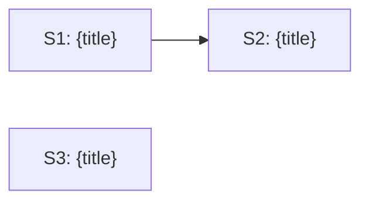

# Activity: Sequence from Manifest

**Activity ID**: 180
**Order**: 3
**Phase**: None
**Dependencies**: None

## Description

Sequence from Manifest

## Guidance

## Purpose
Derive the execution queue from the PIN-built manifest. Do NOT rebuild the dependency graph or conflict map — PIN-02 already computed them from actual skeleton commits. This activity reads and validates.

## Steps

### Step 1: Parse Parallel Groups and Conflict Map
From the loaded ITER-*.yaml manifest (MIN-02 output):
- Extract `parallel_groups`: e.g. `A: [S1, S3]`, `B: [S2]`
- Extract `conflict_map`: e.g. `mcp_integration/tools.py: [S1, S2]`

> The conflict map was derived by PIN-02 from actual `git diff --name-only` per skeleton commit. Do not recompute it.

### Step 2: Check Dependency State
For each scenario, check `dependencies[]`. Get each dependency issue one at a time:
```bash
gh issue view {dependency_issue_number} --json number,state,labels
```
Mark scenario as:
- **READY** — no dependencies, or all dependency issues closed with `status-done`
- **BLOCKED** — one or more dependency issues still open

### Step 3: Build Ordered Execution Queue
Order: Group A → Group B → Group C … Within each group, READY scenarios before BLOCKED.

```
[READY]   S1 [A] {title} — #{issue}
[READY]   S3 [A] {title} — #{issue}  (parallel with S1)
[BLOCKED] S2 [B] {title} — #{issue}  (waits for S1: status-done)
```

### Step 4: Switch to Plan Mode and Present Queue
Switch to **Plan mode**. Present the execution queue as a Mermaid dependency diagram:



Label parallel scenarios clearly. Note any BLOCKED scenarios and their unmet dependencies.

### Step 5: Output Execution Plan
```
=== EXECUTION QUEUE ===
Groups: {N} | Scenarios: {N} ready, {N} blocked

Group A (parallel):
  [READY] S1 #{issue} — {title}
  [READY] S3 #{issue} — {title}

Group B (after A):
  [BLOCKED] S2 #{issue} — {title} — waiting for S1

Conflicts: {file} shared by {S_N, S_M} — serialized in groups
Next: MIN-04 Execute
======================
```

## Success Criteria
- `parallel_groups` and `conflict_map` parsed from manifest (not recomputed)
- Each scenario dependency state checked via `gh issue view` (one at a time)
- Execution queue ordered correctly: group order + dependency order within groups
- Mermaid diagram presented in Plan mode
- Ready to proceed to MIN-04

> The conflict map and parallel groups were established by PIN-02 from actual skeleton commits.
> MIN-03 reads and validates them — it does not recompute them.

## Agent

None

## Skill

None

## Rules

See `../rules/` for full rule content.

## Notes

Exported via Mimir MCP tools.
