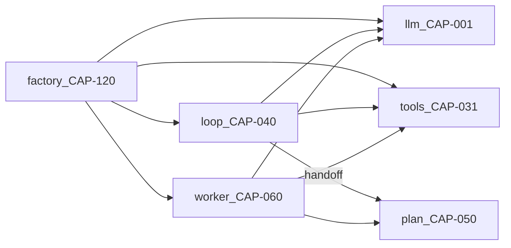

# AI Agent Reference Architecture

**Artifact ID**: 56
**Type**: Document (Reference)
**Required**: False
**Produced By Activity ID**: 200 (Define AI Agent Architecture)
**Consumers**: DTA → SAO §17; BPE-01 agent feature planning

Portable, single-file blueprint: pick a scenario → tick capabilities → copy code blocks → wire → test.

---

# 1. How to use this document

**Workflow:**

1. Find your scenario in **Scenario index** (`SC-xx`) → copy its CAP-ID list.
2. Look up each CAP in **Capability table** → open the matching **Capability specifications** spec → paste code into your repo.
3. Wire packages per **Module wiring** → start from the closest **Assembly templates** template → prove with **Integration proof** tests.

**Rules:**

- Select **capabilities** (`CAP-xxx`), not modules — modules are file-location hints only.
- Every CAP spec is self-contained; no external codebase required to understand it.
- Delete CAP blocks you did not select; the only allowed LLM mock is **CAP-004** ScriptedLLM.
- Structured JSON from LLM (bootstrap, discovery, map/extract) → **SC-02** + **CAP-008** + **CAP-009** mandatory.
- Unsure which scenario? Use the decision tree in **Scenario index**.

---

# 2. Scenario index

| ID | Name | When (biz words) | CAP-IDs (required) | CAP-IDs (optional) |
|----|------|------------------|--------------------|--------------------|
| SC-01 | Conversational planner | User chats; agent calls tools; work beyond one tool call becomes a background job | 001,004,020,030,031,040,050,051,060,120,121 | 002,006,007,010,033,042,043,044,061,070,100 |
| SC-02 | Field extractor / batch ingest | Scripted chain: D0 pre-filter → D1 LLM canonicalize → propose writes; no chat loop | 001,004,008,009,020,030,031,120,121,122 | 005,011,023,032,036 |
| SC-03 | Compiled pipeline | Trigger fires known step graph; selective LLM on some steps | 001,004,020,050,051,053,060,061,062,120 | 054,066,100 |
| SC-04 | Event-driven nudge | Domain event → agent message/plan without user opening chat | 001,040,110,120 | 050,060,100 |
| SC-05 | Governed mutations | Agent proposes writes; human approves destructive ops | 001,030,031,033,036 | 040,050 |

**Example mappings:**

- Munin chat → SC-01
- Ratatosk bootstrap → SC-02
- CI sync / update pipeline → SC-03
- ChangeSet approve flow → SC-05

**Decision tree:**

```text
Parse JSON from LLM?      yes → include CAP-008, CAP-009
User conversation?        yes → include CAP-040
Work survives crash?      yes → include CAP-050, CAP-060, CAP-062
Multi-turn soft intent?   yes → include CAP-070
Human approves deletes?   yes → include CAP-033
Proactive on events?      yes → SC-04
```


Read the summary table above, then open the matching **SC-xx** section below for full scenario cards.

---

# SC-01 · Conversational planner

**Pick when:** A user opens chat (or equivalent UI), sends natural-language messages, and the app runs a tool-calling loop; work that outlives one request is handed to a background worker.

**Example flow:** User: “Analyze auth module and propose a refactor plan” → agent calls read tools → creates durable plan → worker executes steps → user sees progress/completion.

**Product examples:** Munin chat planner; in-app copilot that searches the codebase and kicks off multi-step work.

**Not this if:** Input is a batch file/CI job with no conversation (→ SC-02 or SC-03); the agent only proposes writes pending approval with no chat loop (→ SC-05, optionally plus SC-01).

**Starting template:** T-01 Planner


---

# SC-02 · Field extractor / batch ingest

**Pick when:** Fixed or batch input (repo snapshot, document, API payload) is ingested through a **scripted step chain**; one or more LLM steps emit **structured JSON** that drives domain writes; no ReAct chat loop.

**Typical flow (dual-tier):**
1. **Gather** — scan input into raw candidates (deterministic).
2. **D0 pre-filter** — path/class/rules reject obvious noise; merge duplicates on stable natural key (deterministic, unit-testable).
3. **D1 canonicalize** — planning-tier LLM batch: merge / reject / rename remaining candidates (parse failure must fail loud).
4. **Cleanup** — deterministic post-LLM rules (externals, denylist, cardinality caps).
5. **Propose writes** — create/update/delete ops via domain service (often through SC-05 ChangeSet).

**Example flow:** Field CLI scans a repo → D0 drops tests/fixtures → D1 LLM merges duplicates → service proposes ChangeSet → CLI exits with op counts.

**Product examples:** Bootstrap/discovery agents; map/extract pipelines; “ingest this spec into the model” batch jobs.

**Not this if:** User multi-turn chat steers the task (→ SC-01); steps are a fixed template graph with selective LLM nodes (→ SC-03).

**Often combined with:** SC-05 when writes go through approval / confidence gates.

**Starting template:** T-02 Field


---

# SC-03 · Compiled pipeline

**Pick when:** A trigger (schedule, webhook, CI, domain event handler) runs a **known step graph**; only some steps call the LLM; order and step types are designed upfront.

**Example flow:** CI merge → enqueue compiled plan → worker runs data step → LLM planning step → assessment step → publish artifact; completed steps skipped on retry.

**Product examples:** CI sync / update pipeline; nightly reconciliation; compiled onboarding checklist.

**Not this if:** Step order is discovered live from chat (→ SC-01); single-shot JSON extract (→ SC-02).

**Starting template:** T-03 Pipeline


---

# SC-04 · Event-driven nudge

**Pick when:** Something happens in the domain (ChangeSet merged, SLA breach, stale graph) and the system proactively notifies or plans **without** the user opening chat first.

**Example flow:** ChangeSet approved → event handler → short agent loop or enqueue plan → user gets notification or suggested next action.

**Product examples:** Proactive “your model drifted” nudge; auto-triage on failed sync.

**Not this if:** Every interaction starts from user chat (→ SC-01); only batch extract (→ SC-02).

**Starting template:** T-00 custom (CAP-110 + subset of SC-01 stack)


---

# SC-05 · Governed mutations

**Pick when:** The agent may call **mutating or destructive** tools but policy requires human approval before commit (HITL), with server-side identity on every tool call.

**Example flow:** Agent suggests `delete_element` → tool parks action as pending → UI shows approve/reject → only on approve does the service execute.

**Product examples:** ChangeSet approve flow; destructive MCP tools with confirmation; governed graph edits.

**Not this if:** All tools are read-only (drop CAP-033); mutations are fully automated with no approval gate.

**Often combined with:** SC-01 or SC-02 (governance layer on top of planner or field agent).

**Starting template:** T-00 custom (CAP-033, CAP-036 + base scenario CAPs)

---

# SC-02 × SC-05 · Full rescan invariants

**Applies when:** A field-extract / batch-ingest agent (SC-02) performs a **full rescan** that replaces an existing snapshot and emits **delete** as well as **add/update** operations, and all writes pass through governed mutation (SC-05).

**Invariant 1 — Confidence parity**
- Delete operations on a rescan MUST use the same auto-apply confidence policy as adds/updates.
- Either: all rescan ops auto-apply atomically, OR none auto-apply until human review completes.
- **Anti-pattern — hybrid graph:** high-confidence adds applied while low-confidence deletes stay pending → old and new entities coexist.

**Invariant 2 — Delete before create**
- When the domain uses natural-key upserts (`get_or_create` on slug/code), apply **delete operations before add/create** operations for the same rescan batch.
- **Anti-pattern — empty graph:** adds bind to existing rows via natural key, then deletes remove those rows → near-empty or inconsistent state.

**Proof obligations:** PRF-SC02-03, PRF-SC02-04, PRF-SC05-02.

**Implementation checklist (record in project SAO §17):**
- [ ] Rescan delete ops meet auto-apply threshold (or rescan disables partial auto-apply).
- [ ] ChangeSet apply ordering: deletes → updates → adds when rescan flag is set.
- [ ] Integration test reproduces both anti-patterns and asserts fix.


---

# 3. Capability table

Scan this table. Tick what you need. Find each CAP-ID in **Capability specifications** below.


---

# Group A — LLM boundary (`llm/`)

| ID | Name | Job | Module | Requires | Scenarios | Spec |
|----|------|-----|--------|----------|-----------|------|
| CAP-001 | LLM Port protocol | Single `complete()` entry; agents depend on protocol not vendor SDK | llm | — | all | CAP-NNN section |
| CAP-002 | Tool-calling generate | LLM returns structured `tool_calls` alongside text | llm | 001 | SC-01,03,04 | CAP-NNN section |
| CAP-003 | Token stream | Stream tokens to caller for live UI | llm | 001 | SC-01 | CAP-NNN section |
| CAP-004 | ScriptedLLM | Replay queued responses in tests; only allowed mock seam | llm | 001 | all | CAP-NNN section |
| CAP-005 | LLM retry backoff | Exponential backoff on rate limit / transient errors | llm | 001 | SC-01,03 | CAP-NNN section |
| CAP-006 | Retry status callback | `(message, attempt, delay)` hook during backoff | llm | 005 | SC-01 | CAP-NNN section |
| CAP-007 | Extended thinking request | Provider reasoning budget (`budget_tokens`) on planning calls | llm | 001 | SC-01,03 | CAP-NNN section |
| CAP-008 | Thinking response normalize | Adapter splits `content` vs `thinking` at boundary | llm | 001 | SC-02 | CAP-NNN section |
| CAP-009 | Structured JSON extract | Strip fences/tags; parse array/object from LLM output | llm | 008 | SC-02 | CAP-NNN section |
| CAP-010 | Prompt cache blocks | Anthropic `system_blocks` with `cache_control: ephemeral` | llm | 001,020 | SC-01,03 | CAP-NNN section |
| CAP-011 | Provider factory | Select adapter via config/env (`LLM_PROVIDER`, model tier) | llm | 001 | all | CAP-NNN section |


---

# Group B — Prompt (`prompt/`)

| ID | Name | Job | Module | Requires | Scenarios | Spec |
|----|------|-----|--------|----------|-----------|------|
| CAP-020 | Layered prompt stack | Foundation + identity + recipe + dynamic context | prompt | — | all | CAP-NNN section |
| CAP-021 | PromptBuilder | Fluent `with_identity().with_workflow().with_context().build()` | prompt | 020 | all | CAP-NNN section |
| CAP-022 | Workflow recipe layer | Named template injects task guidance + expected tools | prompt | 020,021 | SC-01,03 | CAP-NNN section |
| CAP-023 | Validate-before-LLM | Reject invalid inputs structurally before spending tokens | prompt | — | SC-02,03 | CAP-NNN section |


---

# Group C — Tools (`tools/`)

| ID | Name | Job | Module | Requires | Scenarios | Spec |
|----|------|-----|--------|----------|-----------|------|
| CAP-030 | Tool registry | Map tool name → domain service callable | tools | — | all | CAP-NNN section |
| CAP-031 | Tool envelope | Every call returns `{success, result, error}`; never raises to loop | tools | 030 | all | CAP-NNN section |
| CAP-032 | Write guard | Allowlist/deny-by-default for mutating tools | tools | 030,031 | SC-02,05 | CAP-NNN section |
| CAP-033 | HITL destructive tools | Park delete/mutate until human approval | tools | 031 | SC-05 | CAP-NNN section |
| CAP-034 | Schema adapter | Reflect Python fn → Anthropic/OpenAI tool JSON schema | tools | 030 | SC-01 | CAP-NNN section |
| CAP-035 | Intra-plan read cache | Cache read tool results by plan+tool+args hash | tools | 031 | SC-01,03 | CAP-NNN section |
| CAP-036 | Auth identity override | Server injects/overrides `user_id` in every tool call | tools | 031 | SC-05 | CAP-NNN section |


---

# Group D — Agent loop (`loop/`)

| ID | Name | Job | Module | Requires | Scenarios | Spec |
|----|------|-----|--------|----------|-----------|------|
| CAP-040 | Bounded ReAct loop | LLM↔tools iterate until `end_turn` or cap | loop | 001,002,031 | SC-01,04 | CAP-NNN section |
| CAP-041 | History window | Sliding window on messages sent to LLM | loop | 040 | SC-01 | CAP-NNN section |
| CAP-042 | Context filter | Filter history by `context_type`/`context_id` | loop | 041 | SC-01 | CAP-NNN section |
| CAP-043 | Force-final breakers | Inject "answer now" when iteration/tool churn exceeded | loop | 040 | SC-01 | CAP-NNN section |
| CAP-044 | Plan handoff intercept | `create_plan` success → enqueue worker → stop loop | loop | 040,050,062 | SC-01 | CAP-NNN section |


---

# Group E — Plan (`plan/`)

| ID | Name | Job | Module | Requires | Scenarios | Spec |
|----|------|-----|--------|----------|-----------|------|
| CAP-050 | Durable plan model | Persist ordered steps with status/result/error | plan | — | SC-01,03 | CAP-NNN section |
| CAP-051 | Step state machine | `pending→running→completed, failed, waiting_retry` | plan | 050 | SC-01,03 | CAP-NNN section |
| CAP-052 | Atomic mark_started | `UPDATE … WHERE status IN (pending,waiting_retry)` | plan | 051 | SC-01,03 | CAP-NNN section |
| CAP-053 | Hybrid step flags | `is_critical`, `is_planning`, `is_variable_assessment`, data-only | plan | 051 | SC-03 | CAP-NNN section |
| CAP-054 | Step synthesis chain | Pass prior `llm_synthesis` to next LLM step | plan | 053 | SC-03 | CAP-NNN section |
| CAP-055 | Plan adapt | Insert/remove/update pending steps mid-run | plan | 051 | SC-01,03 | CAP-NNN section |


---

# Group F — Worker (`worker/`)

| ID | Name | Job | Module | Requires | Scenarios | Spec |
|----|------|-----|--------|----------|-----------|------|
| CAP-060 | Async plan worker | Celery task runs `execute_plan(plan_id)` loop | worker | 050,051 | SC-01,03 | CAP-NNN section |
| CAP-061 | Dual-layer 429 | In-call backoff + job `waiting_retry` + Celery retry | worker | 005,060 | SC-01,03 | CAP-NNN section |
| CAP-062 | on_commit enqueue | `transaction.on_commit(lambda: execute_plan.delay(id))` | worker | 060 | SC-01,03 | CAP-NNN section |
| CAP-063 | acks_late broker | `acks_late=True`; `visibility_timeout` > max task duration | worker | 060 | SC-01,03 | CAP-NNN section |
| CAP-064 | Orphan recovery | Periodic beat re-dispatches stuck plans | worker | 060,065 | SC-01,03 | CAP-NNN section |
| CAP-065 | Running reset | Reset stale `running` → `pending` before re-queue | worker | 052 | SC-01,03 | CAP-NNN section |
| CAP-066 | Per-step model tier | Planning=large model; data/assess=cheap model | worker | 001,011,060 | SC-01,03 | CAP-NNN section |


---

# Group G — Blackboard (`blackboard/`)

| ID | Name | Job | Module | Requires | Scenarios | Spec |
|----|------|-----|--------|----------|-----------|------|
| CAP-070 | Blackboard schema | Fixed string keys: phase, hypothesis, current_plan, … | blackboard | — | SC-01 | CAP-NNN section |
| CAP-071 | Extract and truncate | Parse model text → allowlisted dict ≤ N chars | blackboard | 070 | SC-01 | CAP-NNN section |
| CAP-072 | Retain on parse fail | Bad extract keeps prior board | blackboard | 071 | SC-01 | CAP-NNN section |
| CAP-073 | Durability tier | In-process vs JSON column on run/plan/conversation | blackboard | 070 | SC-01 | CAP-NNN section |


---

# Group H — Learning (`learning/`)

| ID | Name | Job | Module | Requires | Scenarios | Spec |
|----|------|-----|--------|----------|-----------|------|
| CAP-080 | Step outcome capture | Persist assessment/satisfaction/suggestion on steps | learning | 051 | optional | CAP-NNN section |
| CAP-081 | Learned rules inject | Append-only rules prepended to foundation prompt | learning | 020 | optional | CAP-NNN section |


---

# Group I — Knowledge (`knowledge/`)

| ID | Name | Job | Module | Requires | Scenarios | Spec |
|----|------|-----|--------|----------|-----------|------|
| CAP-090 | RAG retrieval tool | Optional `search_knowledge` tool; LLM decides to call | knowledge | 030,031 | optional | CAP-NNN section |


---

# Group J — Streaming (`streaming/`)

| ID | Name | Job | Module | Requires | Scenarios | Spec |
|----|------|-----|--------|----------|-----------|------|
| CAP-100 | SSE progress events | Typed events: token, plan_step, rate_limit | streaming | 040 or 060 | SC-01,03 | CAP-NNN section |


---

# Group K — Events (`events/`)

| ID | Name | Job | Module | Requires | Scenarios | Spec |
|----|------|-----|--------|----------|-----------|------|
| CAP-110 | Event ingress | Domain event → handler → short loop or enqueue plan | events | 120 | SC-04 | CAP-NNN section |


---

# Group L — Factory (`factory/`)

| ID | Name | Job | Module | Requires | Scenarios | Spec |
|----|------|-----|--------|----------|-----------|------|
| CAP-120 | Agent factory | Composition root wires LLM + tools + prompt + optional board | factory | 001,030,020 | all | CAP-NNN section |
| CAP-121 | Agent identities | Frozen dataclass: tone, tools, model tier per persona | factory | 120 | all | CAP-NNN section |
| CAP-122 | Model tier config | Named tiers: planning / execution / field + env mapping | factory | 011,121 | SC-01,02,03 | CAP-NNN section |

---

# 4. Capability specifications

Intro — specs are split per `# CAP-NNN` section.

---

# CAP-001 · LLM Port protocol

**Job:** Single `complete()` entry point; all agents depend on protocol, never vendor SDK.
**Need when:** Any in-app LLM call (all scenarios).
**Skip when:** Never — if no LLM, skip entire agent architecture.
**Requires:** — | **Pairs with:** CAP-004, CAP-011 | **Module:** `llm/`

**Contract**
- `BaseLLM.complete(messages, system, max_tokens, temperature) -> LLMResponse`
- `LLMResponse`: `content`, `thinking`, `model`, `usage`, `stop_reason`
- `LLMError` on timeout/API failure

**Code — protocol**

```python
from dataclasses import dataclass, field
from typing import Protocol, runtime_checkable

@dataclass
class LLMMessage:
    role: str  # system | user | assistant
    content: str

@dataclass
class LLMResponse:
    content: str
    model: str = ""
    usage: dict = field(default_factory=dict)
    stop_reason: str = "end_turn"
    thinking: str = ""

@runtime_checkable
class BaseLLM(Protocol):
    model_id: str
    def complete(
        self,
        messages: list[LLMMessage],
        system: str = "",
        max_tokens: int = 1024,
        temperature: float = 0.2,
    ) -> LLMResponse: ...

class LLMError(Exception):
    ...
```

**Wire:** `factory/` selects adapter; `loop/`, `worker/`, field agents call `complete()` only.

**Test:** `test_cap_001_adapter_satisfies_protocol`

**Fails if:** Agent imports Anthropic/OpenAI SDK directly — cannot swap providers or test with CAP-004.


---

# CAP-002 · Tool-calling generate

**Job:** LLM returns structured `tool_calls` alongside assistant text for ReAct loops.
**Need when:** SC-01, SC-03, SC-04 — conversational or tool-using agents.
**Skip when:** SC-02 field extract only (JSON in content, no tool protocol).
**Requires:** CAP-001 | **Pairs with:** CAP-040 | **Module:** `llm/`

**Contract**
- Extended response includes `tool_calls: list[dict] | None`
- Each call: `{name, arguments}` or provider-native shape normalized at adapter

**Code — tool response shape**

```python
@dataclass
class LLMResponse:
    content: str
    tool_calls: list[dict] | None = None
    stop_reason: str = "end_turn"  # tool_use | end_turn

# Adapter normalizes provider output to tool_calls list
def normalize_tool_calls(raw: dict) -> list[dict]:
    return [{"name": tc["name"], "arguments": tc.get("input", {})} for tc in raw.get("tool_calls", [])]
```

**Wire:** `loop/react.py` reads `tool_calls`; field agents (SC-02) omit CAP-002.

**Test:** `test_cap_002_tool_calls_round_trip`

**Fails if:** Loop parses tool calls from free-text content — brittle and provider-specific.


---

# CAP-003 · Token stream

**Job:** Stream partial tokens to caller for live UI rendering.
**Need when:** SC-01 with live chat UI (pairs with CAP-100).
**Skip when:** Batch/field agents with no streaming UI.
**Requires:** CAP-001 | **Pairs with:** CAP-100 | **Module:** `llm/`

**Contract**
- `stream(messages, system) -> Iterator[str]` yields content deltas
- Separate from progress events (plan steps) in CAP-100

**Code — stream iterator**

```python
from collections.abc import Iterator

class BaseLLM(Protocol):
    def stream(
        self,
        messages: list[LLMMessage],
        system: str = "",
        *,
        max_tokens: int = 4096,
    ) -> Iterator[str]:
        ...
```

**Wire:** UI/SSE publisher consumes `stream()`; do not mix plan progress into token stream.

**Test:** `test_cap_003_stream_yields_deltas`

**Fails if:** Blocking `complete()` only — chat UI freezes until full response.

**Status:** sketch — implement when CAP-100 selected


---

# CAP-004 · ScriptedLLM

**Job:** Replay queued `LLMResponse` values in order — the only allowed LLM mock in integration tests.
**Need when:** All scenarios for CI agent proofs (§7).
**Skip when:** Production runtime — never deploy ScriptedLLM.
**Requires:** CAP-001 | **Pairs with:** — | **Module:** `llm/`

**Contract**
- Constructor takes ordered response strings or `LLMResponse` objects
- `complete()` pops next; raises `LLMError` when exhausted

**Code — test double**

```python
class ScriptedLLM:
    model_id = "scripted"

    def __init__(self, responses: list[str]) -> None:
        if not responses:
            raise ValueError("ScriptedLLM requires at least one response")
        self._responses = list(responses)
        self._index = 0

    def complete(self, messages, system="", max_tokens=1024, temperature=0.2) -> LLMResponse:
        if self._index >= len(self._responses):
            raise LLMError(f"ScriptedLLM exhausted after {len(self._responses)} calls")
        content = self._responses[self._index]
        self._index += 1
        return LLMResponse(content=content, model=self.model_id)
```

**Wire:** Inject via `factory.create_agent(..., llm=ScriptedLLM([...]))` in pytest only.

**Test:** `test_cap_004_scripted_replays_in_order`

**Fails if:** Mocking domain services or tools — hides real integration failures.


---

# CAP-005 · LLM retry backoff

**Job:** Exponential backoff wrapper for rate limits and transient LLM errors.
**Need when:** SC-01, SC-03 — any production LLM calls that may 429.
**Skip when:** Local-only dev with zero rate limits (still recommended).
**Requires:** CAP-001 | **Pairs with:** CAP-006, CAP-061 | **Module:** `llm/`

**Contract**
- Retry capped (e.g. min(30 * 2**(n-1), 120) seconds)
- Re-raise after max attempts

**Code — retry helper**

```python
import time
from typing import Callable, TypeVar

T = TypeVar("T")

def with_llm_retry(
    fn: Callable[[], T],
    *,
    max_attempts: int = 5,
    status_callback: Callable[[str, int, int], None] | None = None,
) -> T:
    for attempt in range(1, max_attempts + 1):
        try:
            return fn()
        except RateLimitError as exc:
            if attempt == max_attempts:
                raise
            delay = min(30 * (2 ** (attempt - 1)), 120)
            if status_callback:
                status_callback(str(exc), attempt, delay)
            time.sleep(delay)
    raise RuntimeError("unreachable")
```

**Wire:** Wrap adapter `complete()` calls in `loop/` and `worker/`; field agents use for long batch runs.

**Test:** `test_cap_005_retries_on_rate_limit`

**Fails if:** Uncaught 429 crashes agent mid-run with no resume path.


---

# CAP-006 · Retry status callback

**Job:** Notify caller during backoff so UI/logs show wait state without full SSE.
**Need when:** SC-01 — user-visible chat during rate-limit waits.
**Skip when:** Headless batch with no status surface.
**Requires:** CAP-005 | **Pairs with:** CAP-100 | **Module:** `llm/`

**Contract**
- Signature: `(message: str, attempt: int, delay_seconds: int) -> None`
- Called before each sleep in retry helper

**Code — callback usage**

```python
def on_rate_limit(message: str, attempt: int, delay: int) -> None:
    logger.info("rate_limit wait attempt=%s delay=%s msg=%s", attempt, delay, message)
    # optional: emit SSE rate_limit_status event (CAP-100)

with_llm_retry(lambda: llm.complete(msgs), status_callback=on_rate_limit)
```

**Wire:** Pass callback from `loop/` or conversation service into LLM retry wrapper.

**Test:** `test_cap_006_callback_fires_before_sleep`

**Fails if:** Silent 120s sleeps — users think the app hung.


---

# CAP-007 · Extended thinking request

**Job:** Enable provider reasoning budget on planning-heavy LLM calls.
**Need when:** SC-01/03 planning or narrative steps using Claude-style extended thinking.
**Skip when:** SC-02 field JSON extract; cheap assessment/data steps.
**Requires:** CAP-001 | **Pairs with:** CAP-008 | **Module:** `llm/`

**Contract**
- Optional param: `thinking={"type": "enabled", "budget_tokens": N}`
- Default N illustrative: 8000 for planning tier

**Code — Anthropic-style request**

```python
response = client.messages.create(
    model=model,
    messages=messages,
    max_tokens=16000,
    thinking={"type": "enabled", "budget_tokens": 8000},
)
```

**Wire:** Worker selects CAP-007 only for `is_planning=True` steps (CAP-053, CAP-066).

**Test:** `test_cap_007_thinking_enabled_on_planning_step`

**Fails if:** Thinking enabled on every call — cost/latency explosion on data steps.


---

# CAP-008 · Thinking response normalize

**Job:** Adapters return machine-parseable `content`; provider reasoning goes to `thinking`.
**Need when:** SC-02; any step that parses JSON from LLM output; all thinking models (Qwen3, Claude, o-series).
**Skip when:** Natural-language-only output, never parsed structurally.
**Requires:** CAP-001 | **Pairs with:** CAP-009 | **Module:** `llm/`

**Contract**
- `LLMResponse.content` — answer only (tags stripped)
- `LLMResponse.thinking` — optional trace; log at DEBUG only
- Normalize in adapter `_parse_response`, not in agent/runner

**Code — adapter parse (Ollama example)**

```python
from llm.structured import normalize_llm_text

def _parse_response(raw: dict) -> LLMResponse:
    message = raw.get("message") or {}
    thinking = str(message.get("thinking") or "")
    raw_content = str(message.get("content") or "")
    content = normalize_llm_text(raw_content)
    return LLMResponse(content=content, thinking=thinking, model=raw.get("model", ""))
```

**Wire:** Every provider adapter implements `_parse_response`; log content_chars/thinking_chars at INFO.

**Test:** `test_cap_008_thinking_field_separated_from_content`

**Fails if:** Parser sees `` or prose mixed with JSON → `None` → silent zero ops.


---

# CAP-009 · Structured JSON extract

**Job:** Shared strip + JSON parse for map/extract/metric steps.
**Need when:** SC-02; any `extract_json_*` consumer.
**Skip when:** Tool-calling or NL-only responses.
**Requires:** CAP-008 | **Pairs with:** — | **Module:** `llm/`

**Contract**
- `normalize_llm_text(raw) -> str`
- `extract_json_array(raw) -> list[dict] | None`
- `extract_json_object(raw) -> dict | None`
- Bracket/brace slice fallback on parse fail

**Code — extractors**

```python
import json
import re

_THINKING_RE = re.compile(r"<\s*think(?:ing)?\s*>[\s\S]*?<\s*/\s*think(?:ing)?\s*>", re.I)

def normalize_llm_text(raw: str) -> str:
    text = _THINKING_RE.sub("", raw or "").strip()
    return strip_markdown_fence(text)

def extract_json_array(raw: str) -> list[dict] | None:
    text = normalize_llm_text(raw)
    if not text:
        return None
    try:
        data = json.loads(text)
    except json.JSONDecodeError:
        start, end = text.find("["), text.rfind("]")
        if start < 0 or end <= start:
            return None
        data = json.loads(text[start : end + 1])
    return [x for x in data if isinstance(x, dict)] if isinstance(data, list) else None
```

**Wire:** Single module imported by field agent and discovery runner — never duplicate parsers.

**Test:** `test_cap_009_thinking_wrapped_json_array_parses`

**Fails if:** Parse returns None but pipeline exits 0 with zero domain ops.


---

# CAP-010 · Prompt cache blocks

**Job:** Anthropic-style ephemeral cache on stable system prompt blocks.
**Need when:** SC-01/03 with repeated LLM calls sharing foundation prompt.
**Skip when:** Single-shot field extract (SC-02).
**Requires:** CAP-001, CAP-020 | **Pairs with:** CAP-021 | **Module:** `llm/`

**Contract**
- `system_blocks: list[dict]` with `cache_control: {type: ephemeral}` on stable layers
- Dynamic/user content never in cached blocks

**Code — system blocks**

```python
system_blocks = [
    {"type": "text", "text": FOUNDATION_PROMPT, "cache_control": {"type": "ephemeral"}},
    {"type": "text", "text": domain_rules, "cache_control": {"type": "ephemeral"}},
]
client.messages.create(model=model, system=system_blocks, messages=messages)
```

**Wire:** `PromptBuilder.build()` returns blocks for layers 1–2; layer 4 goes in user message.

**Test:** `test_cap_010_cached_blocks_sent_on_second_call`

**Fails if:** Full system prompt resent every call — cost/latency multiply.


---

# CAP-011 · Provider factory

**Job:** Select LLM adapter and model tier from config/env.
**Need when:** All scenarios.
**Skip when:** —
**Requires:** CAP-001 | **Pairs with:** CAP-122 | **Module:** `llm/`

**Contract**
- `LLM_PROVIDER` env: anthropic | openai | ollama | scripted
- `build_llm(tier: str) -> BaseLLM`

**Code — factory**

```python
import os

def build_llm(*, tier: str = "field") -> BaseLLM:
    provider = os.getenv("LLM_PROVIDER", "ollama")
    if provider == "scripted":
        raise ValueError("use ScriptedLLM directly in tests")
    if provider == "ollama":
        from llm.adapters.ollama import OllamaClient
        model = os.getenv("LLM_OLLAMA_MODEL", "qwen3:14b")
        return OllamaClient(model=model)
    ...
```

**Wire:** `factory.create_agent` calls `build_llm(identity.model_tier)`.

**Test:** `test_cap_011_factory_returns_protocol_instance`

**Fails if:** Hard-coded model in agent code — cannot route tiers (CAP-066).


---

# CAP-020 · Layered prompt stack

**Job:** Four layers: foundation, identity, recipe, dynamic.
**Need when:** Scenarios: all.
**Skip when:** See §2 decision tree when this CAP is not in your scenario list.
**Requires:** — | **Pairs with:** CAP-021 | **Module:** `prompt/`

**Contract**
- Layer 1 Foundation: tools protocol, safety, HITL
- Layer 2 Identity: persona
- Layer 3 Recipe (optional)
- Layer 4 Dynamic: run context

**Code**

```python
FOUNDATION = """You must use tools for facts. Use create_plan for 2+ tool steps."""
```

**Wire:** See **Assembly templates** templates; pairs with CAP-022.

**Test:** `test_cap_020_smoke`

**Fails if:** Capability omitted but scenario requires it — agent fails at runtime.


---

# CAP-021 · PromptBuilder

**Job:** Fluent builder assembles layers into system prompt or blocks.
**Need when:** Scenarios: all.
**Skip when:** See §2 decision tree when this CAP is not in your scenario list.
**Requires:** CAP-020 | **Pairs with:** CAP-010 | **Module:** `prompt/`

**Contract**
- `with_identity()`, `with_workflow()`, `with_context()`, `build() -> str | blocks`

**Code**

```python
class PromptBuilder:
    def with_identity(self, identity): ...
    def with_context(self, **ctx): ...
    def build(self) -> str: ...
```

**Wire:** See **Assembly templates** templates; pairs with CAP-020.

**Test:** `test_cap_021_smoke`

**Fails if:** Capability omitted but scenario requires it — agent fails at runtime.


---

# CAP-022 · Workflow recipe layer

**Job:** Named DB template injects task guidance between identity and dynamic.
**Need when:** Scenarios: SC-01,03.
**Skip when:** See §2 decision tree when this CAP is not in your scenario list.
**Requires:** CAP-020,021 | **Pairs with:** — | **Module:** `prompt/`

**Contract**
- Template: name, prompt_template, required_tools, expected_steps

**Code**

```python
@dataclass
class WorkflowTemplate:
    name: str
    prompt_template: str
    required_tools: list[str]
```

**Wire:** See **Assembly templates** templates; pairs with CAP-021.

**Test:** `test_cap_022_smoke`

**Fails if:** Capability omitted but scenario requires it — agent fails at runtime.


---

# CAP-023 · Validate-before-LLM

**Job:** Structural validation rejects bad inputs before token spend.
**Need when:** Scenarios: SC-02,03.
**Skip when:** See §2 decision tree when this CAP is not in your scenario list.
**Requires:** — | **Pairs with:** — | **Module:** `prompt/`

**Contract**
- Validate snapshot/schema/metamodel constraints pre-call

**Code**

```python
def validate_extract_input(snapshot: dict) -> None:
    if not snapshot.get("files"):
        raise ValueError("empty snapshot")
```

**Wire:** See **Assembly templates** templates.

**Test:** `test_cap_023_smoke`

**Fails if:** Capability omitted but scenario requires it — agent fails at runtime.


---

# CAP-030 · Tool registry

**Job:** Map tool name → callable over domain services.
**Need when:** Scenarios: all with tools.
**Skip when:** See §2 decision tree when this CAP is not in your scenario list.
**Requires:** — | **Pairs with:** CAP-031 | **Module:** `tools/`

**Contract**
- `registry: dict[str, Callable]` built at factory time

**Code**

```python
REGISTRY: dict[str, Callable] = {}

def register(name: str):
    def deco(fn): REGISTRY[name] = fn; return fn
    return deco
```

**Wire:** See **Assembly templates** templates; pairs with CAP-031.

**Test:** `test_cap_030_smoke`

**Fails if:** Capability omitted but scenario requires it — agent fails at runtime.


---

# CAP-031 · Tool envelope

**Job:** Stable `{success, result, error}`; never raise to loop.
**Need when:** Scenarios: all with tools.
**Skip when:** See §2 decision tree when this CAP is not in your scenario list.
**Requires:** CAP-030 | **Pairs with:** CAP-040 | **Module:** `tools/`

**Contract**
- Executor catches exceptions; returns envelope

**Code**

```python
def execute(self, tool_call: dict) -> dict:
    try:
        fn = self.registry[tool_call["name"]]
        return {"success": True, "result": fn(**tool_call["arguments"]), "error": None}
    except Exception as exc:
        return {"success": False, "result": None, "error": str(exc)}
```

**Wire:** See **Assembly templates** templates; pairs with CAP-030.

**Test:** `test_cap_031_smoke`

**Fails if:** Capability omitted but scenario requires it — agent fails at runtime.


---

# CAP-032 · Write guard

**Job:** Allowlist or deny-by-default for mutating tools.
**Need when:** Scenarios: SC-02,05.
**Skip when:** See §2 decision tree when this CAP is not in your scenario list.
**Requires:** CAP-030,031 | **Pairs with:** CAP-033 | **Module:** `tools/`

**Contract**
- `WRITE_TOOLS` frozenset or explicit deny list

**Code**

```python
WRITE_TOOLS = frozenset({"propose_changeset", "delete_element"})

def is_write(tool_name: str) -> bool:
    return tool_name in WRITE_TOOLS
```

**Wire:** See **Assembly templates** templates; pairs with CAP-031.

**Test:** `test_cap_032_smoke`

**Fails if:** Capability omitted but scenario requires it — agent fails at runtime.


---

# CAP-033 · HITL destructive tools

**Job:** Park destructive tool calls as suggested actions pending approval.
**Need when:** Scenarios: SC-05.
**Skip when:** See §2 decision tree when this CAP is not in your scenario list.
**Requires:** CAP-031 | **Pairs with:** CAP-036 | **Module:** `tools/`

**Contract**
- Destructive tools return pending approval record, not immediate execute

**Code**

```python
if is_write(tool_call["name"]):
    return {"success": True, "result": {"status": "pending_approval", "tool": tool_call}, "error": None}
```

**Wire:** See **Assembly templates** templates; pairs with CAP-031.

**Test:** `test_cap_033_smoke`

**Fails if:** Capability omitted but scenario requires it — agent fails at runtime.


---

# CAP-034 · Schema adapter

**Job:** Reflect Python callables to provider tool JSON schemas.
**Need when:** Scenarios: SC-01.
**Skip when:** See §2 decision tree when this CAP is not in your scenario list.
**Requires:** CAP-030 | **Pairs with:** — | **Module:** `tools/`

**Contract**
- Docstring → description; type hints → input_schema

**Code**

```python
def to_anthropic_tool(fn: Callable) -> dict:
    return {"name": fn.__name__, "description": fn.__doc__.split("\n")[0], "input_schema": hints_to_schema(fn)}
```

**Wire:** See **Assembly templates** templates; pairs with CAP-030.

**Test:** `test_cap_034_smoke`

**Fails if:** Capability omitted but scenario requires it — agent fails at runtime.


---

# CAP-035 · Intra-plan read cache

**Job:** Cache read-tool results keyed by plan+tool+args hash.
**Need when:** Scenarios: SC-01,03.
**Skip when:** See §2 decision tree when this CAP is not in your scenario list.
**Requires:** CAP-031 | **Pairs with:** — | **Module:** `tools/`

**Contract**
- Key: `plan_id:tool:sha256(args)`; invalidate on plan terminal

**Code**

```python
def cache_key(plan_id: int, tool: str, args: dict) -> str:
    import hashlib, json
    h = hashlib.sha256(json.dumps(args, sort_keys=True).encode()).hexdigest()
    return f"{plan_id}:{tool}:{h}"
```

**Wire:** See **Assembly templates** templates; pairs with CAP-031.

**Test:** `test_cap_035_smoke`

**Fails if:** Capability omitted but scenario requires it — agent fails at runtime.


---

# CAP-036 · Auth identity override

**Job:** Hard-inject server `user_id`; override model-supplied values in tool args.
**Need when:** Scenarios: SC-05.
**Skip when:** See §2 decision tree when this CAP is not in your scenario list.
**Requires:** CAP-031 | **Pairs with:** CAP-033 | **Module:** `tools/`

**Contract**
- Override before every tool execute; prompt states never trust user-supplied user_id

**Code**

```python
def execute(self, tool_call: dict, *, auth_user_id: int) -> dict:
    args = {**tool_call.get("arguments", {}), "user_id": auth_user_id}
    ...
```

**Wire:** See **Assembly templates** templates; pairs with CAP-031.

**Test:** `test_cap_036_smoke`

**Fails if:** Capability omitted but scenario requires it — agent fails at runtime.


---

# CAP-040 · Bounded ReAct loop

**Job:** LLM↔tools iterate until end_turn or max iterations.
**Need when:** Scenarios: SC-01,04.
**Skip when:** See §2 decision tree when this CAP is not in your scenario list.
**Requires:** CAP-001,002,031 | **Pairs with:** CAP-043,044 | **Module:** `loop/`

**Contract**
- Hard cap (e.g. 10); append tool results to messages each round

**Code**

```python
def bounded_react_loop(llm, executor, messages, system, *, max_iter=10):
    for i in range(max_iter):
        resp = llm.complete_with_tools(messages, system, tools=schemas)
        if not resp.tool_calls:
            return resp.content
        for tc in resp.tool_calls:
            messages.append(tool_result_message(executor.execute(tc)))
    return force_final_answer(llm, messages, system)
```

**Wire:** See **Assembly templates** templates; pairs with CAP-002.

**Test:** `test_cap_040_smoke`

**Fails if:** Capability omitted but scenario requires it — agent fails at runtime.


---

# CAP-041 · History window

**Job:** Sliding window truncates messages sent to LLM.
**Need when:** Scenarios: SC-01.
**Skip when:** See §2 decision tree when this CAP is not in your scenario list.
**Requires:** CAP-040 | **Pairs with:** CAP-042 | **Module:** `loop/`

**Contract**
- Keep last N messages after filtering

**Code**

```python
def window_messages(msgs: list, *, limit: int = 20) -> list:
    return msgs[-limit:]
```

**Wire:** See **Assembly templates** templates; pairs with CAP-040.

**Test:** `test_cap_041_smoke`

**Fails if:** Capability omitted but scenario requires it — agent fails at runtime.


---

# CAP-042 · Context filter

**Job:** Filter history by context_type/context_id before windowing.
**Need when:** Scenarios: SC-01.
**Skip when:** See §2 decision tree when this CAP is not in your scenario list.
**Requires:** CAP-041 | **Pairs with:** — | **Module:** `loop/`

**Contract**
- Prevent cross-conversation bleed

**Code**

```python
def filter_context(msgs, *, context_type: str, context_id: str) -> list:
    return [m for m in msgs if m.context matches (context_type, context_id)]
```

**Wire:** See **Assembly templates** templates; pairs with CAP-041.

**Test:** `test_cap_042_smoke`

**Fails if:** Capability omitted but scenario requires it — agent fails at runtime.


---

# CAP-043 · Force-final breakers

**Job:** Inject no-tools final call when iteration/tool churn exceeded.
**Need when:** Scenarios: SC-01.
**Skip when:** See §2 decision tree when this CAP is not in your scenario list.
**Requires:** CAP-040 | **Pairs with:** — | **Module:** `loop/`

**Contract**
- Triggers: iter≥N, tools≥M, after create_plan, hard max

**Code**

```python
if iteration >= MAX or only_hitl_tools_remain:
    return llm.complete(messages + [{"role":"user","content":"Provide final answer now."}], system)
```

**Wire:** See **Assembly templates** templates; pairs with CAP-040.

**Test:** `test_cap_043_smoke`

**Fails if:** Capability omitted but scenario requires it — agent fails at runtime.


---

# CAP-044 · Plan handoff intercept

**Job:** On create_plan success: persist plan, on_commit enqueue, stop loop.
**Need when:** Scenarios: SC-01.
**Skip when:** See §2 decision tree when this CAP is not in your scenario list.
**Requires:** CAP-040,050,062 | **Pairs with:** — | **Module:** `loop/`

**Contract**
- Return brief user summary; do not continue iterating

**Code**

```python
def on_plan_created(plan_id: int) -> str:
    transaction.on_commit(lambda: execute_plan.delay(plan_id))
    return "Plan queued."
```

**Wire:** See **Assembly templates** templates; pairs with CAP-062.

**Test:** `test_cap_044_smoke`

**Fails if:** Capability omitted but scenario requires it — agent fails at runtime.


---

# CAP-050 · Durable plan model

**Job:** Persist ExecutionPlan + ordered PlanStep records.
**Need when:** Scenarios: SC-01,03.
**Skip when:** See §2 decision tree when this CAP is not in your scenario list.
**Requires:** — | **Pairs with:** CAP-051 | **Module:** `plan/`

**Contract**
- Plan has status; steps have order, action, tool, result JSON

**Code**

```python
class ExecutionPlan(models.Model):
    status = models.CharField(max_length=20)
    def steps(self): return self.planstep_set.order_by("order")
```

**Wire:** See **Assembly templates** templates; pairs with CAP-051.

**Test:** `test_cap_050_smoke`

**Fails if:** Capability omitted but scenario requires it — agent fails at runtime.


---

# CAP-051 · Step state machine

**Job:** Steps: pending→running→completed|failed|waiting_retry.
**Need when:** Scenarios: SC-01,03.
**Skip when:** See §2 decision tree when this CAP is not in your scenario list.
**Requires:** CAP-050 | **Pairs with:** CAP-052 | **Module:** `plan/`

**Contract**
- Terminal states immutable; completed steps never re-run

**Code**

```python
STEP_PENDING, STEP_RUNNING = "pending", "running"
STEP_COMPLETED, STEP_FAILED = "completed", "failed"
STEP_WAITING = "waiting_retry"
```

**Wire:** See **Assembly templates** templates; pairs with CAP-052.

**Test:** `test_cap_051_smoke`

**Fails if:** Capability omitted but scenario requires it — agent fails at runtime.


---

# CAP-052 · Atomic mark_started

**Job:** Single worker owns plan via conditional UPDATE.
**Need when:** Scenarios: SC-01,03.
**Skip when:** See §2 decision tree when this CAP is not in your scenario list.
**Requires:** CAP-051 | **Pairs with:** CAP-065 | **Module:** `plan/`

**Contract**
- `UPDATE plan SET status=running WHERE id=? AND status IN (pending,waiting_retry)`

**Code**

```python
def mark_started(plan_id: int) -> bool:
    updated = Plan.objects.filter(id=plan_id, status__in=["pending","waiting_retry"]).update(status="running")
    return updated == 1
```

**Wire:** See **Assembly templates** templates; pairs with CAP-060.

**Test:** `test_cap_052_smoke`

**Fails if:** Capability omitted but scenario requires it — agent fails at runtime.


---

# CAP-053 · Hybrid step flags

**Job:** Data / assessment / planning step semantics via booleans.
**Need when:** Scenarios: SC-03.
**Skip when:** See §2 decision tree when this CAP is not in your scenario list.
**Requires:** CAP-051 | **Pairs with:** CAP-054,066 | **Module:** `plan/`

**Contract**
- `is_critical`, `is_planning`, `is_variable_assessment`

**Code**

```python
@dataclass
class PlanStep:
    is_critical: bool = True
    is_planning: bool = False
    is_variable_assessment: bool = False
```

**Wire:** See **Assembly templates** templates; pairs with CAP-060.

**Test:** `test_cap_053_smoke`

**Fails if:** Capability omitted but scenario requires it — agent fails at runtime.


---

# CAP-054 · Step synthesis chain

**Job:** Prior LLM step outputs passed as context to subsequent LLM steps.
**Need when:** Scenarios: SC-03.
**Skip when:** See §2 decision tree when this CAP is not in your scenario list.
**Requires:** CAP-053 | **Pairs with:** — | **Module:** `plan/`

**Contract**
- Store `result["llm_synthesis"]`; inject formatted chain before next LLM step

**Code**

```python
def prior_syntheses(plan, before_order: int) -> str:
    parts = [s.result["llm_synthesis"] for s in plan.steps if s.order < before_order and s.result]
    return "\n".join(parts)
```

**Wire:** See **Assembly templates** templates; pairs with CAP-060.

**Test:** `test_cap_054_smoke`

**Fails if:** Capability omitted but scenario requires it — agent fails at runtime.


---

# CAP-055 · Plan adapt

**Job:** Insert/remove/update pending steps when mission allows.
**Need when:** Scenarios: SC-01,03.
**Skip when:** See §2 decision tree when this CAP is not in your scenario list.
**Requires:** CAP-051 | **Pairs with:** — | **Module:** `plan/`

**Contract**
- Only mutate pending steps; never completed

**Code**

```python
def insert_step(plan, after_order: int, step: PlanStep) -> None:
    assert step.status == "pending"
    ...
```

**Wire:** See **Assembly templates** templates; pairs with CAP-051.

**Test:** `test_cap_055_smoke`

**Fails if:** Capability omitted but scenario requires it — agent fails at runtime.


---

# CAP-060 · Async plan worker

**Job:** Celery task loops pending steps via execute_single_step.
**Need when:** Scenarios: SC-01,03.
**Skip when:** See §2 decision tree when this CAP is not in your scenario list.
**Requires:** CAP-050,051 | **Pairs with:** CAP-061 | **Module:** `worker/`

**Contract**
- `@shared_task` `execute_plan(plan_id)`

**Code**

```python
@shared_task(bind=True)
def execute_plan(self, plan_id: int):
    plan = ExecutionPlan.objects.get(id=plan_id)
    if not plan.mark_started():
        return
    while step := plan.next_pending():
        execute_single_step(plan, step)
```

**Wire:** See **Assembly templates** templates; pairs with CAP-062.

**Test:** `test_cap_060_smoke`

**Fails if:** Capability omitted but scenario requires it — agent fails at runtime.


---

# CAP-061 · Dual-layer 429

**Job:** In-call backoff (CAP-005) plus job-level waiting_retry.
**Need when:** Scenarios: SC-01,03.
**Skip when:** See §2 decision tree when this CAP is not in your scenario list.
**Requires:** CAP-005,060 | **Pairs with:** — | **Module:** `worker/`

**Contract**
- On 429 in worker: mark step waiting_retry; Celery retry with countdown

**Code**

```python
except RateLimitError as exc:
    step.mark_waiting_retry(str(exc))
    raise self.retry(countdown=60)
```

**Wire:** See **Assembly templates** templates; pairs with CAP-005.

**Test:** `test_cap_061_smoke`

**Fails if:** Capability omitted but scenario requires it — agent fails at runtime.


---

# CAP-062 · on_commit enqueue

**Job:** Enqueue worker only after DB transaction commits.
**Need when:** Scenarios: SC-01,03.
**Skip when:** See §2 decision tree when this CAP is not in your scenario list.
**Requires:** CAP-060 | **Pairs with:** CAP-044 | **Module:** `worker/`

**Contract**
- Never `delay()` inside uncommitted transaction

**Code**

```python
from django.db import transaction
transaction.on_commit(lambda: execute_plan.delay(plan.id))
```

**Wire:** See **Assembly templates** templates; pairs with CAP-044.

**Test:** `test_cap_062_smoke`

**Fails if:** Capability omitted but scenario requires it — agent fails at runtime.


---

# CAP-063 · acks_late broker

**Job:** Defer ACK until task completes; long visibility_timeout.
**Need when:** Scenarios: SC-01,03.
**Skip when:** See §2 decision tree when this CAP is not in your scenario list.
**Requires:** CAP-060 | **Pairs with:** — | **Module:** `worker/`

**Contract**
- `acks_late=True`; broker visibility > worst-case task duration

**Code**

```python
# celery settings
CELERY_TASK_ACKS_LATE = True
CELERY_BROKER_TRANSPORT_OPTIONS = {"visibility_timeout": 7200}
```

**Wire:** See **Assembly templates** templates; pairs with CAP-060.

**Test:** `test_cap_063_smoke`

**Fails if:** Capability omitted but scenario requires it — agent fails at runtime.


---

# CAP-064 · Orphan recovery

**Job:** Beat task re-dispatches plans stuck too long.
**Need when:** Scenarios: SC-01,03.
**Skip when:** See §2 decision tree when this CAP is not in your scenario list.
**Requires:** CAP-060,065 | **Pairs with:** — | **Module:** `worker/`

**Contract**
- Find plans running/pending older than threshold; re-queue

**Code**

```python
def recover_orphaned_plans():
    stale = Plan.objects.filter(status="running", updated_at__lt=threshold())
    stale.update(status="pending")
    for p in stale: execute_plan.delay(p.id)
```

**Wire:** See **Assembly templates** templates; pairs with CAP-065.

**Test:** `test_cap_064_smoke`

**Fails if:** Capability omitted but scenario requires it — agent fails at runtime.


---

# CAP-065 · Running reset

**Job:** Reset stale running→pending before re-dispatch.
**Need when:** Scenarios: SC-01,03.
**Skip when:** See §2 decision tree when this CAP is not in your scenario list.
**Requires:** CAP-052 | **Pairs with:** CAP-064 | **Module:** `worker/`

**Contract**
- Required before mark_started succeeds on retry

**Code**

```python
Plan.objects.filter(status="running", updated_at__lt=cutoff).update(status="pending")
```

**Wire:** See **Assembly templates** templates; pairs with CAP-064.

**Test:** `test_cap_065_smoke`

**Fails if:** Capability omitted but scenario requires it — agent fails at runtime.


---

# CAP-066 · Per-step model tier

**Job:** Planning steps use large model; data/assess use cheap model.
**Need when:** Scenarios: SC-01,03.
**Skip when:** See §2 decision tree when this CAP is not in your scenario list.
**Requires:** CAP-001,011,060 | **Pairs with:** CAP-007,053 | **Module:** `worker/`

**Contract**
- Store `model_used` on step for audit

**Code**

```python
def llm_for_step(step) -> BaseLLM:
    if step.is_planning:
        return build_llm(tier="planning")
    return build_llm(tier="execution")
```

**Wire:** See **Assembly templates** templates; pairs with CAP-011.

**Test:** `test_cap_066_smoke`

**Fails if:** Capability omitted but scenario requires it — agent fails at runtime.


---

# CAP-070 · Blackboard schema

**Job:** Fixed string keys for soft intent across turns.
**Need when:** Scenarios: SC-01.
**Skip when:** See §2 decision tree when this CAP is not in your scenario list.
**Requires:** — | **Pairs with:** CAP-071 | **Module:** `blackboard/`

**Contract**
- Keys: phase, hypothesis, current_plan, last_actions, next_intent

**Code**

```python
ALLOWED_KEYS = frozenset({"phase","hypothesis","current_plan","last_actions","next_intent"})
```

**Wire:** See **Assembly templates** templates; pairs with CAP-071.

**Test:** `test_cap_070_smoke`

**Fails if:** Capability omitted but scenario requires it — agent fails at runtime.


---

# CAP-071 · Extract and truncate

**Job:** Parse model text to allowlisted board dict ≤ max chars.
**Need when:** Scenarios: SC-01.
**Skip when:** See §2 decision tree when this CAP is not in your scenario list.
**Requires:** CAP-070 | **Pairs with:** CAP-072 | **Module:** `blackboard/`

**Contract**
- Drop unknown keys; enforce size cap (~500 chars)

**Code**

```python
def extract_blackboard(text: str, max_chars: int = 500) -> dict[str, str] | None:
    data = parse_json_or_kv(text)
    if not data: return None
    board = {k: str(v) for k, v in data.items() if k in ALLOWED_KEYS}
    return truncate(board, max_chars)
```

**Wire:** See **Assembly templates** templates; pairs with CAP-070.

**Test:** `test_cap_071_smoke`

**Fails if:** Capability omitted but scenario requires it — agent fails at runtime.


---

# CAP-072 · Retain on parse fail

**Job:** Invalid extract leaves prior board unchanged.
**Need when:** Scenarios: SC-01.
**Skip when:** See §2 decision tree when this CAP is not in your scenario list.
**Requires:** CAP-071 | **Pairs with:** — | **Module:** `blackboard/`

**Contract**
- `set_from_model_text() -> bool`; False means retain

**Code**

```python
def set_from_model_text(self, text: str) -> bool:
    board = extract_blackboard(text)
    if board is None:
        return False
    self._board = board
    return True
```

**Wire:** See **Assembly templates** templates; pairs with CAP-040.

**Test:** `test_cap_072_smoke`

**Fails if:** Capability omitted but scenario requires it — agent fails at runtime.


---

# CAP-073 · Durability tier

**Job:** In-process vs JSON column on run/plan/conversation.
**Need when:** Scenarios: SC-01.
**Skip when:** See §2 decision tree when this CAP is not in your scenario list.
**Requires:** CAP-070 | **Pairs with:** — | **Module:** `blackboard/`

**Contract**
- Tier A: instance field; Tier B: persisted JSON

**Code**

```python
class RunBlackboard(models.Model):
    run = models.OneToOneField("Run", on_delete=models.CASCADE)
    data = models.JSONField(default=dict)
```

**Wire:** See **Assembly templates** templates; pairs with CAP-070.

**Test:** `test_cap_073_smoke`

**Fails if:** Capability omitted but scenario requires it — agent fails at runtime.


---

# CAP-080 · Step outcome capture

**Job:** Persist learning fields on plan steps.
**Need when:** Scenarios: optional.
**Skip when:** See §2 decision tree when this CAP is not in your scenario list.
**Requires:** CAP-051 | **Pairs with:** CAP-081 | **Module:** `learning/`

**Contract**
- outcome_assessment, outcome_satisfaction, improvement_suggestion

**Code**

```python
class PlanStep(models.Model):
    outcome_assessment = models.TextField(blank=True)
    improvement_suggestion = models.TextField(blank=True)
```

**Wire:** See **Assembly templates** templates; pairs with CAP-051.

**Test:** `test_cap_080_smoke`

**Fails if:** Capability omitted but scenario requires it — agent fails at runtime.


---

# CAP-081 · Learned rules inject

**Job:** Append-only rules prepended to foundation prompt.
**Need when:** Scenarios: optional.
**Skip when:** See §2 decision tree when this CAP is not in your scenario list.
**Requires:** CAP-020 | **Pairs with:** — | **Module:** `learning/`

**Contract**
- Human-reviewed before injection

**Code**

```python
def foundation_with_rules(base: str, rules: list[str]) -> str:
    return "\n".join(rules) + "\n\n" + base
```

**Wire:** See **Assembly templates** templates; pairs with CAP-020.

**Test:** `test_cap_081_smoke`

**Fails if:** Capability omitted but scenario requires it — agent fails at runtime.

**Status:** sketch


---

# CAP-090 · RAG retrieval tool

**Job:** Optional search_knowledge tool behind embeddings index.
**Need when:** Scenarios: optional.
**Skip when:** See §2 decision tree when this CAP is not in your scenario list.
**Requires:** CAP-030,031 | **Pairs with:** — | **Module:** `knowledge/`

**Contract**
- LLM decides to call; empty hit is valid

**Code**

```python
def search_knowledge(query: str, *, limit: int = 5) -> list[dict]:
    return index.query(query, top_k=limit)
```

**Wire:** See **Assembly templates** templates; pairs with CAP-030.

**Test:** `test_cap_090_smoke`

**Fails if:** Capability omitted but scenario requires it — agent fails at runtime.

**Status:** sketch


---

# CAP-100 · SSE progress events

**Job:** Typed SSE: typing, rate_limit, plan_step, ai_message.
**Need when:** Scenarios: SC-01,03.
**Skip when:** See §2 decision tree when this CAP is not in your scenario list.
**Requires:** CAP-040 or 060 | **Pairs with:** CAP-006 | **Module:** `streaming/`

**Contract**
- Channel: `agent:stream:{conversation_id}`

**Code**

```python
def publish(event: str, payload: dict) -> None:
    redis.publish(f"agent:stream:{conversation_id}", json.dumps({"event": event, **payload}))
```

**Wire:** See **Assembly templates** templates; pairs with loop/worker.

**Test:** `test_cap_100_smoke`

**Fails if:** Capability omitted but scenario requires it — agent fails at runtime.

**Status:** sketch


---

# CAP-110 · Event ingress

**Job:** Domain event handler invokes agent factory or enqueues plan.
**Need when:** Scenarios: SC-04.
**Skip when:** See §2 decision tree when this CAP is not in your scenario list.
**Requires:** CAP-120 | **Pairs with:** CAP-050 | **Module:** `events/`

**Contract**
- Idempotent on event_id

**Code**

```python
def on_domain_event(event_id: str, payload: dict) -> None:
    if EventDedupe.seen(event_id): return
    agent = create_agent("responder")
    agent.handle_event(payload)
```

**Wire:** See **Assembly templates** templates; pairs with CAP-120.

**Test:** `test_cap_110_smoke`

**Fails if:** Capability omitted but scenario requires it — agent fails at runtime.

**Status:** sketch


---

# CAP-120 · Agent factory

**Job:** Composition root wires LLM + tools + prompt + optional board.
**Need when:** Scenarios: all.
**Skip when:** See §2 decision tree when this CAP is not in your scenario list.
**Requires:** CAP-001,030,020 | **Pairs with:** CAP-121 | **Module:** `factory/`

**Contract**
- `create_agent(identity, *, llm=None)`

**Code**

```python
def create_agent(identity: AgentIdentity, *, llm: BaseLLM | None = None):
    llm = llm or build_llm(tier=identity.model_tier)
    tools = ToolExecutor(build_registry(identity.allowed_tools))
    prompt = PromptBuilder().with_identity(identity).build()
    return Agent(llm, tools, prompt)
```

**Wire:** See **Assembly templates** templates.

**Test:** `test_cap_120_smoke`

**Fails if:** Capability omitted but scenario requires it — agent fails at runtime.


---

# CAP-121 · Agent identities

**Job:** Frozen dataclass: tone, tools, model tier per persona.
**Need when:** Scenarios: all.
**Skip when:** See §2 decision tree when this CAP is not in your scenario list.
**Requires:** CAP-120 | **Pairs with:** CAP-122 | **Module:** `factory/`

**Contract**
- Identities are data, not subclasses

**Code**

```python
@dataclass(frozen=True)
class AgentIdentity:
    name: str
    system_tone: str
    allowed_tools: frozenset[str]
    model_tier: str
```

**Wire:** See **Assembly templates** templates; pairs with CAP-120.

**Test:** `test_cap_121_smoke`

**Fails if:** Capability omitted but scenario requires it — agent fails at runtime.


---

# CAP-122 · Model tier config

**Job:** Named tiers planning/execution/field mapped to env model IDs.
**Need when:** Scenarios: SC-01,02,03.
**Skip when:** See §2 decision tree when this CAP is not in your scenario list.
**Requires:** CAP-011,121 | **Pairs with:** CAP-066 | **Module:** `factory/`

**Contract**
- Field tier default max_tokens ≥ 8000 when thinking models

**Code**

```python
TIERS = {"planning": "claude-opus", "execution": "claude-sonnet", "field": "qwen3:14b"}

def build_llm(tier: str) -> BaseLLM:
    return adapter_for(TIERS[tier])
```

**Wire:** See **Assembly templates** templates; pairs with CAP-011.

**Test:** `test_cap_122_smoke`

**Fails if:** Capability omitted but scenario requires it — agent fails at runtime.


---

# 5. Module wiring

Package map, forbidden imports, and dependency matrix are separate sections below.

---

# Module wiring — package map

```text
llm/         CAP-001–011
prompt/      CAP-020–023
tools/       CAP-030–036
loop/        CAP-040–044
plan/        CAP-050–055
worker/      CAP-060–066
blackboard/  CAP-070–073
learning/    CAP-080–081
knowledge/   CAP-090
streaming/   CAP-100
events/      CAP-110
factory/     CAP-120–122
```

---

# Module wiring — forbidden imports


- `tools/` must not import `loop/`
- `llm/` must not import domain apps
- `loop/` must not own business rules — calls tools only


---

# Module wiring — dependency matrix


| CAP | 001 | 008 | 009 | 031 | 040 | 050 | 060 |
|-----|:---:|:---:|:---:|:---:|:---:|:---:|:---:|
| CAP-009 | ✓ | ✓ | — | | | | |
| CAP-040 | ✓ | | | ✓ | — | | |
| CAP-044 | | | | | ✓ | ✓ | ✓ |
| CAP-060 | ✓ | | | ✓ | | ✓ | — |



---

# 6. Assembly templates

Start from the template closest to your **Scenario index** scenario. Delete CAP wiring you did not select.


---

# T-01 Planner (SC-01)

**CAP-IDs:** 001,004,020,030,031,040,044,050,051,052,060,062,120,121

```python
# factory/agent_factory.py — T-01 Conversational planner
from dataclasses import dataclass

from llm.base import BaseLLM, LLMMessage  # CAP-001
from llm.scripted import ScriptedLLM       # CAP-004 (tests only)
from prompt.builder import PromptBuilder   # CAP-020, CAP-021
from tools.executor import ToolExecutor    # CAP-030, CAP-031
from loop.react import bounded_react_loop  # CAP-040, CAP-044
from plan.models import ExecutionPlan      # CAP-050, CAP-051
from worker.tasks import execute_plan      # CAP-060, CAP-062


@dataclass(frozen=True)
class AgentIdentity:  # CAP-121
    name: str
    system_tone: str
    allowed_tools: frozenset[str]
    model_tier: str


def create_agent(identity: AgentIdentity, *, llm: BaseLLM | None = None):
    llm = llm or build_llm_for_tier(identity.model_tier)  # CAP-011, CAP-122
    tools = ToolExecutor(registry=build_tool_registry(identity.allowed_tools))
    prompt = PromptBuilder().with_identity(identity).build()
    return PlannerAgent(llm=llm, tools=tools, prompt=prompt)


class PlannerAgent:
    def handle_message(self, user_id: int, text: str) -> str:
        return bounded_react_loop(  # CAP-040
            self.llm,
            self.tools,
            messages=[LLMMessage(role="user", content=text)],
            system=self.prompt,
            on_plan_created=self._enqueue_plan,  # CAP-044, CAP-062
        )
```


---

# T-02 Field (SC-02)

**CAP-IDs:** 001,004,008,009,020,030,031,120,121,122

```python
# factory/field_factory.py — T-02 Field extractor / bootstrap
from llm.base import LLMMessage
from llm.structured import extract_json_array  # CAP-009
from prompt.builder import PromptBuilder       # CAP-020
from tools.executor import ToolExecutor        # CAP-031


def create_field_agent(*, llm, tools: ToolExecutor, identity):
    return FieldAgent(llm=llm, tools=tools, prompt=PromptBuilder().with_identity(identity).build())


class FieldAgent:
    def extract_candidates(self, snapshot: str) -> list[dict]:
        resp = self.llm.complete(  # CAP-001; adapter does CAP-008
            [LLMMessage(role="user", content=snapshot)],
            system=self.prompt,
            max_tokens=8000,
        )
        items = extract_json_array(resp.content)  # CAP-009
        if items is None:
            raise ExtractError("structured parse failed — fail loud, not silent zero-op")
        return items
```


---

# T-03 Pipeline (SC-03)

**CAP-IDs:** 001,004,020,050,051,053,060,061,062,120

```python
# worker/pipeline.py — T-03 Compiled pipeline
from django.db import transaction

from plan.models import ExecutionPlan
from worker.tasks import execute_plan  # CAP-060, CAP-062


def enqueue_compiled_plan(template_id: str, context: dict) -> int:
    plan = ExecutionPlan.from_template(template_id, context)  # CAP-050
    plan.save()
    transaction.on_commit(lambda: execute_plan.delay(plan.id))
    return plan.id
```


---

# T-00 Custom

Tick CAP-IDs in the capability table; copy matching specification blocks, wire in `factory/agent_factory.py`.

---

# 7. Integration proof

**Rule:** Only **CAP-004** ScriptedLLM may mock the LLM. Everything else uses real DB/services.

| Test ID | Scenario | Proves CAP-IDs | Adverse? |
|---------|----------|----------------|----------|
| PRF-SC02-01 | SC-02 | 008,009 — thinking-wrapped JSON → ops > 0 | yes |
| PRF-SC02-02 | SC-02 | 009 — parse fail must not exit 0 with zero side effects | yes |
| PRF-SC02-03 | SC-02 | D0 pre-filter reduces candidate set deterministically | no |
| PRF-SC02-04 | SC-02 | D1 parse fail → non-zero exit, zero domain writes | yes |
| PRF-SC01-01 | SC-01 | 040,044,050,060 — message → plan → complete | no |
| PRF-SC01-02 | SC-01 | 061 — 429 retry; completed steps not re-run | yes |
| PRF-SC01-03 | SC-01 | 072 — bad LLM output retains blackboard | yes |
| PRF-SC05-01 | SC-05 | 033,036 — destructive tool blocked until approval | yes |
| PRF-SC05-02 | SC-02+05 | Full rescan: no hybrid graph; delete-before-add on natural key | yes |

**PRF-SC02-01 sketch:**

```python
def test_sc02_thinking_json_extract(scripted_llm, field_agent):
    scripted_llm.queue('{"message":{"thinking":"…","content":"[{\"name\":\"Api\"}]"}}')
    items = field_agent.extract_candidates("scan repo")
    assert len(items) == 1
    assert items[0]["name"] == "Api"
```
**PRF-SC02-03 sketch:**

```python
def test_sc02_d0_prefilter_drops_noise():
    raw = [{"name": "Api", "path": "src/api.py"}, {"name": "test_foo", "path": "tests/test_foo.py"}]
    kept = d0_prefilter(raw, exclude_globs=["tests/**"])
    assert len(kept) == 1
    assert kept[0]["name"] == "Api"
```

**PRF-SC05-02 sketch:**

```python
def test_rescan_delete_before_add_no_empty_graph(change_set_service, entity_model):
    existing = entity_model.objects.create(slug="api", name="Api")
    ops = rescan_operations(deletes=[existing.pk], adds=[{"slug": "api", "name": "Api v2"}])
    change_set_service.apply(ops, rescan=True)
    assert entity_model.objects.filter(slug="api").count() == 1
    assert entity_model.objects.get(slug="api").name == "Api v2"
```


Record chosen tests in project SAO §17 as the agent DoD gate.

---

*End of Artifact 56 — AI Agent Reference Architecture*
