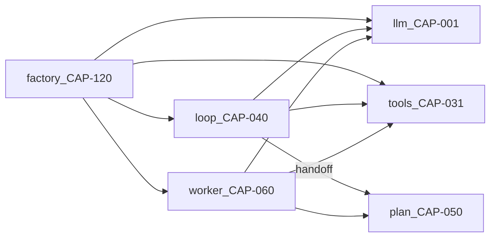

# AI Agent Reference Architecture

**Artifact ID**: 56
**Type**: Document
**Required**: False

## Description

# AI Agent Reference Architecture

**Artifact ID**: 56
**Type**: Document (Reference)
**Required**: False
**Produced By Activity ID**: 200 (Define AI Agent Architecture)
**Consumers**: DTA-19 → SAO §17; BPE-01 agent feature planning

Portable, single-file blueprint: confirm components → pick patterns → choose serving mode → tick capabilities → copy code blocks → wire → test.

---

# How to use this document

**Audience:** Solution architects and implementers running DTA-19 (Define AI Agent Architecture) and filling SAO §17.

**Workflow:**

1. Read **Part 1 — Components** and confirm infra, model, optional vector tier, framework packages, memory tiers, and observability baseline.
2. Pick one or more **Part 2 — Design patterns**; each pattern lists required **SC-xx** scenarios and **CAP-xxx** bundles.
3. Choose **Part 3 — Serving mode** (real-time chat, batch/queue, or both).
4. Tick capabilities in **Part 4.1 Capability table**; copy matching **Part 4.2 Capability specifications** into your repo.
5. Wire packages per **Part 4.3 Module wiring**; start from the closest **Part 4.4 Assembly template**.
6. Prove integration with **Part 4.5 Integration proof** tests before release.

**Rules:**

- Select **capabilities** (`CAP-xxx`), not modules — modules are package-location hints only.
- Every CAP spec is self-contained; no external codebase is required to understand it.
- Delete CAP blocks you did not select; the only allowed LLM mock is **CAP-004** ScriptedLLM.
- Structured JSON from LLM (bootstrap, discovery, map/extract) → Pattern 2 / **SC-02** + **CAP-008** + **CAP-009** mandatory.
- Unsure which pattern? Use **Part 5 — Quick reference** decision trees.
- Large domain state in chat → **CAP-037** snapshot + **CAP-039** dual tool exposure.
- Need memory beyond a hot snapshot → **Component 5 — Memory** tier decision tree before CAP-091–094.
- Background plan/worker selected → never execute pre-defined steps as dumb scripts — see **Pattern 4 · Anti-patterns**.
- Production agent → **CAP-101** interaction trace (`correlation_id` + normalized usage/cost/latency at CAP-001 boundary).
- Dual path **CAP-037–039**: required when domain state is large; default in **T-01**; optional in bare SC-01 minimum.
- Background steps that call the LLM → include **CAP-053, CAP-054, CAP-066** (mandatory when worker runs LLM per step; see Pattern 4 anti-patterns).

**Reference implementation note:** Code samples use Django ORM and Celery as the reference stack. Substitute equivalent transaction-commit hooks and a task broker in other frameworks — preserve the contracts (on_commit enqueue, acks_late, durable plan rows).

---

# Part 1 — Agentic architecture and key components

## 1.0 Architecture overview

Agentic systems stack infrastructure, model access, optional retrieval, orchestration packages, memory, design patterns, serving modes, and observability. Components are **composable** — pick only what your patterns require.

```text
Infra (env, secrets, broker)
  → Model layer (BaseLLM, adapters, tiers)
  → Vector tier (optional — embeddings + index)
  → Framework packages (factory, loop, plan, worker, tools, …)
  → Memory tiers (snapshot, semantic, profile, notes, reference library)
  → Design patterns (Part 2)
  → Serving mode (Part 3 — real-time and/or batch)
  → Observability (correlation_id, SSE, usage/cost trace)
```

**Pattern ↔ component matrix**

| Pattern | Infra | Model | Vector | Framework | Memory | Observability |
|---------|:-----:|:-----:|:------:|:---------:|:------:|:-------------:|
| 1 Prompt framework | ✓ | ✓ | — | prompt/ | — | optional |
| 2 RAG & structured extract | ✓ | ✓ | ✓ | tools/, worker/ | Tier 4 | optional |
| 3 Multi-agent communication | ✓ | ✓ | — | events/, loop/ | optional | ✓ |
| 4 Conversational agents + roles | ✓ | ✓ | optional | loop/, plan/, worker/, context/ | Tier 1–3 | ✓ |
| 5 Function calling & tool agents | ✓ | ✓ | — | tools/, loop/ | — | ✓ |
| 6 Tool protocols (MCP, A2A, ACP) | ✓ | ✓ | — | tools/, external MCP | — | ✓ |
| 7 Compiled pipeline | ✓ | ✓ | — | plan/, worker/ | — | optional |

---

## 1.1 Component 1 — Infra layer

The infra layer supplies **environment configuration**, **secret handling**, **LLM provider readiness**, and (when async plans are used) **message broker + result backend**. Agents must fail fast when infra is misconfigured — never silently fall back to wrong models or missing credentials.

### Environment contract

| Variable | Purpose | Required when |
|----------|---------|---------------|
| `LLM_PROVIDER` | Adapter selection: `anthropic`, `openai`, `ollama`, … | Always |
| `ANTHROPIC_API_KEY` / `OPENAI_API_KEY` | Cloud provider auth | Matching provider |
| `OLLAMA_HOST` | Base URL for local Ollama (default `http://127.0.0.1:11434`) | `LLM_PROVIDER=ollama` |
| `LLM_OLLAMA_MODEL` | Default Ollama model tag | Ollama provider |
| `LLM_TIER_<NAME>` | Maps named tier → model id (planning / execution / field) | CAP-122 |
| `CELERY_BROKER_URL` | Task queue broker (or equivalent) | CAP-060 |
| `CELERY_RESULT_BACKEND` | Task results store (or equivalent) | CAP-060 |
| `CORRELATION_ID_HEADER` | HTTP header name (default `X-Correlation-ID`) | CAP-101 |

### Ollama readiness

Before accepting traffic with `LLM_PROVIDER=ollama`:

1. Confirm Ollama daemon is running on `OLLAMA_HOST`.
2. Probe `GET {OLLAMA_HOST}/api/tags` or `GET {OLLAMA_HOST}/api/ps` — non-200 → **fail startup** (do not queue requests against a dead local LLM).
3. Verify configured model tag appears in `/api/tags`; if missing, log explicit pull instruction (`ollama pull <model>`).
4. Health endpoint on your API should surface LLM readiness separately from DB readiness.

### Secrets policy

- API keys live **server-side only** — environment variables or secret manager; never in frontend bundles, MCP stdio client env exposed to IDE extensions without review, or committed config.
- Tool calls that mutate data must receive **server-injected identity** (CAP-036) — never trust client-supplied user ids for writes.
- Log redaction: never log full API keys or raw tool payloads containing secrets.

### Worker infra checklist (SC-01 / SC-03)

When background plan execution is selected:

- [ ] Broker reachable from worker process
- [ ] `acks_late=True` and visibility timeout > max task duration (CAP-063)
- [ ] Result backend sized for plan metadata (not full LLM transcripts unless required)
- [ ] Beat/cron for orphan recovery if CAP-064 selected
- [ ] Rate-limit handling: CAP-061 dual-layer 429 (in-call backoff + job `waiting_retry`)

---

## 1.2 Component 2 — Model layer

The model layer isolates vendor SDKs behind a **provider-agnostic port**. All agent code depends on **CAP-001** `BaseLLM`, not Anthropic/OpenAI/Ollama directly.

**Core responsibilities:**

| Concern | CAP-IDs | Notes |
|---------|---------|-------|
| Single completion entry | CAP-001 | `complete(messages, system, tools?, …) -> LLMResponse` |
| Tool-calling generate | CAP-002 | Normalized `tool_calls` list in response |
| Token streaming | CAP-003 | Iterator/stream for live UI |
| Test seam | CAP-004 | ScriptedLLM — **only** allowed LLM mock |
| Retry / backoff | CAP-005, CAP-006 | Exponential backoff + status callback |
| Extended thinking | CAP-007, CAP-008 | Provider reasoning budget; adapter splits thinking vs content |
| Structured JSON extract | CAP-009 | Strip fences; parse array/object — fail loud |
| Prompt cache blocks | CAP-010 | Ephemeral cache on stable system layers |
| Provider factory | CAP-011 | Select adapter from env |
| Model tiers | CAP-122 | planning / execution / field mapping |

Implement adapters in `llm/adapters/`; wire via `build_llm_for_tier()` in factory (CAP-120). Full specs: **Part 4.2**.

---

## 1.3 Component 3 — Vector stores and embeddings

Add a vector tier when **semantic retrieval** is required and brute-force JSON snapshots or SQL search are insufficient.

**When to add**

| Signal | Action |
|--------|--------|
| Pattern 2 / SC-02 with document corpus | Index chunks for `search_knowledge` (CAP-090 + CAP-094) |
| Tier 2 semantic memory (CAP-091) | Embed entity text fields or note bodies |
| Snapshot exceeds token budget | Query-time retrieval instead of full layer-4 dump |

**Minimal interfaces**

```python
def embed_text(text: str, *, model: str | None = None) -> list[float]: ...

class VectorIndex:
    def upsert(self, scope_id: str, doc_id: str, chunks: list[dict]) -> None: ...
    def query(self, scope_id: str, embedding: list[float], *, limit: int = 20) -> list[dict]: ...
```

**Backend comparison (pick one per deployment)**

| Backend | Best for | Trade-offs |
|---------|----------|------------|
| pgvector (Postgres extension) | Single-DB apps; transactional ingest | Couples search to DB load |
| Dedicated vector DB | High QPS semantic search | Extra service to operate |
| In-process / dev index | Local dev, tests | Not durable; no horizontal scale |

**Index lifecycle:** ingest → chunk (fixed size + overlap) → embed → upsert metadata `{scope_id, doc_type, title, version}` → query at tool-call time. Re-ingest bumps version; CAP-090 searches latest index only.

Wire CAP-090/091/094 specs in **Part 4.2** when this component is selected.

---

## 1.4 Component 4 — Agent framework (internal orchestration)

This architecture uses **first-party packages** — not LangChain, CrewAI, or AutoGen. Orchestration is explicit: factory composes LLM + tools + prompt; loop runs bounded ReAct; plan persists steps; worker executes async.

**Package map**

```text
llm/            CAP-001–011      Model port + adapters
prompt/         CAP-020–023      Layered prompt stack
tools/          CAP-030–036      Registry, envelope, HITL, guards
context/        CAP-037–039      Snapshot + dual tool exposure
loop/           CAP-040–044      Bounded ReAct + plan handoff
plan/           CAP-050–055      Durable steps + synthesis chain
worker/         CAP-060–066      Async execution + 429 handling
blackboard/     CAP-070–073      Soft multi-turn intent
learning/       CAP-080–081      Optional outcome capture
knowledge/      CAP-090–094      RAG + memory tiers
streaming/      CAP-100          SSE progress events
events/         CAP-110          Domain event ingress
observability/  CAP-101          Interaction trace
factory/        CAP-120–122      Composition root + identities
```

**Composition root (CAP-120):** single place that constructs `PlannerAgent`, `FieldAgent`, or pipeline worker with injected dependencies.

**Forbidden imports**

- `tools/` must not import `loop/`
- `llm/` must not import domain apps
- `loop/` must not own business rules — calls tools only
- `context/` must not import `loop/` or `worker/`
- `observability/` must not import domain mutation paths — record only

Full dependency matrix and diagram: **Part 4.3**.

---

## 1.5 Component 5 — Memory

Stack memory **tiers by access pattern** — do not pick one strategy for everything.

| Tier | Name | When | CAP-IDs | Freshness |
|------|------|------|---------|-----------|
| 1 | Hot snapshot | SC-01 chat; domain fits structured JSON | CAP-037, CAP-038, CAP-039 | TTL cache; invalidate on mutation |
| 2 | Semantic retrieval | Snapshot too large; NL lookup | CAP-091 | Query-time embedding search |
| 3 | AI-managed profile | Persistent preferences across sessions | CAP-092 | Agent/user merge + audit |
| 4 | Reference library | Books, playbooks, frameworks on demand | CAP-094, CAP-090 | Versioned docs + RAG index |
| 5 | Entity notes graph | Recurring people, projects, topics | CAP-093 | Per-entity notes |

**Decision tree**

```text
All state fits in one JSON snapshot (< ~25K tokens)?     yes → Tier 1 only
Need "find X in my history" without full snapshot?       yes → add Tier 2 (CAP-091)
Agent should remember user patterns across sessions?     yes → add Tier 3 (CAP-092)
User uploads reference docs / playbooks?                   yes → add Tier 4 (CAP-094)
Recurring entities with free-form notes?                 yes → add Tier 5 (CAP-093)
```

**Dual execution path (Tier 1 + SC-01):** conversation mode hydrates snapshot into prompt layer 4 (CAP-037) and exposes **mutation-only** tools (CAP-039); plan worker uses **full** registry for reads and analysis (CAP-060 + CAP-044).

**Blackboard (optional):** CAP-070–073 for soft multi-turn intent when the user steers without explicit tool calls — not a substitute for Tier 1 snapshot on large domains.

---

## 1.6 Component 6 — Observability

Production agents require **request-level traceability** without locking to a single LLM vendor's dashboard.

**Correlation ID:** generate at API entry (or honor inbound header); propagate through loop, worker tasks, tool executions, and SSE channel.

**Per-LLM-call record (CAP-101):** at the CAP-001 adapter boundary, normalize `{input_tokens, output_tokens, latency_ms, estimated_cost}` into `AgentInteraction` rows keyed by `correlation_id`.

**SSE progress (CAP-100):** typed events — `token`, `plan_step`, `plan_failed`, `rate_limit` — for real-time serving (Part 3.1).

**Key metrics to monitor**

| Metric | Why |
|--------|-----|
| LLM latency p95 | User experience / SLA |
| Tokens per conversation | Cost control |
| Tool error rate | Domain or schema drift |
| Plan failure rate | Worker or synthesis issues |
| Queue depth / task age | Worker capacity |
| 429 retry count | Provider quota planning |
| Snapshot cache hit rate | CAP-037 efficiency |

This is **not** a full AgentOps platform chapter — export these signals to your existing logs, metrics, and dashboards.

---

# Part 2 — Design patterns

Each pattern maps to **SC-xx** scenarios and **CAP-xxx** bundles. Copy the scenario card, tick CAPs in Part 4, wire the assembly template.

---

## Pattern 1 — Prompt framework

**When to use:** Every agent — layered system prompt separates stable identity from dynamic context.

**When not to use:** Never skip entirely; SC-02 may use a minimal two-layer stack.

**Required components:** Model (CAP-001), Prompt (CAP-020–023), optional CAP-010 cache on stable layers.

**Scenario / CAP map**

| SC | Role | CAP-IDs |
|----|------|---------|
| all | Foundation + identity + recipe + dynamic context | CAP-020, CAP-021 |
| SC-01, SC-03 | Workflow recipe layer | CAP-022 |
| SC-02, SC-03 | Validate-before-LLM | CAP-023 |
| SC-01, SC-03 | Prompt cache blocks | CAP-010 |

**Example flow:** Factory builds `PromptBuilder().with_identity(identity).with_workflow(recipe).with_context(snapshot=…).build()` → passed as `system` to CAP-001.

**Assembly template:** T-01, T-02, or T-03 (all include CAP-020).

---

## Pattern 2 — RAG and structured extract

**When to use:** Batch ingest, bootstrap, or field extraction where LLM output is **structured JSON** driving domain writes (SC-02).

**When not to use:** Pure conversational Q&A with no extract step (SC-01 only).

**Required components:** Model (CAP-008, CAP-009), Vector tier optional (CAP-090, CAP-094), Tools (CAP-030, CAP-031).

**Scenario / CAP map — SC-02 · Field extractor / batch ingest**

**Pick when:** Fixed or batch input (repo snapshot, document, API payload) is ingested through a **scripted step chain**; one or more LLM steps emit **structured JSON** that drives domain writes; no ReAct chat loop.

**Typical flow (dual-tier):**

| Step | Type | Responsibility |
|------|------|----------------|
| 1 Gather | **Domain pipeline (non-CAP)** | Scan input into raw candidates (deterministic) |
| 2 D0 pre-filter | **Domain pipeline (non-CAP)** | Path/class/rules reject noise; merge duplicates on stable natural key |
| 3 D1 canonicalize | **CAP-008, CAP-009** | Planning-tier LLM batch: merge / reject / rename; parse failure must fail loud |
| 4 Cleanup | **Domain pipeline (non-CAP)** | Deterministic post-LLM rules (externals, denylist, cardinality caps) |
| 5 Propose writes | **Domain pipeline (non-CAP)** | Create/update/delete ops via domain service (often through SC-05 ChangeSet) |

Only D1 maps to CAP specs — Gather, D0, Cleanup, and Propose-writes are unit-testable product code in your domain package.

**Example flow:** CLI scans a repo → D0 drops tests/fixtures → D1 LLM merges duplicates → service proposes ChangeSet → CLI exits with op counts.

**Not this if:** User multi-turn chat steers the task (→ Pattern 4 / SC-01); steps are a fixed template graph with selective LLM nodes (→ Pattern 7 / SC-03).

**Often combined with:** Pattern 5 / SC-05 when writes go through approval / confidence gates.

**CAP-IDs (required):** 001, 004, 008, 009, 020, 030, 031, 120, 121, 122

**CAP-IDs (optional):** 005, 011, 023, 032, 036, 090, 091, 094

**Starting template:** T-02 Field

---

## Pattern 3 — Multi-agent communication

**When to use:** Domain events should trigger agent messages or plans **without** the user opening chat first (SC-04).

**When not to use:** All interactions start from user chat (→ Pattern 4 / SC-01).

**Required components:** Events (CAP-110), Model (CAP-001, CAP-002), Loop (CAP-040), Factory (CAP-120), optional Plan/Worker (CAP-050, CAP-060).

**Scenario / CAP map — SC-04 · Event-driven nudge**

**Pick when:** Something happens in the domain (ChangeSet merged, SLA breach, stale graph) and the system proactively notifies or plans without the user opening chat first.

**Example flow:** ChangeSet approved → event handler → short agent loop or enqueue plan → user gets notification or suggested next action.

**Not this if:** Every interaction starts from user chat (→ SC-01); only batch extract (→ SC-02).

**CAP-IDs (required):** 001, 002, 040, 110, 120

**CAP-IDs (optional):** 050, 060, 100, 101

**Starting template:** T-00 custom (CAP-110 + subset of SC-01 stack)

**Note:** This pattern describes **in-app event → agent** wiring — not a full A2A wire protocol spec. External agent-to-agent buses (A2A, ACP) are covered in Pattern 6.

---

## Pattern 4 — Conversational agents and roles

**When to use:** User opens chat, agent calls tools, work beyond one request becomes a background job (SC-01).

**Required components:** Loop (CAP-040–044), Plan (CAP-050), Worker (CAP-060), Context (CAP-037–039 when domain is large), Identities (CAP-121, CAP-122).

**Scenario / CAP map — SC-01 · Conversational planner**

**Pick when:** A user opens chat (or equivalent UI), sends natural-language messages, and the app runs a tool-calling loop; work that outlives one request is handed to a background worker.

**Example flow:** User: “Analyze auth module and propose a refactor plan” → agent calls read tools → creates durable plan → worker executes steps → user sees progress/completion.

**Not this if:** Input is a batch file/CI job with no conversation (→ SC-02 or SC-03); the agent only proposes writes pending approval with no chat loop (→ SC-05, optionally plus SC-01).

**Dual execution path (recommended for large domain state):** Chat uses CAP-037 snapshot in layer 4 + CAP-039 mutation-only tools. Plan worker (CAP-060) retains full read/analyze tools. Required when domain state is large; default in T-01; optional in bare SC-01 minimum.

**Hybrid worker (when background steps call LLM):** Include CAP-053, CAP-054, CAP-066 — mandatory when worker runs an LLM per step; see anti-patterns below.

**CAP-IDs (required):** 001, 002, 004, 020, 030, 031, 040, 044, 050, 051, 060, 062, 120, 121

**CAP-IDs (optional):** 003, 005, 006, 007, 010, 033, 037, 038, 039, 042, 043, 052, 053, 054, 061, 066, 070, 091, 092, 093, 100, 101

**Starting template:** T-01 Planner

### Anti-patterns (Pattern 4 + worker)

**Mechanical step execution**

**Symptom:** Worker runs pre-created `PlanStep` rows by parsing `action` strings and calling `ToolExecutor` **without an LLM call per step**.

**Fix:** Hybrid worker execution (CAP-053 + CAP-054 + CAP-066): each step gets workflow prompt + prior synthesis; LLM chooses tools before advancing.

**Proof:** PRF-SC01-06

**Assuming chat loop recovers worker failures**

**Symptom:** Plan fails in background; user waits forever; chat agent unaware.

**Fix:** CAP-100 SSE `plan_failed` event and/or inject failure context on next user message — CAP-040 does not auto-retry worker steps.

**Proof:** PRF-SC01-07

---

## Pattern 5 — Function calling and tool agents

**When to use:** Agent proposes **mutating or destructive** writes; human approval required before commit (SC-05); or any scenario using tool registry.

**Required components:** Tools (CAP-030–036), optional Loop (CAP-040).

**Scenario / CAP map — SC-05 · Governed mutations**

**Pick when:** The agent may call mutating or destructive tools but policy requires human approval before commit (HITL), with server-side identity on every tool call.

**Example flow:** Agent suggests `delete_element` → tool parks action as pending → UI shows approve/reject → only on approve does the service execute.

**Often combined with:** SC-01 or SC-02 (governance layer on top of planner or field agent).

**CAP-IDs (required):** 001, 030, 031, 033, 036

**CAP-IDs (optional):** 040, 050, 032

**Starting template:** T-00 custom (CAP-033, CAP-036 + base scenario CAPs)

### SC-02 × SC-05 · Full rescan invariants

**Applies when:** SC-02 performs a **full rescan** with delete ops and writes pass through SC-05.

**Invariant 1 — Confidence parity:** Delete ops on rescan use the same auto-apply policy as adds/updates.

**Invariant 2 — Delete before create:** When domain uses natural-key upserts, apply deletes before adds for the same rescan batch.

**Proof obligations:** PRF-SC02-03, PRF-SC02-04, PRF-SC05-02.

---

## Pattern 6 — Tool protocols (MCP, A2A, ACP)

**When to use:** External clients (IDE, remote agents) invoke tools via **MCP**; or you evaluate agent-to-agent buses for cross-system delegation.

**In-app vs external boundary**

| Layer | Responsibility |
|-------|----------------|
| In-app `tools/` registry | CAP-030–036; domain services; HITL |
| External MCP server | Transport, auth, tool listing for clients — see playbook artifact **MCP FastMCP Reference Architecture** |
| A2A / ACP (conceptual) | Use when agents are **peers across systems** with their own runtime — prefer async handoff + durable plan (CAP-050) over synchronous chat coupling |

**When to choose MCP:** IDE or third-party agent needs discoverable tools with stdio or HTTP+SSE transport.

**When to choose in-app registry only:** Single deployed app with first-party UI — MCP optional.

**When to evaluate A2A/ACP:** Multiple autonomous agents owned by different teams/services need standardized delegation — start with event + plan enqueue (Pattern 3) before adopting a full protocol stack.

**CAP-IDs:** CAP-030, CAP-031, CAP-034 (schema); MCP server wiring is **not** duplicated here.

---

## Pattern 7 — Compiled pipeline

**When to use:** A trigger (schedule, webhook, CI, domain event handler) runs a **known step graph**; only some steps call the LLM (SC-03).

**Required components:** Plan (CAP-050), Worker (CAP-060), Model (CAP-001, CAP-002), Factory (CAP-120).

**Scenario / CAP map — SC-03 · Compiled pipeline**

**Pick when:** A trigger fires a known step graph; only some steps call the LLM.

**Example flow:** CI merge → enqueue compiled plan → worker runs data step → LLM planning step → assessment step → publish artifact.

**Not this if:** User multi-turn chat steers the task (→ SC-01); batch extract with D0/D1 chain (→ SC-02).

**CAP-IDs (required):** 001, 002, 004, 020, 050, 051, 053, 060, 061, 062, 120

**CAP-IDs (optional):** 054, 066, 100, 101

**Starting template:** T-03 Pipeline

---

# Part 3 — Serving modes

Serving mode determines **latency expectations**, **queueing**, and **progress reporting**. Pick one or combine real-time + batch.

> **Out of scope for this artifact:** Edge serving (on-device models), intelligent data pipelines, and full AgentOps platforms. Use Component 6 key metrics only.

---

## 3.1 Real-time serving

**Applies to:** Pattern 4 / SC-01, Pattern 3 event nudges with live UI, Pattern 5 with chat.

**Characteristics:**

- Synchronous request thread runs **CAP-040** bounded ReAct loop (default cap on iterations/tool calls).
- **CAP-003** streams tokens to client when chat UI supports partial render.
- **CAP-044** intercepts `create_plan` → enqueues worker → ends loop — user gets immediate ack while work continues async.
- **CAP-039** conversation mode keeps chat fast: snapshot reads in prompt, mutation-only tools exposed.
- **CAP-100** SSE channel publishes `token`, `tool_start`, `tool_end`, `plan_created` events keyed by `correlation_id`.

**Checklist**

- [ ] HTTP timeout > worst-case sync loop OR loop hands off to worker before timeout
- [ ] Streaming flushes on token boundaries (avoid buffering entire completion)
- [ ] Plan handoff returns `plan_id` to client for progress subscription
- [ ] CAP-101 records each LLM call in the sync path

---

## 3.2 Batch and queued serving

**Applies to:** Pattern 2 / SC-02 CLI ingest, Pattern 7 / SC-03 compiled pipelines, background portion of SC-01.

**Characteristics:**

- **CAP-060** Celery (or equivalent task broker) executes `execute_plan(plan_id)` outside the request thread.
- **CAP-062** enqueues with `transaction.on_commit` (or equivalent post-commit hook) so plan rows exist before worker starts.
- **CAP-061** dual-layer 429: in-call backoff (CAP-005) plus job state `waiting_retry` + broker retry.
- **CAP-063–065** durability: `acks_late`, orphan recovery beat, stale `running` reset.
- **CAP-066** per-step model tier: planning steps use large model; data/assessment steps use cheap tier.
- SC-02 exits with non-zero status on CAP-009 parse failure — never silent zero-op batch jobs.

**Checklist**

- [ ] Worker uses **CAP-039** `mode=workflow` (full tool registry)
- [ ] Idempotent step completion (CAP-052 atomic mark_started)
- [ ] Batch CLI maps domain errors to exit codes for CI
- [ ] Queue monitoring alerts on task age p95

---

## 3.3 Observability for serving

Bridges **Component 6** with runtime events:

| Event | Source | Consumer |
|-------|--------|----------|
| `plan_step` | CAP-100 / worker | UI progress bar |
| `plan_failed` | CAP-100 / worker | User notification; support triage |
| `rate_limit` | CAP-006 / CAP-061 | Retry UI message |
| LLM usage row | CAP-101 | Cost dashboards |

**Wire once:** middleware sets `correlation_id` → pass to `bounded_react_loop`, `execute_plan`, SSE publisher, and CAP-101 wrapper — same id end-to-end.

**Proof:** PRF-OBS-01, PRF-SC01-07

---

# Part 4 — Capability appendix

## 4.1 Capability table

Scan this table. Tick what you need. Find each CAP-ID in **Capability specifications** below.


---

# Group A — LLM boundary (`llm/`)

| ID | Name | Job | Module | Requires | Scenarios | Spec |
|----|------|-----|--------|----------|-----------|------|
001| CAP-| CAP-001 | LLM Port protocol | Single `complete()` entry; agents depend on protocol not vendor SDK | llm | — | all  |
002| CAP-| CAP-002 | Tool-calling generate | LLM returns structured `tool_calls` alongside text | llm | 001 | SC-01,03,04  |
003| CAP-| CAP-003 | Token stream | Stream tokens to caller for live UI | llm | 001 | SC-01  |
004| CAP-| CAP-004 | ScriptedLLM | Replay queued responses in tests; only allowed mock seam | llm | 001 | all  |
005| CAP-| CAP-005 | LLM retry backoff | Exponential backoff on rate limit / transient errors | llm | 001 | SC-01,03  |
006| CAP-| CAP-006 | Retry status callback | `(message, attempt, delay)` hook during backoff | llm | 005 | SC-01  |
007| CAP-| CAP-007 | Extended thinking request | Provider reasoning budget (`budget_tokens`) on planning calls | llm | 001 | SC-01,03  |
008| CAP-| CAP-008 | Thinking response normalize | Adapter splits `content` vs `thinking` at boundary | llm | 001 | SC-02  |
009| CAP-| CAP-009 | Structured JSON extract | Strip fences/tags; parse array/object from LLM output | llm | 008 | SC-02  |
010| CAP-| CAP-010 | Prompt cache blocks | Anthropic `system_blocks` with `cache_control: ephemeral` | llm | 001,020 | SC-01,03  |
011| CAP-| CAP-011 | Provider factory | Select adapter via config/env (`LLM_PROVIDER`, model tier) | llm | 001 | all  |


---

# Group B — Prompt (`prompt/`)

| ID | Name | Job | Module | Requires | Scenarios | Spec |
|----|------|-----|--------|----------|-----------|------|
020| CAP-| CAP-020 | Layered prompt stack | Foundation + identity + recipe + dynamic context | prompt | — | all  |
021| CAP-| CAP-021 | PromptBuilder | Fluent `with_identity().with_workflow().with_context().build()` | prompt | 020 | all  |
022| CAP-| CAP-022 | Workflow recipe layer | Named template injects task guidance + expected tools | prompt | 020,021 | SC-01,03  |
023| CAP-| CAP-023 | Validate-before-LLM | Reject invalid inputs structurally before spending tokens | prompt | — | SC-02,03  |


---

# Group C — Tools (`tools/`)

| ID | Name | Job | Module | Requires | Scenarios | Spec |
|----|------|-----|--------|----------|-----------|------|
030| CAP-| CAP-030 | Tool registry | Map tool name → domain service callable | tools | — | all  |
031| CAP-| CAP-031 | Tool envelope | Every call returns `{success, result, error}`; never raises to loop | tools | 030 | all  |
032| CAP-| CAP-032 | Write guard | Allowlist/deny-by-default for mutating tools | tools | 030,031 | SC-02,05  |
033| CAP-| CAP-033 | HITL destructive tools | Park delete/mutate until human approval | tools | 031 | SC-05  |
034| CAP-| CAP-034 | Schema adapter | Reflect Python fn → Anthropic/OpenAI tool JSON schema | tools | 030 | SC-01  |
035| CAP-| CAP-035 | Intra-plan read cache | Cache read tool results by plan+tool+args hash | tools | 031 | SC-01,03  |
| CAP-036 | Auth identity override | Server injects/overrides `user_id` in every tool call | tools | 031 | SC-05 | CAP-036 |


---

# Group C2 — Context (`context/`)

| ID | Name | Job | Module | Requires | Scenarios | Spec |
|----|------|-----|--------|----------|-----------|------|
| CAP-037 | Context snapshot hydration | Pre-compute user/domain state JSON for prompt layer 4 | context | — | SC-01 | CAP-037 |
| CAP-038 | Snapshot invalidation hooks | Invalidate/rebuild snapshot on domain mutations | context | 037 | SC-01 | CAP-038 |
| CAP-039 | Dual tool exposure | Conversation=writes only; workflow=full registry | context | 037,030 | SC-01,03 | CAP-039 |

---

# Group D — Agent loop (`loop/`)

| ID | Name | Job | Module | Requires | Scenarios | Spec |
|----|------|-----|--------|----------|-----------|------|
040| CAP-| CAP-040 | Bounded ReAct loop | LLM↔tools iterate until `end_turn` or cap | loop | 001,002,031 | SC-01,04  |
041| CAP-| CAP-041 | History window | Sliding window on messages sent to LLM | loop | 040 | SC-01  |
042| CAP-| CAP-042 | Context filter | Filter history by `context_type`/`context_id` | loop | 041 | SC-01  |
043| CAP-| CAP-043 | Force-final breakers | Inject "answer now" when iteration/tool churn exceeded | loop | 040 | SC-01  |
044| CAP-| CAP-044 | Plan handoff intercept | `create_plan` success → enqueue worker → stop loop | loop | 040,050,062 | SC-01  |


---

# Group E — Plan (`plan/`)

| ID | Name | Job | Module | Requires | Scenarios | Spec |
|----|------|-----|--------|----------|-----------|------|
050| CAP-| CAP-050 | Durable plan model | Persist ordered steps with status/result/error | plan | — | SC-01,03  |
051| CAP-| CAP-051 | Step state machine | `pending→running→completed, failed, waiting_retry` | plan | 050 | SC-01,03  |
052| CAP-| CAP-052 | Atomic mark_started | `UPDATE … WHERE status IN (pending,waiting_retry)` | plan | 051 | SC-01,03  |
053| CAP-| CAP-053 | Hybrid step flags | `is_critical`, `is_planning`, `is_variable_assessment`, data-only | plan | 051 | SC-03  |
054| CAP-| CAP-054 | Step synthesis chain | Pass prior `llm_synthesis` to next LLM step | plan | 053 | SC-03  |
055| CAP-| CAP-055 | Plan adapt | Insert/remove/update pending steps mid-run | plan | 051 | SC-01,03  |


---

# Group F — Worker (`worker/`)

| ID | Name | Job | Module | Requires | Scenarios | Spec |
|----|------|-----|--------|----------|-----------|------|
060| CAP-| CAP-060 | Async plan worker | Celery task runs `execute_plan(plan_id)` loop | worker | 050,051 | SC-01,03  |
061| CAP-| CAP-061 | Dual-layer 429 | In-call backoff + job `waiting_retry` + Celery retry | worker | 005,060 | SC-01,03  |
062| CAP-| CAP-062 | on_commit enqueue | `transaction.on_commit(lambda: execute_plan.delay(id))` | worker | 060 | SC-01,03  |
063| CAP-| CAP-063 | acks_late broker | `acks_late=True`; `visibility_timeout` > max task duration | worker | 060 | SC-01,03  |
064| CAP-| CAP-064 | Orphan recovery | Periodic beat re-dispatches stuck plans | worker | 060,065 | SC-01,03  |
065| CAP-| CAP-065 | Running reset | Reset stale `running` → `pending` before re-queue | worker | 052 | SC-01,03  |
066| CAP-| CAP-066 | Per-step model tier | Planning=large model; data/assess=cheap model | worker | 001,011,060 | SC-01,03  |


---

# Group G — Blackboard (`blackboard/`)

| ID | Name | Job | Module | Requires | Scenarios | Spec |
|----|------|-----|--------|----------|-----------|------|
070| CAP-| CAP-070 | Blackboard schema | Fixed string keys: phase, hypothesis, current_plan, … | blackboard | — | SC-01  |
071| CAP-| CAP-071 | Extract and truncate | Parse model text → allowlisted dict ≤ N chars | blackboard | 070 | SC-01  |
072| CAP-| CAP-072 | Retain on parse fail | Bad extract keeps prior board | blackboard | 071 | SC-01  |
073| CAP-| CAP-073 | Durability tier | In-process vs JSON column on run/plan/conversation | blackboard | 070 | SC-01  |


---

# Group H — Learning (`learning/`)

| ID | Name | Job | Module | Requires | Scenarios | Spec |
|----|------|-----|--------|----------|-----------|------|
080| CAP-| CAP-080 | Step outcome capture | Persist assessment/satisfaction/suggestion on steps | learning | 051 | optional  |
081| CAP-| CAP-081 | Learned rules inject | Append-only rules prepended to foundation prompt | learning | 020 | optional  |


---

# Group I — Knowledge & memory (`knowledge/`)

| ID | Name | Job | Module | Requires | Scenarios | Spec |
|----|------|-----|--------|----------|-----------|------|
| CAP-090 | Reference RAG retrieval | Optional `search_knowledge` over document index (Tier 4) | knowledge | 030,031,094 | optional | CAP-090 |
| CAP-091 | Semantic context search | NL query → ranked entities across large state (Tier 2) | knowledge | 030,031 | SC-01 optional | CAP-091 |
| CAP-092 | AI-managed profile memory | Persistent preferences/patterns updated by agent (Tier 3) | knowledge | 030,031 | optional | CAP-092 |
| CAP-093 | Entity notes graph | Topic/entity-linked notes for recurring subjects (Tier 5) | knowledge | 030,031 | optional | CAP-093 |
| CAP-094 | Reference knowledge library | Ingest/version reference docs for RAG (Tier 4 store) | knowledge | — | optional | CAP-094 |


---

# Group J — Streaming (`streaming/`)

| ID | Name | Job | Module | Requires | Scenarios | Spec |
|----|------|-----|--------|----------|-----------|------|
100| CAP-| CAP-100 | SSE progress events | Typed events: token, plan_step, rate_limit | streaming | 040 or 060 | SC-01,03  |


---

# Group K — Events (`events/`)

| ID | Name | Job | Module | Requires | Scenarios | Spec |
|----|------|-----|--------|----------|-----------|------|
110| CAP-| CAP-110 | Event ingress | Domain event → handler → short loop or enqueue plan | events | 120 | SC-04  |


---

# Group M — Observability (`observability/`)

| ID | Name | Job | Module | Requires | Scenarios | Spec |
|----|------|-----|--------|----------|-----------|------|
| CAP-101 | Agent interaction trace | correlation_id + per-LLM-call usage/latency/cost | observability | 001 | all prod | CAP-101 |


---

# Group L — Factory (`factory/`)

| ID | Name | Job | Module | Requires | Scenarios | Spec |
|----|------|-----|--------|----------|-----------|------|
120| CAP-| CAP-120 | Agent factory | Composition root wires LLM + tools + prompt + optional board | factory | 001,030,020 | all  |
121| CAP-| CAP-121 | Agent identities | Frozen dataclass: tone, tools, model tier per persona | factory | 120 | all  |
122| CAP-| CAP-122 | Model tier config | Named tiers: planning / execution / field + env mapping | factory | 011,121 | SC-01,02,03  |

---

## 4.2 Capability specifications

Intro — each spec is a `# CAP-NNN` section below.

---

# CAP-001 · LLM Port protocol

**Job:** Single `complete()` entry point; all agents depend on protocol, never vendor SDK.
**Need when:** Any in-app LLM call (all scenarios).
**Skip when:** Never — if no LLM, skip entire agent architecture.
**Requires:** — | **Pairs with:** CAP-004, CAP-011 | **Module:** `llm/`

**Contract**
- `BaseLLM.complete(messages, system, max_tokens, temperature) -> LLMResponse`
- `LLMResponse`: `content`, `thinking`, `model`, `usage`, `stop_reason`
- `LLMError` on timeout/API failure

**Code — protocol**

```python
from dataclasses import dataclass, field
from typing import Protocol, runtime_checkable

@dataclass
class LLMMessage:
    role: str  # system | user | assistant
    content: str

@dataclass
class LLMResponse:
    content: str
    model: str = ""
    usage: dict = field(default_factory=dict)
    stop_reason: str = "end_turn"
    thinking: str = ""

@runtime_checkable
class BaseLLM(Protocol):
    model_id: str
    def complete(
        self,
        messages: list[LLMMessage],
        system: str = "",
        max_tokens: int = 1024,
        temperature: float = 0.2,
    ) -> LLMResponse: ...

class LLMError(Exception):
    ...
```

**Wire:** `factory/` selects adapter; `loop/`, `worker/`, field agents call `complete()` only.

**Test:** `test_cap_001_adapter_satisfies_protocol`

**Fails if:** Agent imports Anthropic/OpenAI SDK directly — cannot swap providers or test with CAP-004.


---

# CAP-002 · Tool-calling generate

**Job:** LLM returns structured `tool_calls` alongside assistant text for ReAct loops.
**Need when:** SC-01, SC-03, SC-04 — any agent that invokes tools via the LLM protocol.
**Skip when:** SC-02 field extract only (JSON in content body, no tool-calling protocol).
**Requires:** CAP-001 | **Pairs with:** CAP-034, CAP-040 | **Module:** `llm/`

**Contract**
- `complete_with_tools(messages, system, tools, …) -> LLMResponse` extends CAP-001
- `LLMResponse.tool_calls: list[dict] | None` — normalized at adapter boundary
- Each call: `{id, name, arguments}` — arguments is a dict (never raw string)
- `stop_reason`: `end_turn` when no tools; `tool_use` when tool_calls present
- Adapters map Anthropic/OpenAI/Ollama shapes into this contract — loop never parses free text

**Code — protocol extension + adapter normalize**

```python
@dataclass
class LLMResponse:
    content: str
    tool_calls: list[dict] | None = None
    stop_reason: str = "end_turn"
    thinking: str = ""
    model: str = ""
    usage: dict | None = None

class BaseLLM(Protocol):
    def complete_with_tools(
        self,
        messages: list[LLMMessage],
        system: str,
        *,
        tools: list[dict],
        max_tokens: int = 4096,
        temperature: float = 0.2,
    ) -> LLMResponse: ...

def normalize_tool_calls(raw: dict) -> list[dict]:
    calls = []
    for tc in raw.get("tool_calls") or raw.get("tool_use") or []:
        calls.append({
            "id": tc.get("id", tc.get("call_id", "")),
            "name": tc["name"],
            "arguments": tc.get("input") or tc.get("arguments") or {},
        })
    return calls
```

**Wire:** `loop/react.py` calls `complete_with_tools`; pass tool schemas from CAP-034. Field agents (SC-02) use `complete()` only.

**Test:** `test_cap_002_tool_calls_round_trip`

**Fails if:** Loop regex-parses tool calls from assistant text — brittle and breaks on provider change.

---

# CAP-003 · Token stream

**Job:** Stream partial tokens to caller for live UI rendering.
**Need when:** SC-01 with live chat UI (pairs with CAP-100).
**Skip when:** Batch/field agents with no streaming UI.
**Requires:** CAP-001 | **Pairs with:** CAP-100 | **Module:** `llm/`

**Contract**
- `stream(messages, system) -> Iterator[str]` yields content deltas
- Separate from progress events (plan steps) in CAP-100

**Code — stream iterator**

```python
from collections.abc import Iterator

class BaseLLM(Protocol):
    def stream(
        self,
        messages: list[LLMMessage],
        system: str = "",
        *,
        max_tokens: int = 4096,
    ) -> Iterator[str]:
        ...
```

**Wire:** UI/SSE publisher consumes `stream()`; do not mix plan progress into token stream.

**Test:** `test_cap_003_stream_yields_deltas`

**Fails if:** Blocking `complete()` only — chat UI freezes until full response.

**Status:** sketch — implement when CAP-100 selected


---

# CAP-004 · ScriptedLLM

**Job:** Replay queued `LLMResponse` values in order — the only allowed LLM mock in integration tests.
**Need when:** All scenarios for CI agent proofs (§7).
**Skip when:** Production runtime — never deploy ScriptedLLM.
**Requires:** CAP-001 | **Pairs with:** — | **Module:** `llm/`

**Contract**
- Constructor takes ordered response strings or `LLMResponse` objects
- `complete()` pops next; raises `LLMError` when exhausted

**Code — test double**

```python
class ScriptedLLM:
    model_id = "scripted"

    def __init__(self, responses: list[str]) -> None:
        if not responses:
            raise ValueError("ScriptedLLM requires at least one response")
        self._responses = list(responses)
        self._index = 0

    def complete(self, messages, system="", max_tokens=1024, temperature=0.2) -> LLMResponse:
        if self._index >= len(self._responses):
            raise LLMError(f"ScriptedLLM exhausted after {len(self._responses)} calls")
        content = self._responses[self._index]
        self._index += 1
        return LLMResponse(content=content, model=self.model_id)
```

**Wire:** Inject via `factory.create_agent(..., llm=ScriptedLLM([...]))` in pytest only.

**Test:** `test_cap_004_scripted_replays_in_order`

**Fails if:** Mocking domain services or tools — hides real integration failures.


---

# CAP-005 · LLM retry backoff

**Job:** Exponential backoff wrapper for rate limits and transient LLM errors.
**Need when:** SC-01, SC-03 — any production LLM calls that may 429.
**Skip when:** Local-only dev with zero rate limits (still recommended).
**Requires:** CAP-001 | **Pairs with:** CAP-006, CAP-061 | **Module:** `llm/`

**Contract**
- Retry capped (e.g. min(30 * 2**(n-1), 120) seconds)
- Re-raise after max attempts

**Code — retry helper**

```python
import time
from typing import Callable, TypeVar

T = TypeVar("T")

def with_llm_retry(
    fn: Callable[[], T],
    *,
    max_attempts: int = 5,
    status_callback: Callable[[str, int, int], None] | None = None,
) -> T:
    for attempt in range(1, max_attempts + 1):
        try:
            return fn()
        except RateLimitError as exc:
            if attempt == max_attempts:
                raise
            delay = min(30 * (2 ** (attempt - 1)), 120)
            if status_callback:
                status_callback(str(exc), attempt, delay)
            time.sleep(delay)
    raise RuntimeError("unreachable")
```

**Wire:** Wrap adapter `complete()` calls in `loop/` and `worker/`; field agents use for long batch runs.

**Test:** `test_cap_005_retries_on_rate_limit`

**Fails if:** Uncaught 429 crashes agent mid-run with no resume path.


---

# CAP-006 · Retry status callback

**Job:** Notify caller during backoff so UI/logs show wait state without full SSE.
**Need when:** SC-01 — user-visible chat during rate-limit waits.
**Skip when:** Headless batch with no status surface.
**Requires:** CAP-005 | **Pairs with:** CAP-100 | **Module:** `llm/`

**Contract**
- Signature: `(message: str, attempt: int, delay_seconds: int) -> None`
- Called before each sleep in retry helper

**Code — callback usage**

```python
def on_rate_limit(message: str, attempt: int, delay: int) -> None:
    logger.info("rate_limit wait attempt=%s delay=%s msg=%s", attempt, delay, message)
    # optional: emit SSE rate_limit_status event (CAP-100)

with_llm_retry(lambda: llm.complete(msgs), status_callback=on_rate_limit)
```

**Wire:** Pass callback from `loop/` or conversation service into LLM retry wrapper.

**Test:** `test_cap_006_callback_fires_before_sleep`

**Fails if:** Silent 120s sleeps — users think the app hung.


---

# CAP-007 · Extended thinking request

**Job:** Enable provider reasoning budget on planning-heavy LLM calls.
**Need when:** SC-01/03 planning or narrative steps using Claude-style extended thinking.
**Skip when:** SC-02 field JSON extract; cheap assessment/data steps.
**Requires:** CAP-001 | **Pairs with:** CAP-008 | **Module:** `llm/`

**Contract**
- Optional param: `thinking={"type": "enabled", "budget_tokens": N}`
- Default N illustrative: 8000 for planning tier

**Code — Anthropic-style request**

```python
response = client.messages.create(
    model=model,
    messages=messages,
    max_tokens=16000,
    thinking={"type": "enabled", "budget_tokens": 8000},
)
```

**Wire:** Worker selects CAP-007 only for `is_planning=True` steps (CAP-053, CAP-066).

**Test:** `test_cap_007_thinking_enabled_on_planning_step`

**Fails if:** Thinking enabled on every call — cost/latency explosion on data steps.


---

# CAP-008 · Thinking response normalize

**Job:** Adapters return machine-parseable `content`; provider reasoning goes to `thinking`.
**Need when:** SC-02; any step that parses JSON from LLM output; all thinking models (Qwen3, Claude, o-series).
**Skip when:** Natural-language-only output, never parsed structurally.
**Requires:** CAP-001 | **Pairs with:** CAP-009 | **Module:** `llm/`

**Contract**
- `LLMResponse.content` — answer only (tags stripped)
- `LLMResponse.thinking` — optional trace; log at DEBUG only
- Normalize in adapter `_parse_response`, not in agent/runner

**Code — adapter parse (Ollama example)**

```python
from llm.structured import normalize_llm_text

def _parse_response(raw: dict) -> LLMResponse:
    message = raw.get("message") or {}
    thinking = str(message.get("thinking") or "")
    raw_content = str(message.get("content") or "")
    content = normalize_llm_text(raw_content)
    return LLMResponse(content=content, thinking=thinking, model=raw.get("model", ""))
```

**Wire:** Every provider adapter implements `_parse_response`; log content_chars/thinking_chars at INFO.

**Test:** `test_cap_008_thinking_field_separated_from_content`

**Fails if:** Parser sees `` or prose mixed with JSON → `None` → silent zero ops.


---

# CAP-009 · Structured JSON extract

**Job:** Shared strip + JSON parse for map/extract/metric steps.
**Need when:** SC-02; any `extract_json_*` consumer.
**Skip when:** Tool-calling or NL-only responses.
**Requires:** CAP-008 | **Pairs with:** — | **Module:** `llm/`

**Contract**
- `normalize_llm_text(raw) -> str`
- `extract_json_array(raw) -> list[dict] | None`
- `extract_json_object(raw) -> dict | None`
- Bracket/brace slice fallback on parse fail

**Code — extractors**

```python
import json
import re

_THINKING_RE = re.compile(r"<\s*think(?:ing)?\s*>[\s\S]*?<\s*/\s*think(?:ing)?\s*>", re.I)

def normalize_llm_text(raw: str) -> str:
    text = _THINKING_RE.sub("", raw or "").strip()
    return strip_markdown_fence(text)

def extract_json_array(raw: str) -> list[dict] | None:
    text = normalize_llm_text(raw)
    if not text:
        return None
    try:
        data = json.loads(text)
    except json.JSONDecodeError:
        start, end = text.find("["), text.rfind("]")
        if start < 0 or end <= start:
            return None
        data = json.loads(text[start : end + 1])
    return [x for x in data if isinstance(x, dict)] if isinstance(data, list) else None
```

**Wire:** Single module imported by field agent and discovery runner — never duplicate parsers.

**Test:** `test_cap_009_thinking_wrapped_json_array_parses`

**Fails if:** Parse returns None but pipeline exits 0 with zero domain ops.


---

# CAP-010 · Prompt cache blocks

**Job:** Anthropic-style ephemeral cache on stable system prompt blocks.
**Need when:** SC-01/03 with repeated LLM calls sharing foundation prompt.
**Skip when:** Single-shot field extract (SC-02).
**Requires:** CAP-001, CAP-020 | **Pairs with:** CAP-021 | **Module:** `llm/`

**Contract**
- `system_blocks: list[dict]` with `cache_control: {type: ephemeral}` on stable layers
- Dynamic/user content never in cached blocks

**Code — system blocks**

```python
system_blocks = [
    {"type": "text", "text": FOUNDATION_PROMPT, "cache_control": {"type": "ephemeral"}},
    {"type": "text", "text": domain_rules, "cache_control": {"type": "ephemeral"}},
]
client.messages.create(model=model, system=system_blocks, messages=messages)
```

**Wire:** `PromptBuilder.build()` returns blocks for layers 1–2; layer 4 goes in user message.

**Test:** `test_cap_010_cached_blocks_sent_on_second_call`

**Fails if:** Full system prompt resent every call — cost/latency multiply.


---

# CAP-011 · Provider factory

**Job:** Select LLM adapter and model tier from config/env.
**Need when:** All scenarios.
**Skip when:** —
**Requires:** CAP-001 | **Pairs with:** CAP-122 | **Module:** `llm/`

**Contract**
- `LLM_PROVIDER` env: anthropic | openai | ollama | scripted
- `build_llm(tier: str) -> BaseLLM`

**Code — factory**

```python
import os

def build_llm(*, tier: str = "field") -> BaseLLM:
    provider = os.getenv("LLM_PROVIDER", "ollama")
    if provider == "scripted":
        raise ValueError("use ScriptedLLM directly in tests")
    if provider == "ollama":
        from llm.adapters.ollama import OllamaClient
        model = os.getenv("LLM_OLLAMA_MODEL", "qwen3:14b")
        return OllamaClient(model=model)
    ...
```

**Wire:** `factory.create_agent` calls `build_llm(identity.model_tier)`.

**Test:** `test_cap_011_factory_returns_protocol_instance`

**Fails if:** Hard-coded model in agent code — cannot route tiers (CAP-066).


---

# CAP-020 · Layered prompt stack

**Job:** Four layers: foundation, identity, recipe, dynamic.
**Need when:** Scenarios: all.
**Skip when:** See Part 5 — Quick reference when this CAP is not in your scenario list.
**Requires:** — | **Pairs with:** CAP-021 | **Module:** `prompt/`

**Contract**
- Layer 1 Foundation: tools protocol, safety, HITL
- Layer 2 Identity: persona
- Layer 3 Recipe (optional)
- Layer 4 Dynamic: run context

**Code**

```python
FOUNDATION = """You must use tools for facts. Use create_plan for 2+ tool steps."""
```

**Wire:** See **Assembly templates** templates; pairs with CAP-022.

**Test:** `test_cap_020_smoke`

**Fails if:** Capability omitted but scenario requires it — agent fails at runtime.


---

# CAP-021 · PromptBuilder

**Job:** Fluent builder assembles layers into system prompt or blocks.
**Need when:** Scenarios: all.
**Skip when:** See Part 5 — Quick reference when this CAP is not in your scenario list.
**Requires:** CAP-020 | **Pairs with:** CAP-010 | **Module:** `prompt/`

**Contract**
- `with_identity()`, `with_workflow()`, `with_context()`, `build() -> str | blocks`

**Code**

```python
class PromptBuilder:
    def with_identity(self, identity): ...
    def with_context(self, **ctx): ...
    def build(self) -> str: ...
```

**Wire:** See **Assembly templates** templates; pairs with CAP-020.

**Test:** `test_cap_021_smoke`

**Fails if:** Capability omitted but scenario requires it — agent fails at runtime.


---

# CAP-022 · Workflow recipe layer

**Job:** Named DB template injects task guidance between identity and dynamic.
**Need when:** Scenarios: SC-01,03.
**Skip when:** See Part 5 — Quick reference when this CAP is not in your scenario list.
**Requires:** CAP-020,021 | **Pairs with:** — | **Module:** `prompt/`

**Contract**
- Template: name, prompt_template, required_tools, expected_steps

**Code**

```python
@dataclass
class WorkflowTemplate:
    name: str
    prompt_template: str
    required_tools: list[str]
```

**Wire:** See **Assembly templates** templates; pairs with CAP-021.

**Test:** `test_cap_022_smoke`

**Fails if:** Capability omitted but scenario requires it — agent fails at runtime.


---

# CAP-023 · Validate-before-LLM

**Job:** Structural validation rejects bad inputs before token spend.
**Need when:** Scenarios: SC-02,03.
**Skip when:** See Part 5 — Quick reference when this CAP is not in your scenario list.
**Requires:** — | **Pairs with:** — | **Module:** `prompt/`

**Contract**
- Validate snapshot/schema/metamodel constraints pre-call

**Code**

```python
def validate_extract_input(snapshot: dict) -> None:
    if not snapshot.get("files"):
        raise ValueError("empty snapshot")
```

**Wire:** See **Assembly templates** templates.

**Test:** `test_cap_023_smoke`

**Fails if:** Capability omitted but scenario requires it — agent fails at runtime.


---

# CAP-030 · Tool registry

**Job:** Map tool name → callable over domain services.
**Need when:** Scenarios: all with tools.
**Skip when:** See Part 5 — Quick reference when this CAP is not in your scenario list.
**Requires:** — | **Pairs with:** CAP-031 | **Module:** `tools/`

**Contract**
- `registry: dict[str, Callable]` built at factory time

**Code**

```python
REGISTRY: dict[str, Callable] = {}

def register(name: str):
    def deco(fn): REGISTRY[name] = fn; return fn
    return deco
```

**Wire:** See **Assembly templates** templates; pairs with CAP-031.

**Test:** `test_cap_030_smoke`

**Fails if:** Capability omitted but scenario requires it — agent fails at runtime.


---

# CAP-031 · Tool envelope

**Job:** Stable `{success, result, error}`; never raise to loop.
**Need when:** Scenarios: all with tools.
**Skip when:** See Part 5 — Quick reference when this CAP is not in your scenario list.
**Requires:** CAP-030 | **Pairs with:** CAP-040 | **Module:** `tools/`

**Contract**
- Executor catches exceptions; returns envelope

**Code**

```python
def execute(self, tool_call: dict) -> dict:
    try:
        fn = self.registry[tool_call["name"]]
        return {"success": True, "result": fn(**tool_call["arguments"]), "error": None}
    except Exception as exc:
        return {"success": False, "result": None, "error": str(exc)}
```

**Wire:** See **Assembly templates** templates; pairs with CAP-030.

**Test:** `test_cap_031_smoke`

**Fails if:** Capability omitted but scenario requires it — agent fails at runtime.


---

# CAP-032 · Write guard

**Job:** Allowlist or deny-by-default for mutating tools.
**Need when:** Scenarios: SC-02,05.
**Skip when:** See Part 5 — Quick reference when this CAP is not in your scenario list.
**Requires:** CAP-030,031 | **Pairs with:** CAP-033 | **Module:** `tools/`

**Contract**
- `WRITE_TOOLS` frozenset or explicit deny list

**Code**

```python
WRITE_TOOLS = frozenset({"propose_changeset", "delete_element"})

def is_write(tool_name: str) -> bool:
    return tool_name in WRITE_TOOLS
```

**Wire:** See **Assembly templates** templates; pairs with CAP-031.

**Test:** `test_cap_032_smoke`

**Fails if:** Capability omitted but scenario requires it — agent fails at runtime.


---

# CAP-033 · HITL destructive tools

**Job:** Park destructive tool calls as suggested actions pending approval.
**Need when:** Scenarios: SC-05.
**Skip when:** See Part 5 — Quick reference when this CAP is not in your scenario list.
**Requires:** CAP-031 | **Pairs with:** CAP-036 | **Module:** `tools/`

**Contract**
- Destructive tools return pending approval record, not immediate execute

**Code**

```python
if is_write(tool_call["name"]):
    return {"success": True, "result": {"status": "pending_approval", "tool": tool_call}, "error": None}
```

**Wire:** See **Assembly templates** templates; pairs with CAP-031.

**Test:** `test_cap_033_smoke`

**Fails if:** Capability omitted but scenario requires it — agent fails at runtime.


---

# CAP-034 · Schema adapter

**Job:** Reflect Python callables to provider tool JSON schemas.
**Need when:** Scenarios: SC-01.
**Skip when:** See Part 5 — Quick reference when this CAP is not in your scenario list.
**Requires:** CAP-030 | **Pairs with:** — | **Module:** `tools/`

**Contract**
- Docstring → description; type hints → input_schema

**Code**

```python
def to_anthropic_tool(fn: Callable) -> dict:
    return {"name": fn.__name__, "description": fn.__doc__.split("\n")[0], "input_schema": hints_to_schema(fn)}
```

**Wire:** See **Assembly templates** templates; pairs with CAP-030.

**Test:** `test_cap_034_smoke`

**Fails if:** Capability omitted but scenario requires it — agent fails at runtime.


---

# CAP-035 · Intra-plan read cache

**Job:** Cache read-tool results keyed by plan+tool+args hash.
**Need when:** Scenarios: SC-01,03.
**Skip when:** See Part 5 — Quick reference when this CAP is not in your scenario list.
**Requires:** CAP-031 | **Pairs with:** — | **Module:** `tools/`

**Contract**
- Key: `plan_id:tool:sha256(args)`; invalidate on plan terminal

**Code**

```python
def cache_key(plan_id: int, tool: str, args: dict) -> str:
    import hashlib, json
    h = hashlib.sha256(json.dumps(args, sort_keys=True).encode()).hexdigest()
    return f"{plan_id}:{tool}:{h}"
```

**Wire:** See **Assembly templates** templates; pairs with CAP-031.

**Test:** `test_cap_035_smoke`

**Fails if:** Capability omitted but scenario requires it — agent fails at runtime.


---

# CAP-036 · Auth identity override

**Job:** Hard-inject server `user_id`; override model-supplied values in tool args.
**Need when:** Scenarios: SC-05.
**Skip when:** See Part 5 — Quick reference when this CAP is not in your scenario list.
**Requires:** CAP-031 | **Pairs with:** CAP-033 | **Module:** `tools/`

**Contract**
- Override before every tool execute; prompt states never trust user-supplied user_id

**Code**

```python
def execute(self, tool_call: dict, *, auth_user_id: int) -> dict:
    args = {**tool_call.get("arguments", {}), "user_id": auth_user_id}
    ...
```

**Wire:** See **Assembly templates** templates; pairs with CAP-031.

**Test:** `test_cap_036_smoke`

**Fails if:** Capability omitted but scenario requires it — agent fails at runtime.


---


# CAP-037 · Context snapshot hydration

**Job:** Pre-compute structured user/domain state as JSON for prompt layer 4 (dynamic context).
**Need when:** SC-01 with dual execution path; domain state too large or too chatty to fetch via read tools each turn.
**Skip when:** SC-02 batch (single-shot input); SC-03 data steps pull sources directly; tiny domain where read tools in chat are acceptable without CAP-039.
**Requires:** — | **Pairs with:** CAP-038, CAP-039, CAP-010 | **Module:** `context/`

**Contract**
- `get_or_build(scope_id) -> dict` returns `{snapshot, version, generated_at}`
- Snapshot is structured JSON — intents, tasks, recent activity — not raw ORM dumps
- Inject into `PromptBuilder.with_context(snapshot=...)` (layer 4); never duplicate full snapshot in cached layers 1–3
- Typical TTL: 1–5 minutes in process cache or Redis; authoritative store optional

**Code — snapshot service**

```python
from django.core.cache import cache

class SnapshotService:
    TTL_SECONDS = 300

    def get_or_build(self, scope_id: str) -> dict:
        key = f"agent_snapshot:{scope_id}"
        cached = cache.get(key)
        if cached:
            return cached
        snapshot = self._build_from_domain(scope_id)
        payload = {
            "snapshot": snapshot,
            "version": self._next_version(scope_id),
            "generated_at": timezone.now().isoformat(),
        }
        cache.set(key, payload, self.TTL_SECONDS)
        return payload

    def _build_from_domain(self, scope_id: str) -> dict:
        ...  # aggregate via domain services — not LLM
```

**Wire:** Chat handler calls `get_or_build` before `bounded_react_loop`; worker may bypass snapshot and use read tools (CAP-039).

**Test:** `test_cap_037_snapshot_injected_into_prompt`

**Fails if:** Chat loop calls dozens of read tools per message while CAP-037 selected — dual path not wired.


---

# CAP-038 · Snapshot invalidation hooks

**Job:** Invalidate or bump snapshot version when domain mutations occur so chat never reads stale layer-4 context.
**Need when:** CAP-037 in use; any write tool or background job mutates entities in the snapshot.
**Skip when:** Snapshot is immutable for the session (read-only copilot).
**Requires:** CAP-037 | **Pairs with:** CAP-039 | **Module:** `context/`

**Contract**
- Domain mutation (signal, service post-commit, or write-tool success) → `invalidate(scope_id)` or `bump_version(scope_id)`
- Invalidation is cheap (delete cache key); rebuild is lazy on next `get_or_build`
- Write tools MUST trigger invalidation after successful commit

**Code — invalidation hook**

```python
def invalidate(self, scope_id: str) -> None:
    cache.delete(f"agent_snapshot:{scope_id}")

@receiver(post_save, sender=DomainEntity)
def on_entity_changed(sender, instance, **kwargs):
    SnapshotService().invalidate(instance.scope_id)
```

**Wire:** Register hooks for every entity type included in CAP-037 snapshot; call from write-tool executor on success.

**Test:** `test_cap_038_mutation_bumps_snapshot_version`

**Fails if:** User completes a write in chat but next message still sees pre-mutation snapshot.


---

# CAP-039 · Dual tool exposure

**Job:** Same tool registry; orchestrator exposes different subsets by execution mode.
**Need when:** CAP-037 hydrates reads in chat — expose **mutation-only** tools in conversation; **full** registry in plan worker.
**Skip when:** All tools are reads, or chat latency/cost of read tools is acceptable without snapshot.
**Requires:** CAP-030, CAP-031, CAP-037 | **Pairs with:** CAP-044, CAP-060 | **Module:** `context/`

**Contract**
- Modes: `conversation` | `workflow`
- `conversation`: `WRITE_TOOLS` allowlist only (create/update/complete — project-defined)
- `workflow`: full registry (reads, analyze, list, mutate)
- MCP server may register all tools; **factory** passes mode into `ToolExecutor`
- Attempt to call non-exposed tool → `{success: false, error: "tool not exposed in conversation mode"}`

**Code — mode-aware executor**

```python
class ToolExecutor:
    def __init__(self, registry: dict, *, mode: str = "conversation"):
        self.registry = registry
        self.mode = mode
        self.write_tools = frozenset(registry.keys()) & WRITE_TOOLS

    def exposed_names(self) -> frozenset[str]:
        if self.mode == "workflow":
            return frozenset(self.registry.keys())
        return self.write_tools

    def execute(self, tool_call: dict) -> dict:
        name = tool_call["name"]
        if name not in self.exposed_names():
            return {"success": False, "result": None, "error": f"tool {name!r} not exposed in {self.mode} mode"}
        ...
```

**Wire:** `PlannerAgent` / CAP-040 uses `mode=conversation`; `execute_plan` worker uses `mode=workflow`.

**Test:** `test_cap_039_conversation_blocks_read_tool`

**Fails if:** Chat agent still fan-outs read tools while CAP-037 snapshot is present — cost/latency unchanged.


---

# CAP-091 · Semantic context search

**Job:** Natural-language query → ranked subset of entities from large domain state (Tier 2 memory).
**Need when:** Snapshot alone exceeds token budget; user asks "find logs about X" or "objectives due this week".
**Skip when:** Tier-1 snapshot fits comfortably; SC-02 batch with fixed input.
**Requires:** CAP-030, CAP-031 | **Pairs with:** CAP-037, CAP-090 | **Module:** `knowledge/`

**Contract**
- Single tool: `semantic_context_search(scope_id, query, entity_types?, limit?) -> {results, metadata}`
- Embedding similarity or indexed search over entity text fields
- Returns snippets + relevance scores — not full snapshot
- LLM may call instead of assuming full state is in layer 4

**Code — search tool**

```python
def semantic_context_search(
    scope_id: str,
    query: str,
    *,
    entity_types: list[str] | None = None,
    limit: int = 20,
) -> dict:
    embedding = embed(query)
    hits = index.search(scope_id, embedding, types=entity_types, limit=limit)
    return {"query": query, "results": hits, "metadata": {"count": len(hits)}}
```

**Wire:** Register in workflow mode always; in conversation mode only if snapshot alone is insufficient (optional read).

**Test:** `test_cap_091_semantic_search_returns_ranked_hits`

**Fails if:** Entire history embedded in every prompt instead of query-time retrieval.


---

# CAP-092 · AI-managed profile memory

**Job:** Persistent, agent-updatable user profile (preferences, patterns, strengths, constraints) — Tier 3.
**Need when:** Personalization across sessions; agent should remember stable facts without re-deriving from logs.
**Skip when:** Anonymous or ephemeral agents; profile owned by explicit user settings UI only.
**Requires:** CAP-030, CAP-031 | **Pairs with:** CAP-037 | **Module:** `knowledge/`

**Contract**
- Store: structured JSON profile per user with version + `updated_by` (agent | user)
- Tool: `update_user_profile(scope_id, patch, rationale)` — merge patch; audit changes
- Inject summary slice into layer 4 (not full history)
- Human review recommended for sensitive fields (optional gate)

**Code — profile patch**

```python
def update_user_profile(scope_id: str, patch: dict, *, rationale: str) -> dict:
    profile = Profile.objects.select_for_update().get(scope_id=scope_id)
    profile.data = deep_merge(profile.data, patch)
    profile.version += 1
    profile.save()
    AuditLog.record(scope_id, patch, rationale)
    return profile.data
```

**Wire:** Expose update tool in workflow or governed conversation writes; inject `profile_summary` in PromptBuilder.

**Test:** `test_cap_092_profile_patch_persists`

**Fails if:** Agent re-encodes same preferences in every conversation from scratch.


---

# CAP-093 · Entity notes graph

**Job:** Free-form notes attached to recurring entities (people, projects, topics) — Tier 5.
**Need when:** User works with repeating entities; context is relational not flat.
**Skip when:** Domain has no entity graph or notes are stored only in primary records.
**Requires:** CAP-030, CAP-031 | **Pairs with:** CAP-091 | **Module:** `knowledge/`

**Contract**
- Tools: `get_entity_notes(entity_type, entity_id)`, `upsert_entity_note(...)`, optional `link_entities`
- Notes are user/agent authored text + tags; searchable via CAP-091
- Inject relevant notes into layer 4 when `context_type`/`context_id` matches

**Code — note upsert**

```python
def upsert_entity_note(
    scope_id: str,
    entity_type: str,
    entity_id: str,
    body: str,
    *,
    tags: list[str] | None = None,
) -> dict:
    note, _ = EntityNote.objects.update_or_create(
        scope_id=scope_id,
        entity_type=entity_type,
        entity_id=entity_id,
        defaults={"body": body, "tags": tags or []},
    )
    return {"id": note.pk, "entity_type": entity_type, "entity_id": entity_id}
```

**Wire:** Domain-specific entity types; index note text for CAP-091.

**Test:** `test_cap_093_note_retrieved_for_active_context`

**Fails if:** Same entity context re-explained every session with no note retention.


---

# CAP-094 · Reference knowledge library

**Job:** Ingest, version, and store reference documents (books, playbooks, frameworks) for RAG — Tier 4 store.
**Need when:** Agent should cite or apply user-provided reference material on demand.
**Skip when:** All guidance lives in foundation prompt / skills only.
**Requires:** — | **Pairs with:** CAP-090 | **Module:** `knowledge/`

**Contract**
- Ingest pipeline: upload → chunk → embed → index (async job acceptable)
- Metadata: `doc_type`, `title`, `version`, `tags`
- CAP-090 `search_knowledge` queries this index — do not duplicate indexes

**Code — ingest stub**

```python
def ingest_reference_document(
    scope_id: str,
    title: str,
    content: str,
    *,
    doc_type: str = "playbook",
) -> dict:
    doc = ReferenceDocument.objects.create(scope_id=scope_id, title=title, doc_type=doc_type)
    chunks = chunk_text(content)
    index.upsert(doc.id, chunks)
    return {"document_id": doc.id, "chunks": len(chunks)}
```

**Wire:** Admin or API upload; CAP-090 registered when Tier 4 enabled.

**Test:** `test_cap_094_ingest_then_search_knowledge_hit`

**Fails if:** CAP-090 searches ad-hoc files with no versioned library backing.


---

# CAP-101 · Agent interaction trace

**Job:** End-to-end traceability: correlation_id from API entry through LLM calls; normalized usage, latency, cost per interaction.
**Need when:** Any production agent (all scenarios); required for support, cost control, debugging.
**Skip when:** Local dev only with DEBUG logging (still recommended).
**Requires:** CAP-001 | **Pairs with:** CAP-006, CAP-100 | **Module:** `observability/`

**Contract**
- **Provider-agnostic at orchestrator boundary** — adapters map vendor usage fields into `LLMResponse.usage`
- `correlation_id`: propagated from HTTP header or generated at API entry; attached to logs, worker tasks, SSE events
- `AgentInteraction` record per LLM call: `{correlation_id, conversation_id, plan_id?, model, input_tokens, output_tokens, latency_ms, estimated_cost}`
- Cost = `tokens × rate_table(model_id)` — rates in config, not hard-coded in agents
- Tool executions log `{correlation_id, tool_name, success, duration_ms}` separately from LLM cost

**Code — trace wrapper**

```python
@dataclass
class AgentInteraction:
    correlation_id: str
    model: str
    input_tokens: int
    output_tokens: int
    latency_ms: int
    estimated_cost: Decimal

def traced_complete(llm: BaseLLM, *, correlation_id: str, **kwargs) -> LLMResponse:
    started = time.monotonic()
    resp = llm.complete(**kwargs)
    latency_ms = int((time.monotonic() - started) * 1000)
    AgentInteraction.objects.create(
        correlation_id=correlation_id,
        model=resp.model,
        input_tokens=resp.usage.get("input_tokens", 0),
        output_tokens=resp.usage.get("output_tokens", 0),
        latency_ms=latency_ms,
        estimated_cost=estimate_cost(resp.model, resp.usage),
    )
    logger.info("llm_complete correlation_id=%s model=%s latency_ms=%s", correlation_id, resp.model, latency_ms)
    return resp
```

**Wire:** Middleware sets `correlation_id`; pass through loop, worker, SSE publisher; never rely on provider-specific log formats in agent code.

**Test:** `test_cap_101_correlation_id_links_api_to_interaction_row`

**Fails if:** Support asks for a failure timestamp and only provider dashboard exists — no request-level trace.


---

# CAP-040 · Bounded ReAct loop

**Job:** LLM↔tools iterate until `end_turn` or iteration cap; optional plan handoff callback.
**Need when:** SC-01, SC-04 — conversational or event-triggered tool-calling agents.
**Skip when:** SC-02 batch extract; SC-03 compiled pipeline worker (uses CAP-060 step loop instead).
**Requires:** CAP-001, CAP-002, CAP-031 | **Pairs with:** CAP-043, CAP-044 | **Module:** `loop/`

**Contract**
- Hard cap on iterations (default 10) and optional tool-call count
- Each round: `complete_with_tools` → if no `tool_calls`, return assistant text
- Append `{role: tool, tool_call_id, content}` messages for each executed tool
- Tool results come from CAP-031 envelope — never raise into loop
- Optional `on_plan_created(plan_id) -> str` hook for CAP-044 intercept
- When cap exceeded, delegate to CAP-043 force-final (if selected)

**Code — bounded loop**

```python
from dataclasses import dataclass
from typing import Callable

@dataclass
class ToolCall:
    id: str
    name: str
    arguments: dict

def bounded_react_loop(
    llm,
    executor,
    messages: list,
    system: str,
    *,
    tool_schemas: list[dict],
    max_iter: int = 10,
    on_plan_created: Callable[[int], str] | None = None,
) -> str:
    for _ in range(max_iter):
        resp = llm.complete_with_tools(messages, system, tools=tool_schemas)
        if not resp.tool_calls:
            return resp.content or ""
        for tc in resp.tool_calls:
            if tc["name"] == "create_plan" and on_plan_created:
                result = executor.execute(tc)
                if result.get("success") and result.get("result", {}).get("plan_id"):
                    return on_plan_created(result["result"]["plan_id"])
            envelope = executor.execute(tc)
            messages.append({
                "role": "tool",
                "tool_call_id": tc.get("id", tc["name"]),
                "content": envelope.get("result") if envelope.get("success") else envelope.get("error", ""),
            })
    return force_final_answer(llm, messages, system, tool_schemas=tool_schemas)
```

**Wire:** Factory passes `tool_schemas` from CAP-034; wire `on_plan_created` when CAP-044 selected. Wrap `llm` with CAP-101 trace wrapper in production.

**Test:** `test_cap_040_tool_round_trip_and_cap`

**Fails if:** Loop calls `complete()` without tools while agent scenario requires tool use — SC-01 cannot function.

---

# CAP-041 · History window

**Job:** Sliding window truncates messages sent to LLM.
**Need when:** Scenarios: SC-01.
**Skip when:** See Part 5 — Quick reference when this CAP is not in your scenario list.
**Requires:** CAP-040 | **Pairs with:** CAP-042 | **Module:** `loop/`

**Contract**
- Keep last N messages after filtering

**Code**

```python
def window_messages(msgs: list, *, limit: int = 20) -> list:
    return msgs[-limit:]
```

**Wire:** See **Assembly templates** templates; pairs with CAP-040.

**Test:** `test_cap_041_smoke`

**Fails if:** Capability omitted but scenario requires it — agent fails at runtime.


---

# CAP-042 · Context filter

**Job:** Filter history by context_type/context_id before windowing.
**Need when:** Scenarios: SC-01.
**Skip when:** See Part 5 — Quick reference when this CAP is not in your scenario list.
**Requires:** CAP-041 | **Pairs with:** — | **Module:** `loop/`

**Contract**
- Prevent cross-conversation bleed

**Code**

```python
def filter_context(msgs, *, context_type: str, context_id: str) -> list:
    return [m for m in msgs if getattr(m, "context_type", None) == context_type and getattr(m, "context_id", None) == context_id]
```

**Wire:** See **Assembly templates** templates; pairs with CAP-041.

**Test:** `test_cap_042_smoke`

**Fails if:** Capability omitted but scenario requires it — agent fails at runtime.


---

# CAP-043 · Force-final breakers

**Job:** Inject no-tools final call when iteration/tool churn exceeded.
**Need when:** Scenarios: SC-01.
**Skip when:** See Part 5 — Quick reference when this CAP is not in your scenario list.
**Requires:** CAP-040 | **Pairs with:** — | **Module:** `loop/`

**Contract**
- Triggers: iter≥N, tools≥M, after create_plan, hard max

**Code**

```python
if iteration >= MAX or only_hitl_tools_remain:
    return llm.complete(messages + [{"role":"user","content":"Provide final answer now."}], system)
```

**Wire:** See **Assembly templates** templates; pairs with CAP-040.

**Test:** `test_cap_043_smoke`

**Fails if:** Capability omitted but scenario requires it — agent fails at runtime.


---

# CAP-044 · Plan handoff intercept

**Job:** On successful `create_plan` tool call: persist plan, enqueue worker on commit, stop ReAct loop with user ack.
**Need when:** SC-01 — chat hands durable work to background worker (CAP-060).
**Skip when:** All work completes synchronously in the chat loop; SC-03-only pipelines enqueue without chat loop.
**Requires:** CAP-040, CAP-050, CAP-062 | **Pairs with:** CAP-100 | **Module:** `loop/`

**Contract**
- Intercept inside CAP-040 when tool name is `create_plan` and envelope reports success + `plan_id`
- Call CAP-062 enqueue (`on_commit`) before returning to user
- Return brief summary string — do **not** continue iterating in the sync loop
- Worker runs with CAP-039 `mode=workflow` (full tool registry)

**Code — handoff hook**

```python
def make_plan_handoff(*, conversation_id: str, enqueue_fn) -> callable:
    def on_plan_created(plan_id: int) -> str:
        enqueue_fn(plan_id)  # CAP-062: transaction.on_commit(lambda: execute_plan.delay(plan_id))
        return f"Plan #{plan_id} queued — you'll see progress as steps complete."
    return on_plan_created

# In PlannerAgent.handle_message:
bounded_react_loop(
    self.llm,
    self.tools,
    messages=messages,
    system=system,
    tool_schemas=self.tool_schemas,
    on_plan_created=make_plan_handoff(conversation_id=conv_id, enqueue_fn=self._enqueue_plan),
)
```

**Wire:** Pass hook from conversation service into CAP-040; publish CAP-100 `plan_created` SSE after enqueue.

**Test:** `test_cap_044_handoff_stops_loop_and_enqueues`

**Fails if:** Loop continues after create_plan — user waits on HTTP timeout while worker runs.

---

# CAP-050 · Durable plan model

**Job:** Persist `ExecutionPlan` + ordered `PlanStep` rows that survive process crash and worker retry.
**Need when:** SC-01, SC-03 — any async multi-step agent work.
**Skip when:** Single-shot sync chat with no background execution.
**Requires:** — | **Pairs with:** CAP-051, CAP-062 | **Module:** `plan/`

**Contract**
- `ExecutionPlan`: `{id, status, context_json, created_at, conversation_id?}`
- `PlanStep`: `{plan_id, order, action, tool_name?, args_json, status, result_json, error, llm_synthesis?}`
- Plan statuses: `pending`, `running`, `completed`, `failed`
- Steps ordered by `order` field; worker advances sequentially unless CAP-055 adapt
- `from_template(template_id, context)` factory for SC-03 compiled pipelines

**Code — models (reference impl)**

```python
class ExecutionPlan(models.Model):
    PENDING, RUNNING, COMPLETED, FAILED = "pending", "running", "completed", "failed"
    status = models.CharField(max_length=20, default=PENDING)
    context_json = models.JSONField(default=dict)
    conversation_id = models.CharField(max_length=64, blank=True)

    def steps(self):
        return self.planstep_set.order_by("order")

    @classmethod
    def from_template(cls, template_id: str, context: dict) -> "ExecutionPlan":
        spec = PLAN_TEMPLATES[template_id]  # product-defined step graph
        plan = cls.objects.create(status=cls.PENDING, context_json=context)
        for i, step in enumerate(spec["steps"]):
            PlanStep.objects.create(plan=plan, order=i, **step)
        return plan

class PlanStep(models.Model):
    plan = models.ForeignKey(ExecutionPlan, on_delete=models.CASCADE)
    order = models.PositiveIntegerField()
    action = models.CharField(max_length=128)
    tool_name = models.CharField(max_length=64, blank=True)
    args_json = models.JSONField(default=dict)
    status = models.CharField(max_length=20, default="pending")
    result_json = models.JSONField(null=True, blank=True)
    error = models.TextField(blank=True)
    llm_synthesis = models.TextField(blank=True)
```

**Wire:** Created by CAP-044 `create_plan` tool or SC-03 `enqueue_compiled_plan`; consumed by CAP-060 worker.

**Test:** `test_cap_050_plan_persists_ordered_steps`

**Fails if:** Plan state lives only in memory — crash loses in-flight agent work.

---

# CAP-051 · Step state machine

**Job:** Enforce `pending → running → completed|failed|waiting_retry` transitions; completed steps never re-run.
**Need when:** SC-01, SC-03 — any CAP-050 durable plan executed by CAP-060.
**Skip when:** No durable plan model selected.
**Requires:** CAP-050 | **Pairs with:** CAP-052, CAP-061 | **Module:** `plan/`

**Contract**
- Valid transitions only; terminal states (`completed`, `failed`) are immutable
- `waiting_retry` re-enters from CAP-061 429 handling
- `next_pending()` returns lowest-order step with status `pending` or `waiting_retry`
- Worker skips `completed` steps on resume — idempotent retry semantics

**Code — state helpers**

```python
STEP_PENDING = "pending"
STEP_RUNNING = "running"
STEP_COMPLETED = "completed"
STEP_FAILED = "failed"
STEP_WAITING = "waiting_retry"

TERMINAL = frozenset({STEP_COMPLETED, STEP_FAILED})

class PlanStep(models.Model):
    # ... fields from CAP-050 ...

    def mark_running(self) -> bool:
        if self.status in TERMINAL:
            return False
        self.status = STEP_RUNNING
        self.save(update_fields=["status"])
        return True

    def mark_completed(self, result: dict, *, synthesis: str = "") -> None:
        self.status = STEP_COMPLETED
        self.result_json = result
        self.llm_synthesis = synthesis
        self.save(update_fields=["status", "result_json", "llm_synthesis"])

    def mark_waiting_retry(self, error: str) -> None:
        self.status = STEP_WAITING
        self.error = error
        self.save(update_fields=["status", "error"])

class ExecutionPlan(models.Model):
    def next_pending(self) -> PlanStep | None:
        return self.steps().filter(status__in=[STEP_PENDING, STEP_WAITING]).first()
```

**Wire:** CAP-060 worker loop calls `next_pending()` → execute → `mark_completed` / `mark_failed` / `mark_waiting_retry`.

**Test:** `test_cap_051_completed_step_not_rerun_on_retry`

**Fails if:** Worker re-executes completed steps after 429 retry — duplicate side effects.

---

# CAP-052 · Atomic mark_started

**Job:** Single worker owns plan via conditional UPDATE.
**Need when:** Scenarios: SC-01,03.
**Skip when:** See Part 5 — Quick reference when this CAP is not in your scenario list.
**Requires:** CAP-051 | **Pairs with:** CAP-065 | **Module:** `plan/`

**Contract**
- `UPDATE plan SET status=running WHERE id=? AND status IN (pending,waiting_retry)`

**Code**

```python
def mark_started(plan_id: int) -> bool:
    updated = Plan.objects.filter(id=plan_id, status__in=["pending","waiting_retry"]).update(status="running")
    return updated == 1
```

**Wire:** See **Assembly templates** templates; pairs with CAP-060.

**Test:** `test_cap_052_smoke`

**Fails if:** Capability omitted but scenario requires it — agent fails at runtime.


---

# CAP-053 · Hybrid step flags

**Job:** Data / assessment / planning step semantics via booleans.
**Need when:** Scenarios: SC-03.
**Skip when:** See Part 5 — Quick reference when this CAP is not in your scenario list.
**Requires:** CAP-051 | **Pairs with:** CAP-054,066 | **Module:** `plan/`

**Contract**
- `is_critical`, `is_planning`, `is_variable_assessment`

**Code**

```python
@dataclass
class PlanStep:
    is_critical: bool = True
    is_planning: bool = False
    is_variable_assessment: bool = False
```

**Wire:** See **Assembly templates** templates; pairs with CAP-060.

**Test:** `test_cap_053_smoke`

**Fails if:** Capability omitted but scenario requires it — agent fails at runtime.


---

# CAP-054 · Step synthesis chain

**Job:** Prior LLM step outputs passed as context to subsequent LLM steps.
**Need when:** Scenarios: SC-03.
**Skip when:** See Part 5 — Quick reference when this CAP is not in your scenario list.
**Requires:** CAP-053 | **Pairs with:** — | **Module:** `plan/`

**Contract**
- Store `result["llm_synthesis"]`; inject formatted chain before next LLM step

**Code**

```python
def prior_syntheses(plan, before_order: int) -> str:
    parts = [s.result["llm_synthesis"] for s in plan.steps if s.order < before_order and s.result]
    return "\n".join(parts)
```

**Wire:** See **Assembly templates** templates; pairs with CAP-060.

**Test:** `test_cap_054_smoke`

**Fails if:** Capability omitted but scenario requires it — agent fails at runtime.


---

# CAP-055 · Plan adapt

**Job:** Insert/remove/update pending steps when mission allows.
**Need when:** Scenarios: SC-01,03.
**Skip when:** See Part 5 — Quick reference when this CAP is not in your scenario list.
**Requires:** CAP-051 | **Pairs with:** — | **Module:** `plan/`

**Contract**
- Only mutate pending steps; never completed

**Code**

```python
def insert_step(plan, after_order: int, step: PlanStep) -> None:
    assert step.status == "pending"
    ...
```

**Wire:** See **Assembly templates** templates; pairs with CAP-051.

**Test:** `test_cap_055_smoke`

**Fails if:** Capability omitted but scenario requires it — agent fails at runtime.


---

# CAP-060 · Async plan worker

**Job:** Background task loops pending plan steps via `execute_single_step` outside the HTTP request thread.
**Need when:** SC-01, SC-03 — durable work that outlives the sync chat or trigger request.
**Skip when:** All agent work completes synchronously in CAP-040 with no plan model.
**Requires:** CAP-050, CAP-051 | **Pairs with:** CAP-061, CAP-062, CAP-066 | **Module:** `worker/`

**Contract**
- Entry: `execute_plan(plan_id)` — shared task or equivalent broker job
- CAP-052 `mark_started` on plan — only one worker owns a plan at a time
- Loop: while `step := plan.next_pending()`: `execute_single_step(plan, step)`
- `execute_single_step` uses CAP-039 `mode=workflow` (full tools); hybrid LLM steps use CAP-053/054/066
- On unhandled failure: mark plan `failed`, emit CAP-100 `plan_failed`
- Never run steps as dumb action-string scripts without LLM when hybrid flags set (see Pattern 4 anti-patterns)

**Code — worker task (reference impl)**

```python
@shared_task(bind=True, acks_late=True)
def execute_plan(self, plan_id: int) -> None:
    plan = ExecutionPlan.objects.select_for_update().get(id=plan_id)
    if not plan.mark_started():  # CAP-052
        return
    tools = ToolExecutor(registry=build_tool_registry(), mode="workflow")  # CAP-039
    try:
        while step := plan.next_pending():
            execute_single_step(plan, step, tools=tools, llm=build_llm_for_step(step))
        plan.status = ExecutionPlan.COMPLETED
        plan.save(update_fields=["status"])
    except RateLimitError as exc:
        raise self.retry(exc=exc, countdown=60)  # CAP-061
    except Exception as exc:
        plan.status = ExecutionPlan.FAILED
        plan.save(update_fields=["status"])
        publish_plan_failed(plan.id, str(exc))  # CAP-100
        raise
```

**Wire:** Enqueued via CAP-062 from CAP-044 or SC-03 trigger; pass `correlation_id` from originating request into task context for CAP-101.

**Test:** `test_cap_060_worker_completes_all_steps`

**Fails if:** Worker invoked synchronously inside HTTP handler — request times out on long plans.

---

# CAP-061 · Dual-layer 429

**Job:** In-call backoff (CAP-005) plus job-level waiting_retry.
**Need when:** Scenarios: SC-01,03.
**Skip when:** See Part 5 — Quick reference when this CAP is not in your scenario list.
**Requires:** CAP-005,060 | **Pairs with:** — | **Module:** `worker/`

**Contract**
- On 429 in worker: mark step waiting_retry; Celery retry with countdown

**Code**

```python
except RateLimitError as exc:
    step.mark_waiting_retry(str(exc))
    raise self.retry(countdown=60)
```

**Wire:** See **Assembly templates** templates; pairs with CAP-005.

**Test:** `test_cap_061_smoke`

**Fails if:** Capability omitted but scenario requires it — agent fails at runtime.


---

# CAP-062 · on_commit enqueue

**Job:** Enqueue background worker only after the DB transaction that created the plan commits successfully.
**Need when:** SC-01, SC-03 — any CAP-044 handoff or compiled pipeline enqueue.
**Skip when:** Plan rows are created outside a transaction (single autocommit statement) — still prefer explicit commit boundary.
**Requires:** CAP-060 | **Pairs with:** CAP-044 | **Module:** `worker/`

**Contract**
- Never call `execute_plan.delay(plan_id)` inside an uncommitted transaction
- Worker must see committed `ExecutionPlan` + `PlanStep` rows on first read
- Use framework post-commit hook: Django `transaction.on_commit`, SQLAlchemy `after_commit`, etc.

**Code — enqueue helper**

```python
from django.db import transaction

def enqueue_plan_after_commit(plan_id: int) -> None:
    transaction.on_commit(lambda: execute_plan.delay(plan_id))

# CAP-044 handoff:
def on_plan_created(plan_id: int) -> str:
    enqueue_plan_after_commit(plan_id)
    return f"Plan #{plan_id} queued."

# SC-03 compiled pipeline:
def enqueue_compiled_plan(template_id: str, context: dict) -> int:
    plan = ExecutionPlan.from_template(template_id, context)
    plan.save()
    enqueue_plan_after_commit(plan.id)
    return plan.id
```

**Wire:** All plan creation paths (chat handoff, event handler, CI trigger) call this helper — never raw `.delay()` adjacent to uncommitted ORM writes.

**Test:** `test_cap_062_worker_sees_committed_plan_rows`

**Fails if:** Worker starts before commit — `DoesNotExist` or partial step set race.

---

# CAP-063 · acks_late broker

**Job:** Defer ACK until task completes; long visibility_timeout.
**Need when:** Scenarios: SC-01,03.
**Skip when:** See Part 5 — Quick reference when this CAP is not in your scenario list.
**Requires:** CAP-060 | **Pairs with:** — | **Module:** `worker/`

**Contract**
- `acks_late=True`; broker visibility > worst-case task duration

**Code**

```python
# celery settings
CELERY_TASK_ACKS_LATE = True
CELERY_BROKER_TRANSPORT_OPTIONS = {"visibility_timeout": 7200}
```

**Wire:** See **Assembly templates** templates; pairs with CAP-060.

**Test:** `test_cap_063_smoke`

**Fails if:** Capability omitted but scenario requires it — agent fails at runtime.


---

# CAP-064 · Orphan recovery

**Job:** Beat task re-dispatches plans stuck too long.
**Need when:** Scenarios: SC-01,03.
**Skip when:** See Part 5 — Quick reference when this CAP is not in your scenario list.
**Requires:** CAP-060,065 | **Pairs with:** — | **Module:** `worker/`

**Contract**
- Find plans running/pending older than threshold; re-queue

**Code**

```python
def recover_orphaned_plans():
    stale = Plan.objects.filter(status="running", updated_at__lt=threshold())
    stale.update(status="pending")
    for p in stale: execute_plan.delay(p.id)
```

**Wire:** See **Assembly templates** templates; pairs with CAP-065.

**Test:** `test_cap_064_smoke`

**Fails if:** Capability omitted but scenario requires it — agent fails at runtime.


---

# CAP-065 · Running reset

**Job:** Reset stale running→pending before re-dispatch.
**Need when:** Scenarios: SC-01,03.
**Skip when:** See Part 5 — Quick reference when this CAP is not in your scenario list.
**Requires:** CAP-052 | **Pairs with:** CAP-064 | **Module:** `worker/`

**Contract**
- Required before mark_started succeeds on retry

**Code**

```python
Plan.objects.filter(status="running", updated_at__lt=cutoff).update(status="pending")
```

**Wire:** See **Assembly templates** templates; pairs with CAP-064.

**Test:** `test_cap_065_smoke`

**Fails if:** Capability omitted but scenario requires it — agent fails at runtime.


---

# CAP-066 · Per-step model tier

**Job:** Planning steps use large model; data/assess use cheap model.
**Need when:** Scenarios: SC-01,03.
**Skip when:** See Part 5 — Quick reference when this CAP is not in your scenario list.
**Requires:** CAP-001,011,060 | **Pairs with:** CAP-007,053 | **Module:** `worker/`

**Contract**
- Store `model_used` on step for audit

**Code**

```python
def llm_for_step(step) -> BaseLLM:
    if step.is_planning:
        return build_llm(tier="planning")
    return build_llm(tier="execution")
```

**Wire:** See **Assembly templates** templates; pairs with CAP-011.

**Test:** `test_cap_066_smoke`

**Fails if:** Capability omitted but scenario requires it — agent fails at runtime.


---

# CAP-070 · Blackboard schema

**Job:** Fixed string keys for soft intent across turns.
**Need when:** Scenarios: SC-01.
**Skip when:** See Part 5 — Quick reference when this CAP is not in your scenario list.
**Requires:** — | **Pairs with:** CAP-071 | **Module:** `blackboard/`

**Contract**
- Keys: phase, hypothesis, current_plan, last_actions, next_intent

**Code**

```python
ALLOWED_KEYS = frozenset({"phase","hypothesis","current_plan","last_actions","next_intent"})
```

**Wire:** See **Assembly templates** templates; pairs with CAP-071.

**Test:** `test_cap_070_smoke`

**Fails if:** Capability omitted but scenario requires it — agent fails at runtime.


---

# CAP-071 · Extract and truncate

**Job:** Parse model text to allowlisted board dict ≤ max chars.
**Need when:** Scenarios: SC-01.
**Skip when:** See Part 5 — Quick reference when this CAP is not in your scenario list.
**Requires:** CAP-070 | **Pairs with:** CAP-072 | **Module:** `blackboard/`

**Contract**
- Drop unknown keys; enforce size cap (~500 chars)

**Code**

```python
def extract_blackboard(text: str, max_chars: int = 500) -> dict[str, str] | None:
    data = parse_json_or_kv(text)
    if not data: return None
    board = {k: str(v) for k, v in data.items() if k in ALLOWED_KEYS}
    return truncate(board, max_chars)
```

**Wire:** See **Assembly templates** templates; pairs with CAP-070.

**Test:** `test_cap_071_smoke`

**Fails if:** Capability omitted but scenario requires it — agent fails at runtime.


---

# CAP-072 · Retain on parse fail

**Job:** Invalid extract leaves prior board unchanged.
**Need when:** Scenarios: SC-01.
**Skip when:** See Part 5 — Quick reference when this CAP is not in your scenario list.
**Requires:** CAP-071 | **Pairs with:** — | **Module:** `blackboard/`

**Contract**
- `set_from_model_text() -> bool`; False means retain

**Code**

```python
def set_from_model_text(self, text: str) -> bool:
    board = extract_blackboard(text)
    if board is None:
        return False
    self._board = board
    return True
```

**Wire:** See **Assembly templates** templates; pairs with CAP-040.

**Test:** `test_cap_072_smoke`

**Fails if:** Capability omitted but scenario requires it — agent fails at runtime.


---

# CAP-073 · Durability tier

**Job:** In-process vs JSON column on run/plan/conversation.
**Need when:** Scenarios: SC-01.
**Skip when:** See Part 5 — Quick reference when this CAP is not in your scenario list.
**Requires:** CAP-070 | **Pairs with:** — | **Module:** `blackboard/`

**Contract**
- Tier A: instance field; Tier B: persisted JSON

**Code**

```python
class RunBlackboard(models.Model):
    run = models.OneToOneField("Run", on_delete=models.CASCADE)
    data = models.JSONField(default=dict)
```

**Wire:** See **Assembly templates** templates; pairs with CAP-070.

**Test:** `test_cap_073_smoke`

**Fails if:** Capability omitted but scenario requires it — agent fails at runtime.


---

# CAP-080 · Step outcome capture

**Job:** Persist learning fields on plan steps.
**Need when:** Scenarios: optional.
**Skip when:** See Part 5 — Quick reference when this CAP is not in your scenario list.
**Requires:** CAP-051 | **Pairs with:** CAP-081 | **Module:** `learning/`

**Contract**
- outcome_assessment, outcome_satisfaction, improvement_suggestion

**Code**

```python
class PlanStep(models.Model):
    outcome_assessment = models.TextField(blank=True)
    improvement_suggestion = models.TextField(blank=True)
```

**Wire:** See **Assembly templates** templates; pairs with CAP-051.

**Test:** `test_cap_080_smoke`

**Fails if:** Capability omitted but scenario requires it — agent fails at runtime.


---

# CAP-081 · Learned rules inject

**Job:** Append-only rules prepended to foundation prompt.
**Need when:** Scenarios: optional.
**Skip when:** See Part 5 — Quick reference when this CAP is not in your scenario list.
**Requires:** CAP-020 | **Pairs with:** — | **Module:** `learning/`

**Contract**
- Human-reviewed before injection

**Code**

```python
def foundation_with_rules(base: str, rules: list[str]) -> str:
    return "\n".join(rules) + "\n\n" + base
```

**Wire:** See **Assembly templates** templates; pairs with CAP-020.

**Test:** `test_cap_081_smoke`

**Fails if:** Capability omitted but scenario requires it — agent fails at runtime.

**Status:** sketch


---

# CAP-090 · Reference RAG retrieval

**Job:** Optional `search_knowledge` tool over Tier-4 document index (requires CAP-094 store).
**Need when:** Tier 4 reference library selected; agent may pull framework/playbook chunks on demand.
**Skip when:** See Part 5 — Quick reference when this CAP is not in your scenario list.
**Requires:** CAP-030,031 | **Pairs with:** — | **Module:** `knowledge/`

**Contract**
- LLM decides to call; empty hit is valid

**Code**

```python
def search_knowledge(query: str, *, limit: int = 5) -> list[dict]:
    return index.query(query, top_k=limit)
```

**Wire:** See **Assembly templates** templates; pairs with CAP-030.

**Test:** `test_cap_090_smoke`

**Fails if:** Capability omitted but scenario requires it — agent fails at runtime.

**Status:** sketch


---

# CAP-100 · SSE progress events

**Job:** Typed SSE: typing, rate_limit, plan_step, ai_message.
**Need when:** Scenarios: SC-01,03.
**Skip when:** See Part 5 — Quick reference when this CAP is not in your scenario list.
**Requires:** CAP-040 or 060 | **Pairs with:** CAP-006 | **Module:** `streaming/`

**Contract**
- Channel: `agent:stream:{conversation_id}`

**Code**

```python
def publish(event: str, payload: dict) -> None:
    redis.publish(f"agent:stream:{conversation_id}", json.dumps({"event": event, **payload}))
```

**Wire:** See **Assembly templates** templates; pairs with loop/worker.

**Test:** `test_cap_100_smoke`

**Fails if:** Capability omitted but scenario requires it — agent fails at runtime.

**Status:** sketch


---

# CAP-110 · Event ingress

**Job:** Domain event handler invokes agent factory or enqueues plan.
**Need when:** Scenarios: SC-04.
**Skip when:** See Part 5 — Quick reference when this CAP is not in your scenario list.
**Requires:** CAP-120 | **Pairs with:** CAP-050 | **Module:** `events/`

**Contract**
- Idempotent on event_id

**Code**

```python
def on_domain_event(event_id: str, payload: dict) -> None:
    if EventDedupe.seen(event_id): return
    agent = create_agent("responder")
    agent.handle_event(payload)
```

**Wire:** See **Assembly templates** templates; pairs with CAP-120.

**Test:** `test_cap_110_smoke`

**Fails if:** Capability omitted but scenario requires it — agent fails at runtime.

**Status:** sketch


---

# CAP-120 · Agent factory

**Job:** Composition root wires LLM + tools + prompt + optional board.
**Need when:** Scenarios: all.
**Skip when:** See Part 5 — Quick reference when this CAP is not in your scenario list.
**Requires:** CAP-001,030,020 | **Pairs with:** CAP-121 | **Module:** `factory/`

**Contract**
- `create_agent(identity, *, llm=None)`

**Code**

```python
def create_agent(identity: AgentIdentity, *, llm: BaseLLM | None = None):
    llm = llm or build_llm(tier=identity.model_tier)
    tools = ToolExecutor(build_registry(identity.allowed_tools))
    prompt = PromptBuilder().with_identity(identity).build()
    return Agent(llm, tools, prompt)
```

**Wire:** See **Assembly templates** templates.

**Test:** `test_cap_120_smoke`

**Fails if:** Capability omitted but scenario requires it — agent fails at runtime.


---

# CAP-121 · Agent identities

**Job:** Frozen dataclass: tone, tools, model tier per persona.
**Need when:** Scenarios: all.
**Skip when:** See Part 5 — Quick reference when this CAP is not in your scenario list.
**Requires:** CAP-120 | **Pairs with:** CAP-122 | **Module:** `factory/`

**Contract**
- Identities are data, not subclasses

**Code**

```python
@dataclass(frozen=True)
class AgentIdentity:
    name: str
    system_tone: str
    allowed_tools: frozenset[str]
    model_tier: str
```

**Wire:** See **Assembly templates** templates; pairs with CAP-120.

**Test:** `test_cap_121_smoke`

**Fails if:** Capability omitted but scenario requires it — agent fails at runtime.


---

# CAP-122 · Model tier config

**Job:** Named tiers planning/execution/field mapped to env model IDs.
**Need when:** Scenarios: SC-01,02,03.
**Skip when:** See Part 5 — Quick reference when this CAP is not in your scenario list.
**Requires:** CAP-011,121 | **Pairs with:** CAP-066 | **Module:** `factory/`

**Contract**
- Field tier default max_tokens ≥ 8000 when thinking models

**Code**

```python
TIERS = {"planning": "claude-opus", "execution": "claude-sonnet", "field": "qwen3:14b"}

def build_llm(tier: str) -> BaseLLM:
    return adapter_for(TIERS[tier])
```

**Wire:** See **Assembly templates** templates; pairs with CAP-011.

**Test:** `test_cap_122_smoke`

**Fails if:** Capability omitted but scenario requires it — agent fails at runtime.


---

## 4.3 Module wiring

Package map, forbidden imports, and dependency matrix are separate sections below.

---

# Module wiring — package map

```text
llm/            CAP-001–011
prompt/         CAP-020–023
tools/          CAP-030–036
context/        CAP-037–039
loop/           CAP-040–044
plan/           CAP-050–055
worker/         CAP-060–066
blackboard/     CAP-070–073
learning/       CAP-080–081
knowledge/      CAP-090–094
streaming/      CAP-100
events/         CAP-110
observability/  CAP-101
factory/        CAP-120–122
```

---

# Module wiring — forbidden imports


- `tools/` must not import `loop/`
- `llm/` must not import domain apps
- `loop/` must not own business rules — calls tools only
- `context/` must not import `loop/` or `worker/`
- `observability/` must not import domain mutation paths — record only


---

# Module wiring — dependency matrix


| CAP | 001 | 008 | 009 | 031 | 040 | 050 | 060 |
|-----|:---:|:---:|:---:|:---:|:---:|:---:|:---:|
| CAP-009 | ✓ | ✓ | — | | | | |
| CAP-040 | ✓ | | | ✓ | — | | |
| CAP-044 | | | | | ✓ | ✓ | ✓ |
| CAP-060 | ✓ | | | ✓ | | ✓ | — |


```mermaid
flowchart LR
  factory[factory_CAP-120]
  loop[loop_CAP-040]
  worker[worker_CAP-060]
  llm[llm_CAP-001]
  tools[tools_CAP-031]
  plan[plan_CAP-050]

  factory --> loop
  factory --> worker
  factory --> llm
  factory --> tools
  loop --> llm
  loop --> tools
  loop -->|handoff| plan
  worker --> plan
  worker --> tools
  worker --> llm
```

---

## 4.4 Assembly templates

Start from the template closest to your **Scenario index** scenario. Delete CAP wiring you did not select.


---

# T-01 Planner (SC-01)

**CAP-IDs:** 001,002,004,020,030,031,037,038,039,040,044,050,051,052,060,062,120,121

```python
# factory/agent_factory.py — T-01 Conversational planner (dual execution path)
from dataclasses import dataclass

from llm.base import BaseLLM, LLMMessage  # CAP-001
from llm.scripted import ScriptedLLM       # CAP-004 (tests only)
from prompt.builder import PromptBuilder   # CAP-020, CAP-021
from context.snapshot import SnapshotService  # CAP-037, CAP-038
from tools.executor import ToolExecutor    # CAP-030, CAP-031, CAP-039
from loop.react import bounded_react_loop  # CAP-040, CAP-044
from plan.models import ExecutionPlan      # CAP-050, CAP-051
from worker.tasks import execute_plan      # CAP-060, CAP-062


@dataclass(frozen=True)
class AgentIdentity:  # CAP-121
    name: str
    system_tone: str
    allowed_tools: frozenset[str]
    model_tier: str


def create_agent(identity: AgentIdentity, *, llm: BaseLLM | None = None, mode: str = "conversation"):
    llm = llm or build_llm_for_tier(identity.model_tier)  # CAP-011, CAP-122
    tools = ToolExecutor(
        registry=build_tool_registry(identity.allowed_tools),
        mode=mode,  # CAP-039: conversation | workflow
    )
    prompt = PromptBuilder().with_identity(identity).build()
    return PlannerAgent(llm=llm, tools=tools, prompt=prompt, snapshots=SnapshotService())


class PlannerAgent:
    def handle_message(self, user_id: int, text: str) -> str:
        snapshot = self.snapshots.get_or_build(user_id)  # CAP-037
        system = PromptBuilder().with_identity(...).with_context(snapshot=snapshot).build()
        return bounded_react_loop(  # CAP-040, CAP-002
            self.llm,
            self.tools,  # CAP-039: WRITE_TOOLS only in conversation mode
            messages=[LLMMessage(role="user", content=text)],
            system=system,
            tool_schemas=build_tool_schemas(self.tools),  # CAP-034
            on_plan_created=self._enqueue_plan,  # CAP-044, CAP-062 → worker uses mode=workflow
        )
```

---

# T-02 Field (SC-02)

**CAP-IDs:** 001,004,008,009,020,030,031,120,121,122

```python
# factory/field_factory.py — T-02 Field extractor / bootstrap
from llm.base import LLMMessage
from llm.structured import extract_json_array  # CAP-009
from prompt.builder import PromptBuilder       # CAP-020
from tools.executor import ToolExecutor        # CAP-031


def create_field_agent(*, llm, tools: ToolExecutor, identity):
    return FieldAgent(llm=llm, tools=tools, prompt=PromptBuilder().with_identity(identity).build())


class FieldAgent:
    def extract_candidates(self, snapshot: str) -> list[dict]:
        resp = self.llm.complete(  # CAP-001; adapter does CAP-008
            [LLMMessage(role="user", content=snapshot)],
            system=self.prompt,
            max_tokens=8000,
        )
        items = extract_json_array(resp.content)  # CAP-009
        if items is None:
            raise ExtractError("structured parse failed — fail loud, not silent zero-op")
        return items
```


---

# T-03 Pipeline (SC-03)

**CAP-IDs:** 001,002,004,020,050,051,053,060,061,062,120

```python
# worker/pipeline.py — T-03 Compiled pipeline
from django.db import transaction

from plan.models import ExecutionPlan
from worker.tasks import execute_plan  # CAP-060, CAP-062


def enqueue_compiled_plan(template_id: str, context: dict) -> int:
    plan = ExecutionPlan.from_template(template_id, context)  # CAP-050
    plan.save()
    transaction.on_commit(lambda: execute_plan.delay(plan.id))
    return plan.id
```


---

# T-00 Custom

Tick CAP-IDs in the capability table; copy matching specification blocks, wire in `factory/agent_factory.py`.

---

## 4.5 Integration proof

**Rule:** Only **CAP-004** ScriptedLLM may mock the LLM. Everything else uses real DB/services.

| Test ID | Scenario | Proves CAP-IDs | Adverse? |
|---------|----------|----------------|----------|
| PRF-SC02-01 | SC-02 | 008,009 — thinking-wrapped JSON → ops > 0 | yes |
| PRF-SC02-02 | SC-02 | 009 — parse fail must not exit 0 with zero side effects | yes |
| PRF-SC02-03 | SC-02 | Domain D0 pre-filter reduces candidate set deterministically | no |
| PRF-SC02-04 | SC-02 | D1 parse fail → non-zero exit, zero domain writes | yes |
| PRF-SC01-01 | SC-01 | 040,044,050,060 — message → plan → complete | no |
| PRF-SC01-02 | SC-01 | 061 — 429 retry; completed steps not re-run | yes |
| PRF-SC01-03 | SC-01 | 072 — bad LLM output retains blackboard | yes |
| PRF-SC05-01 | SC-05 | 033,036 — destructive tool blocked until approval | yes |
| PRF-SC05-02 | SC-02+05 | Full rescan: no hybrid graph; delete-before-add on natural key | yes |
| PRF-SC01-04 | SC-01 | 039 — conversation mode rejects read tools | yes |
| PRF-SC01-05 | SC-01 | 038 — mutation invalidates snapshot; next chat rebuilds | no |
| PRF-SC01-06 | SC-01 | 054 — mechanical step executor fails synthesis quality gate | yes |
| PRF-SC01-07 | SC-01 | 100 — worker failure emits plan_failed SSE/event | yes |
| PRF-OBS-01 | all | 101 — correlation_id in API log + LLM usage record | no |

**PRF-SC02-01 sketch:**

```python
def test_sc02_thinking_json_extract(scripted_llm, field_agent):
    scripted_llm.queue('{"message":{"thinking":"…","content":"[{\"name\":\"Api\"}]"}}')
    items = field_agent.extract_candidates("scan repo")
    assert len(items) == 1
    assert items[0]["name"] == "Api"
```
**PRF-SC02-03 sketch:**

```python
def test_sc02_d0_prefilter_drops_noise():
    raw = [{"name": "Api", "path": "src/api.py"}, {"name": "test_foo", "path": "tests/test_foo.py"}]
    kept = d0_prefilter(raw, exclude_globs=["tests/**"])
    assert len(kept) == 1
    assert kept[0]["name"] == "Api"
```


**PRF-SC01-04 sketch:**

```python
def test_conversation_mode_blocks_read_tools(tool_executor):
    tool_executor.mode = "conversation"
    result = tool_executor.execute({"name": "list_entities", "arguments": {}})
    assert result["success"] is False
    assert "not exposed" in result["error"]
```

**PRF-SC01-05 sketch:**

```python
def test_mutation_invalidates_snapshot(snapshot_service, user_id):
    snap1 = snapshot_service.get_or_build(user_id)
    mutate_domain(user_id)
    snap2 = snapshot_service.get_or_build(user_id)
    assert snap2["version"] > snap1["version"]
```

**PRF-SC01-06 sketch:**

```python
def test_mechanical_executor_fails_quality_gate(plan, mechanical_runner):
    with pytest.raises(SynthesisQualityError):
        mechanical_runner.execute_plan(plan)  # no LLM per step
```

**PRF-SC01-07 sketch:**

```python
def test_worker_failure_publishes_event(plan_id, event_bus):
    execute_plan(plan_id)  # fails at step 2
    events = event_bus.drain(channel=f"agent:stream:{conversation_id}")
    assert any(e["event"] == "plan_failed" for e in events)
```

**PRF-OBS-01 sketch:**

```python
def test_correlation_id_in_llm_trace(client, caplog):
    resp = client.post("/api/chat/", headers={"X-Correlation-ID": "abc-123"}, ...)
    assert "abc-123" in caplog.text
    assert AgentInteraction.objects.filter(correlation_id="abc-123").exists()
```

**PRF-SC05-02 sketch:**

```python
def test_rescan_delete_before_add_no_empty_graph(change_set_service, entity_model):
    existing = entity_model.objects.create(slug="api", name="Api")
    ops = rescan_operations(deletes=[existing.pk], adds=[{"slug": "api", "name": "Api v2"}])
    change_set_service.apply(ops, rescan=True)
    assert entity_model.objects.filter(slug="api").count() == 1
    assert entity_model.objects.get(slug="api").name == "Api v2"
```


Record chosen tests in project SAO §17 as the agent DoD gate.

---
---

# Part 5 — Quick reference

## Scenario index

| ID | Name | When (biz words) | CAP-IDs (required) | CAP-IDs (optional) |
|----|------|------------------|--------------------|--------------------|
| SC-01 | Conversational planner | User chats; agent calls tools; work beyond one tool call becomes a background job | 001,002,004,020,030,031,040,044,050,051,060,062,120,121 | 003,005,006,007,010,033,037,038,039,042,043,052,053,054,061,066,070,091,092,093,100,101 |
| SC-02 | Field extractor / batch ingest | Scripted chain: D0 pre-filter → D1 LLM canonicalize → propose writes; no chat loop | 001,004,008,009,020,030,031,120,121,122 | 005,011,023,032,036,090,091,094 |
| SC-03 | Compiled pipeline | Trigger fires known step graph; selective LLM on some steps | 001,002,004,020,050,051,053,060,061,062,120 | 054,066,100,101 |
| SC-04 | Event-driven nudge | Domain event → agent message/plan without user opening chat | 001,002,040,110,120 | 050,060,100,101 |
| SC-05 | Governed mutations | Agent proposes writes; human approves destructive ops | 001,030,031,033,036 | 040,050,032 |

## Pattern picker

```text
Need structured JSON from LLM?           yes → Pattern 2 (SC-02) + CAP-008, CAP-009
User conversation drives work?           yes → Pattern 4 (SC-01)
Work survives request / crash?           yes → CAP-050, CAP-060, CAP-062
Known step graph at trigger time?        yes → Pattern 7 (SC-03)
Proactive on domain events?              yes → Pattern 3 (SC-04)
Human approves deletes/mutations?        yes → Pattern 5 (SC-05)
External IDE/agent tools via MCP?        yes → Pattern 6 + MCP FastMCP Reference Architecture
Large domain state in chat?              yes → CAP-037, CAP-039 (required when large; default in T-01)
Semantic lookup in large history?        yes → CAP-091
Persistent user profile?                   yes → CAP-092
Reference docs/playbooks on demand?      yes → CAP-094 (+ CAP-090)
Production deployment?                   yes → CAP-101
Background steps call LLM?               yes → CAP-053, CAP-054, CAP-066 (mandatory per Pattern 4 anti-patterns)
```

## Memory tier picker

```text
All state fits in one JSON snapshot?     yes → Tier 1 only (CAP-037–039)
Need NL search over entities?            yes → Tier 2 (CAP-091)
Cross-session preferences?               yes → Tier 3 (CAP-092)
Uploaded reference library?              yes → Tier 4 (CAP-094, CAP-090)
Recurring entity notes?                  yes → Tier 5 (CAP-093)
```

## Serving mode picker

```text
User waiting on chat response?           yes → Part 3.1 Real-time (CAP-040, CAP-003, CAP-100)
Batch CLI / CI / async plans?            yes → Part 3.2 Batch/queue (CAP-060–066)
Both?                                    wire CAP-044 handoff + worker path
```

---

*End of Artifact 56 — AI Agent Reference Architecture*
