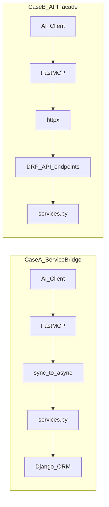

# MCP / FastMCP Reference Architecture

**Artifact ID**: 57
**Type**: Document (Reference)
**Required**: False
**Produced By Activity ID**: DTA (integration & API section of SAO)
**Consumers**: DTA → SAO authors; BPE plans that implement MCP

## Description

Portable blueprint for adding MCP to a Django application with FastMCP. Use during DTA; copy chosen modules into the project SAO. Peer to artifacts 53 (INFRA), 54 (CICD), 56 (AI Agent).

**Out of scope:** in-app agent loops (artifact 56); project-specific package maps and domain write pipelines.

---

# 0. Purpose & How to Use

## 0.1 What this is

A modular catalog for MCP on Django. Modules are optional unless the mission requires them. Dependencies are explicit so you assemble a stack without inventing glue.

## 0.2 DTA workflow

1. Answer mission questions (§1).
2. Pick Case A, Case B, or both (§2).
3. Treat tool descriptors as part of the contract (§3) — not polish.
4. Design payload discipline — filters, limits, batch tools (§4).
5. Choose transport topology (§5) — process model first, URL second.
6. Copy modules + proof into the project SAO; implement via §8 slices.

## 0.3 Design principles

- **Services (or API) are truth** — tools adapt; they do not own business rules.
- **Descriptors are the LLM UX** — weak docstrings produce wrong calls.
- **Default-narrow, explicit-widen** — list tools filter + limit; never dump unbounded history into the model.
- **Batch common “all matching X” intents** — one scoped mutation, not N× update round-trips.
- **MCP is its own process** — not a Django `urlpatterns` entry.
- **Async boundary is explicit** — FastMCP is async; Django ORM is sync.
- **Stdout is sacred on stdio** — logs go to file or stderr only.
- **Prove with real calls** — Client, direct tool, or process JSON-RPC.

---

# 1. Mission Assessment

| # | Question | Drives |
|---|----------|--------|
| Q1 | Consumers: local IDE only, or remote AI clients too? | stdio vs HTTP/SSE sidecar |
| Q2 | Must MCP run without Django/ORM in-process? | Case B |
| Q3 | Is there a stable token-authenticated DRF API? | Case B cost |
| Q4 | Same rules for Web, REST, and MCP? | Shared services (always) |
| Q5 | Auth: process user, PAT per call, or both? | Identity module |
| Q6 | Should end users avoid putting DB credentials in the IDE? | Distributable facade image (Case B) |
| Q7 | Do tools compose multiple API calls / side effects? | Facade orchestration vs fat service methods |

| Signal | Prefer |
|--------|--------|
| Local Django + IDE, fastest path | Case A |
| Public/minimal MCP image, no ORM | Case B |
| Both local speed and distributable client | Hybrid (A + B, aligned signatures) |
| API immature | Case A first; extract B later |
| Need parity audit tool↔endpoint | Case B + mapping table |

---

# 2. Two Integration Cases



## 2.1 Case A — Direct bridge to services

| | |
|--|--|
| **When** | MCP may load Django; lowest latency; API may lag the tool surface |
| **How** | Thin `@mcp.tool` wrappers call `*_service` methods via `sync_to_async` |
| **Guidance** | No business rules in tools; return JSON-safe dicts only; enforce authz inside services |
| **Integration** | Same services as views/ViewSets; `manage.py mcp_server` (or equivalent) after `django.setup()` |

```python
# Pattern: register_tools(mcp) per domain module
@mcp.tool()
async def list_items(*, user_id: str, active_only: bool = True) -> dict:
    """See §3 for full descriptor requirements."""
    return await sync_to_async(_list_items, thread_sensitive=True)(
        user_id=user_id, active_only=active_only
    )
```

**Layout:**

```
mcp/
  server.py                 # FastMCP singleton, initialize_mcp()
  context.py                # optional: contextvars current user
  tools/
    <domain>_tools.py       # register_tools(mcp) or plain functions
  management/commands/
    mcp_server.py           # stdio entry; no stdout noise
```

## 2.2 Case B — Facade over DRF

| | |
|--|--|
| **When** | Separate process/container; no ORM in MCP image; reuse API validation/auth |
| **How** | Sync tools call `httpx` with `Authorization: Token|Bearer …`; map status → exceptions |
| **Guidance** | Keep tool **names and signatures** aligned with Case A if both exist; prefer a dedicated `@action` when composition needs a transaction |
| **Integration** | Depends only on base URL + token; OpenAPI helps humans, descriptors help models |

```python
def create_item(name: str, category: str) -> dict:
    """See §3 for full descriptor requirements."""
    r = get_client().post("/api/items/", json={"name": name, "category": category})
    return check_response(r, "create_item")
```

**Layout:**

```
mcp_facade/
  server.py          # argparse: --server, --token, --transport
  client.py          # shared httpx.Client + check_response
  tools_http.py      # one tool → one or more endpoints
Dockerfile.mcp       # fastmcp + httpx only
```

**Composition:** a tool may call several endpoints (create + link) or API + local FS (export then write files). Document partial-failure behavior; push true transactions into the API.

## 2.3 Hybrid

Two adapters, one tool contract (names, params, errors, return shapes). Case A for in-process/local; Case B for the public image. Do not fork descriptors.

---

# 3. Tool Descriptors — The LLM Contract

**Tool descriptors are not documentation polish. They are the primary interface the model uses to choose tools and fill arguments. FastMCP turns type hints into JSON Schema and surfaces the docstring to the client. A vague docstring is a broken API: wrong tool selection, hallucinated parameters, wasted retries. Concrete examples in the docstring are what make correct first calls the default.**

Invest here before adding more tools.

## 3.1 What the model sees

| Source | Becomes |
|--------|---------|
| Function name | Tool name |
| Type hints (`Literal`, defaults, `Optional`) | JSON Schema constraints |
| Docstring body | Tool description text |
| Param docs with examples | Guidance for argument values |
| Return / raises docs | Expectations after the call |

## 3.2 Required elements

1. Verb-led name matching intent (`list_*`, `create_*`, `get_*`).
2. Opening sentence: **what** it does and **when** to use it.
3. Sentence or clause: **when not** to use it (if a sibling tool exists).
4. Every param: type + meaning + **Example:** value.
5. Return: field list + **Example:** payload.
6. Raises: what the model should do next (`ValueError` → fix args; `PermissionError` → stop/ask user).
7. For nested structures (`list[dict]`): a full example object in the docstring.

## 3.3 Bad vs good

### Pair 1 — Vague CRUD

**Bad** (model will invent fields):

```python
@mcp.tool()
async def update_item(id: int, data: dict) -> dict:
    """Update item."""
    ...
```

**Good:**

```python
@mcp.tool()
async def update_item(
    item_id: int,
    name: str | None = None,
    category: str | None = None,
    status: Literal["draft", "active"] | None = None,
) -> dict:
    """
    Update a draft item. Pass only fields to change.
    Do not use for released items — create a change proposal instead.

    :param item_id: Item primary key. Example: 42
    :param name: New display name, or omit. Example: "React Patterns"
    :param category: Taxonomy bucket, or omit. Example: "frontend"
    :param status: "draft" or "active", or omit. Example: "draft"
    :return: Updated item. Example: {"id": 42, "name": "React Patterns",
              "category": "frontend", "status": "draft", "version": "0.2"}
    :raises ValueError: unknown id, empty name, or duplicate name
    :raises PermissionError: item is released or caller is not owner
    """
    ...
```

### Pair 2 — Nested batch payload

**Bad** (model guesses key names and date formats):

```python
@mcp.tool()
async def create_log_entries(user_id: str, entries: list) -> dict:
    """Create log entries."""
    ...
```

**Good:**

```python
@mcp.tool()
async def create_log_entries(*, user_id: str, entries: list[dict]) -> dict:
    """
    Batch-create time-log entries for a day. Prefer direct foreign keys
    (imperative_id / objective_id) over legacy linked_to_* fields.

    :param user_id: Username. Example: "denis.petelin"
    :param entries: List of entry dicts. Each entry supports:
        - when: ISO-8601 UTC. Example: "2026-01-26T14:30:00Z"
        - duration: HH:MM:SS. Example: "02:00:00"
        - subject: Short label. Example: "Architecture work"
        - imperative_id: Optional link. Example: "3"
        - energy / mood: Optional 1–5. Example: 4
    :return: {"status": "ok", "created": [<entry dicts>]}
    :raises ValueError: invalid duration, unknown ids, or empty entries

    Example:
        entries = [{
            "when": "2026-01-26T14:30:00Z",
            "duration": "02:00:00",
            "subject": "Architecture work",
            "imperative_id": "3",
            "energy": 4,
            "mood": 4
        }]
    """
    ...
```

### Pair 3 — Enums and disambiguation

**Bad** (two similar tools; free-form status):

```python
@mcp.tool()
async def list_playbooks(status: str = "all") -> list:
    """List playbooks."""
    ...

@mcp.tool()
async def list_all_playbooks() -> list:
    """Get playbooks for user."""
    ...
```

**Good** (one tool, constrained filter, clear scope):

```python
@mcp.tool()
async def list_playbooks(
    status: Literal["draft", "released", "active", "all"] = "all",
) -> list:
    """
    List playbooks visible to the current user (owned + shared), newest first.
    Use get_playbook when you already know the id and need nested workflows.

    :param status: Filter. Example: "draft". Use "all" for no filter.
    :return: List of summaries. Example:
        [{"id": 1, "name": "React Dev", "status": "draft", "version": "0.1"}]
    :raises ValueError: if no user context is configured
    """
    ...
```

## 3.4 Merge gate

Before merging a tool, an engineer or agent must successfully call it from an IDE using **only** `tools/list` output — not the Python source. If they cannot, the descriptor failed.

List tools additionally fail the gate if they lack a documented default filter and a hard `limit` (or cursor). Batch tools fail if scope is unbounded (no filter and no id list).

---

# 4. Payload Discipline: Filters, Pagination, Batch Tools

MCP tool results are **model context**, not a UI table. An unbounded `list_*` that returns years of history can be thousands of lines: token blow-up, truncated JSON, IDE/client timeouts that look like “hangs”, and agents that retry or loop on partial data. **Default-narrow, explicit-widen.**

## 4.1 Why filters and limits are mandatory

| Failure mode | What happens |
|--------------|--------------|
| No filter, no limit | Entire table serialized into the tool result |
| Huge payload | Context window fills; later reasoning degrades or the call times out |
| Agent “fixes” it wrong | Calls the same list again, or pages manually with broken offsets |
| N× follow-up updates | Each row update re-sends context; cost and latency explode |

Therefore every list-style tool needs:

1. **Common-case filters** that match how users actually speak (“today”, “active only”, “this week”).
2. A **hard `limit`** (or page cursor) with a **safe default** and a **server-side max**.
3. **`total_count`** (and ideally `filters_applied`) so the model knows to narrow the query or fetch another page — instead of assuming “this is everything.”

Prefer a **summary tool** (`get_day_summary`, `get_today`) when the question is “how is today?” — do not dump full history by default.

## 4.2 How — common-case filters and pagination

**Bad** (will hang real deployments once data grows):

```python
@mcp.tool()
async def list_log_entries(*, user_id: str) -> dict:
    """List all log entries for the user."""
    ...
```

**Good** (filters first, `limit` default, `total_count` back):

```python
@mcp.tool()
async def list_log_entries(
    *,
    user_id: str,
    date: str | None = None,
    week_id: str | None = None,
    objective_id: str | None = None,
    imperative_id: str | None = None,
    search: str | None = None,
    limit: int = 100,
) -> dict:
    """
    List log entries with filters. Always pass the narrowest filter you can
    (prefer date or week_id). Default limit is 100; raise only if total_count
    shows you need another slice.

    :param user_id: Username. Example: "denis.petelin"
    :param date: ISO date filter. Example: "2026-01-02"
    :param week_id: Week id filter. Example: "1"
    :param objective_id: Objective id filter. Example: "5"
    :param imperative_id: Imperative id filter. Example: "3"
    :param search: Subject substring. Example: "meeting"
    :param limit: Max rows to return (default 100, server max 500). Example: 50
    :return: {"log_entries": [...], "total_count": 240, "filters_applied": {...}}
    """
    ...
```

**Common-case filter patterns** (teach these in descriptors):

| Pattern | Example tool shape | User phrase it serves |
|---------|-------------------|------------------------|
| Boolean default | `list_intents(..., active_only=True)` | “my intents” → not archived junk |
| Date / due | `list_objectives(..., due_date="2026-02-06")` | “today’s tasks” |
| Multi-dim + limit | `list_log_entries(date=…, limit=100)` | “what did I log this week?” |
| Small backlog cap | `get_backlog_objectives(..., limit=10)` | “what’s in the backlog?” |

**Guidance:**

- Name the top ~3 user phrases as real parameters — not a single opaque `q: str` if you can avoid it.
- Cap `limit` server-side (typical default 10–100; hard max 100–500 by entity density).
- Return `total_count` even when truncated so the model can refine filters.
- **Case B:** forward the same query params to DRF; unwrap `{results, count}` and expose `total_count` in the tool return — do not silently drop pagination metadata.
- Cursor/`offset` is fine when `limit` alone is not enough; document the paging params in the docstring with examples.

## 4.3 Why batch tools — filter then mutate once

**User intent:** “Reschedule all today’s tasks to tomorrow.”

**Bad agent path** (common without batch tools):

1. `list_objectives(due_date=today)` → 25 rows (already large if unfiltered history was used).
2. Twenty-five `update_objective(id, due_date=tomorrow)` calls.
3. N round-trips, N partial failures, context thrash — slow and fragile.

**Good path:**

1. Optional confirm: `list_objectives(due_date=today)` with a small `limit` / count.
2. One batch tool scoped by the **same common-case filter** (or by ids from that list).

**Flow:** user intent → filtered list → one batch mutation → summary (`updated_count`).

### Two batch styles

| Style | Signature idea | When |
|-------|----------------|------|
| **Filter-scoped** (preferred for NL) | `reschedule_objectives(from_due_date=…, to_due_date=…)` | User named a set (“all today”) |
| **Id-list** | `update_objectives(ids=[…], due_date=…)` | Model already listed and selected ids |

Ship list tools with common-case filters (`list_objectives(due_date=…)`) and batch create (`create_log_entries(entries=[…])`) first; add the **mutation twin** when journeys say “all matching X”.

### Good batch descriptor (illustrative)

```python
@mcp.tool()
async def reschedule_objectives(
    *,
    user_id: str,
    from_due_date: str,
    to_due_date: str,
    completed: bool = False,
) -> dict:
    """
    Move all objectives with from_due_date to to_due_date in one call.
    Use instead of calling update_objective per row. Only incomplete
    objectives are moved unless completed=True.

    :param user_id: Username. Example: "denis.petelin"
    :param from_due_date: Source due date YYYY-MM-DD. Example: "2026-02-06"
    :param to_due_date: Target due date YYYY-MM-DD. Example: "2026-02-07"
    :param completed: Include completed items (default False)
    :return: Summary only — not the full list. Example:
        {"updated_count": 12, "from_due_date": "2026-02-06",
         "to_due_date": "2026-02-07", "sample_ids": ["41", "42", "43"]}
    :raises ValueError: invalid dates, or zero matches when caller expected some
    """
    ...
```

### Batch anti-patterns

- List-all (no filter) then loop `update_*` per row.
- Batch with **neither** filter **nor** ids (accidental full-table update).
- Batch that returns the entire updated collection — return **`updated_count` + sample ids**; offer a filtered list if the user wants detail.

## 4.4 Payload merge gate

- List tool: documented common-case filter(s) + default `limit` + `total_count` in the return shape.
- Batch tool: explicit scope (filter and/or ids); refuses unbounded “all rows”; returns a summary.
- “All matching X” appears in a user journey → batch mutate is required, not optional polish.

---

# 5. Transport & Process Topology

MCP is **not** mounted through Django’s URL router. Reference implementations run FastMCP as a **separate process**. A public path like `/mcp` is a **reverse-proxy** concern, not a `path("mcp/", …)` view.

**Topology (summary):** local IDE → stdio → MCP process → services (Case A) or API (Case B); remote clients → reverse proxy → MCP process over HTTP/SSE.

## 5.1 Recommended patterns

| Pattern | Wiring | Use |
|---------|--------|-----|
| **Stdio** | `mcp.run(transport="stdio", show_banner=False, log_level="ERROR")` from a manage command or `__main__` | Local IDE (Cursor, Claude Desktop) |
| **HTTP sidecar** | Separate process: `mcp.run(transport="http", host=…, port=…)` **or** uvicorn on `mcp.http_app()` | Remote / cloud AI clients |
| **Legacy SSE sidecar** | `mcp.run(transport="sse", host=…, port=…)` | Older clients that still speak SSE |
| **Public `/mcp` URL** | nginx/ALB forwards `/mcp` → MCP process port; disable response buffering for streams | Friendly cloud URL without Django |

**Case A local:** one process loads Django + FastMCP (stdio).
**Case B remote:** MCP process has no Django; only httpx → API.
**Cloud “same host”:** still two processes (web + MCP); proxy joins them on one hostname.

## 5.2 Do not do this

```python
# WRONG — MCP is not a Django view
urlpatterns = [
    path("mcp/", somehow_fastmcp),  # does not work as people hope
]
```

Reasons: FastMCP’s HTTP stack is ASGI (Starlette), needs its own lifespan/session manager, conflicts with WSGI, and fights Django middleware/auth assumptions. Production deployments use a sidecar process, not Django URL routing.

## 5.3 Proxy sketch (public `/mcp`)

```nginx
location /mcp/ {
    proxy_pass http://127.0.0.1:8001/;  # MCP sidecar
    proxy_http_version 1.1;
    proxy_set_header Connection "";
    proxy_buffering off;                 # required for SSE/streamable HTTP
    proxy_read_timeout 3600s;
}
```

Health: expose a small `/health` on the MCP process for container probes (facade pattern).

## 5.4 Advanced — Starlette mount (not Django urls)

FastMCP can build an ASGI app and mount it in **Starlette/FastAPI**:

```python
from starlette.applications import Starlette
from starlette.routing import Mount
from fastmcp import FastMCP

mcp = FastMCP("App")
mcp_app = mcp.http_app(path="/")  # Streamable HTTP

app = Starlette(
    routes=[Mount("/mcp", app=mcp_app)],
    lifespan=mcp_app.lifespan,   # required — nested lifespans are not picked up
)
# run: uvicorn module:app
```

Use this when the **outer** app is already Starlette/FastAPI. Gluing the same into Django ASGI (Channels/`get_asgi_application` + Mount) is possible in theory and painful in practice (lifespan merge, workers, sync ORM). **This RA recommends the sidecar instead.**

Prefer Streamable HTTP (`http` / `http_app`) for new work; keep `sse` only for legacy clients.

---

# 6. Sync ↔ Async & Stdio Hygiene

## 6.1 Async boundary (Case A)

FastMCP invokes tools on an async event loop. Django ORM is sync.

| Rule | Detail |
|------|--------|
| Wrap sync work | `await sync_to_async(fn, thread_sensitive=True)(...)` |
| One unit of work | Prefer one sync helper over many tiny awaits |
| Prefetch inside sync | `select_related` / `list(qs)` before returning to async |
| JSON-safe returns | dict/list/primitives only; no model instances; stringify Decimals |
| Contextvars | `get_current_user()` usually needs `sync_to_async` from async tools |
| Escape hatch | `DJANGO_ALLOW_ASYNC_UNSAFE=true` hides errors; do not treat as architecture |

**Case B sync tools** avoid the ORM problem entirely — a reason facade images stay simple.

## 6.2 Stdio hygiene

On stdio transport, stdout is the protocol.

- Suppress Django setup prints (redirect during `django.setup()`).
- Remove console `StreamHandler`s; log to file and/or stderr.
- `requires_system_checks = []` on the manage command.
- `show_banner=False`, quiet FastMCP log level.
- Never `print()` or `self.stdout.write()` in the hot path.

---

# 7. Testing Tools

Use at least two tiers.

| Tier | How | Proves |
|------|-----|--------|
| **T1 Client** | `async with Client(transport=mcp) as c: await c.call_tool(...)` | Schema, registration, async path |
| **T2 Direct** | `await create_item(...)` (or sync facade fn) + real DB/API | Service/API wiring |
| **T3 Process** | Subprocess JSON-RPC `initialize` → `tools/list` → `tools/call` | Entrypoint + stdio cleanliness |

**T1 recipe — FastMCP Client (proves schema, registration, async path):**

```python
from fastmcp.client import Client

@pytest.fixture
async def mcp_client():
    # `mcp` is the FastMCP server instance imported from your server module
    async with Client(transport=mcp) as client:
        yield client

@pytest.mark.asyncio
@pytest.mark.django_db
async def test_list_items(mcp_client):
    result = await mcp_client.call_tool(
        name="list_items",
        arguments={"user_id": "test.user", "active_only": True},
    )
    assert "items" in result.data

@pytest.mark.asyncio
@pytest.mark.django_db
async def test_tool_names_registered(mcp_client):
    tools = await mcp_client.list_tools()
    tool_names = [t.name for t in tools]
    assert "list_items" in tool_names
    assert "create_item" in tool_names

@pytest.mark.asyncio
@pytest.mark.django_db
async def test_validation_error_is_actionable(mcp_client):
    # Blank required field must return a clear ValueError message, not a 500
    with pytest.raises(Exception, match="name"):
        await mcp_client.call_tool("create_item", arguments={"user_id": "test.user", "name": ""})
```

Also assert: Case B bad/missing token fails cleanly (403/401, not 500).

---

**T2 recipe — Direct service call (proves service/ORM wiring, no MCP overhead):**

```python
import pytest
from myapp.services import ItemService  # adjust import to your project

@pytest.mark.django_db
def test_create_item_persists(django_user_model):
    user = django_user_model.objects.create_user(username="test.user", password="pw")
    svc = ItemService()
    item = svc.create(user_id=user.pk, name="Widget", active=True)
    assert item.pk is not None
    assert item.name == "Widget"

@pytest.mark.django_db
def test_list_items_returns_active_only(django_user_model):
    user = django_user_model.objects.create_user(username="test.user2", password="pw")
    svc = ItemService()
    svc.create(user_id=user.pk, name="Active", active=True)
    svc.create(user_id=user.pk, name="Inactive", active=False)
    results = svc.list(user_id=user.pk, active_only=True)
    assert all(r["active"] for r in results)
    assert len(results) == 1
```

T2 uses the real DB (`@pytest.mark.django_db`), no mocks, no MCP transport. It is fast and runs without the async overhead of T1.

---

**T3 recipe — Subprocess JSON-RPC (proves entrypoint boots cleanly, no stdout noise):**

Required when **stdio transport** is selected. Verifies that the server process emits only valid JSON on stdout.

```python
import json
import subprocess
import sys

def _send(proc, payload: dict) -> dict:
    line = json.dumps(payload) + "\n"
    proc.stdin.write(line.encode())
    proc.stdin.flush()
    return json.loads(proc.stdout.readline())

def test_mcp_server_stdio_clean():
    proc = subprocess.Popen(
        [sys.executable, "-m", "myapp.mcp.server"],  # adjust to your entrypoint
        stdin=subprocess.PIPE,
        stdout=subprocess.PIPE,
        stderr=subprocess.PIPE,
    )
    try:
        # Step 1: initialize handshake
        resp = _send(proc, {
            "jsonrpc": "2.0", "id": 1, "method": "initialize",
            "params": {"protocolVersion": "2024-11-05", "capabilities": {}, "clientInfo": {"name": "test", "version": "0"}},
        })
        assert resp.get("result", {}).get("protocolVersion") is not None, "initialize failed"

        # Step 2: list tools
        resp = _send(proc, {"jsonrpc": "2.0", "id": 2, "method": "tools/list", "params": {}})
        tool_names = [t["name"] for t in resp["result"]["tools"]]
        assert "list_items" in tool_names

        # Step 3: call a read tool
        resp = _send(proc, {
            "jsonrpc": "2.0", "id": 3, "method": "tools/call",
            "params": {"name": "list_items", "arguments": {"active_only": False}},
        })
        assert "error" not in resp, f"tool call failed: {resp}"

        # Step 4: verify no stray stdout noise before/between responses
        # (all non-JSON stdout would have broken json.loads above)
    finally:
        proc.terminate()
        proc.wait()
        stderr_output = proc.stderr.read().decode()
        # Logging goes to stderr — that is fine; assert it is not empty only if you expect startup logs
        assert "Traceback" not in stderr_output, f"server crashed:\n{stderr_output}"
```

Key assertion: if any `print()` or Django startup message reached stdout, `json.loads` would have raised before reaching this point — so passing the test proves stdout is clean.

---

# 8. Modules, Profiles, Proof, Slices

## 8.1 Module map

| ID | Module | Role |
|----|--------|------|
| M1 | Transport | stdio and/or HTTP/SSE sidecar |
| M2 | Server core | FastMCP instance, lifecycle, logging |
| M3 | Tool surface | Names, schemas, **descriptors**, filters/limits/batch (§4) |
| M4a | Service adapter | Case A → `services.py` |
| M4b | HTTP adapter | Case B → DRF via httpx |
| M5 | Identity | Process user / PAT / `who_am_i` |
| M6 | Error contract | `ValueError` / `PermissionError` / 5xx mapping |
| M7 | Test harness | T1–T3 |
| M8 | Distribution | manage command and/or Docker facade |
| M9 | Parity (Case B) | Tool ↔ endpoint map |

**Deps:** M3 → exactly one of M4a/M4b per process; M4a → services → ORM; M4b → HTTP → API → services; M2 → M1+M3+M5+M6.
**Forbidden:** tools → models; facade → ORM.

## 8.2 Profiles

| Profile | Modules | When |
|---------|---------|------|
| **Desktop A** | M1 stdio, M2, M3, M4a, M5, M6, M7, M8 manage | Single-user local |
| **Facade B** | M1 HTTP/SSE, M2, M3, M4b, M5 token, M6, M7, M8 Docker, M9 | Public image / no ORM |
| **Hybrid** | Desktop A + Facade B, shared tool contract | Local + distributable |

## 8.3 Integration proof (DoD)

1. `tools/list` matches the contracted set.
2. Happy path via T1 or T3.
3. Auth failure controlled (bad token / missing user).
4. Validation → actionable `ValueError`.
5. Mutations go through services (assert side effects).
6. Stdio session: no banner/log pollution on stdout.
7. Facade (if any): runs with base URL + token only.
8. Descriptor gate (§3.4) passed for every new tool.
9. Payload gate (§4.4): list tools filter+limit+`total_count`; batch tools scoped; no unbounded dumps.

## 8.4 Build slices

| Slice | Deliverable |
|-------|-------------|
| S0 | Mission answers + profile in SAO |
| S1 | Server core + logging hygiene + empty registry |
| S2 | First read tool + **full descriptor** + filters/`limit` + T1/T2 |
| S3 | First write tool through service/API + error contract |
| S4 | Expand by bounded context; registration count test |
| S5 | Batch mutate when journey says “all matching X” (filter→batch) |
| S6 | (Hybrid/B) facade + Docker + proxy `/mcp` + T3 |
| S7 | Parity table (Case B); IDE smoke on descriptors + payload gate |

---

*Generic reference. Project SAOs adapt modules and name their write-policy constraints; they do not belong in this artifact.*
