# Inception

**Phase ID**: 6
**Order**: 1
**Activities**: 26

## Description

Inception phase establishes the product vision, UX specification, and software architecture before any code is written. Workflow execution sequence: (1) ESM - Envision the System: produces user journey, screen flows, feature files, and mockups. (2) DTA - Define Technical Architecture: consumes ESM artifacts to produce the System Architecture Overview (SAO.md). DTA must complete before DSP can begin since DSP requires the tech stack from SAO.md. NOTE: DSP (Define Software Process) has been moved to the Elaboration phase because it depends on DTA output. Both ESM and DTA must be complete before transitioning to Elaboration.

---

## Inception DAG

Use this diagram to track progress through the phase. Each node is a checkpoint — activities produce artifacts (cylinders), gates require explicit human approval before continuing.

```mermaid
flowchart TD

    %% ── ESM: Envision System ─────────────────────────────
    subgraph ESM["ESM — Envision System"]
        direction TB
        ESM01["ESM-01: Establish Conventions"]
        ESM02["ESM-02: Define User Journey"]
        UJ[("user_journey.md")]
        GATE_A{"Gate A: User Journey Review"}
        ESM03["ESM-03: Define Information Architecture"]
        IA[("IA_guidelines.md")]
        ESM04["ESM-04: Create Dialogue Maps"]
        SF[("screen-flow.drawio")]
        ESM05["ESM-05: Write Feature Files"]
        FF[("docs/features/act-X/*.feature")]
        ESM06["ESM-06: Create Mockups"]
        MK[("mockups/ + templates/mockups/")]
        ESM07["ESM-07: Feed into Implementation"]

        ESM01 --> ESM02
        ESM02 --> UJ
        UJ     --> GATE_A
        GATE_A --> ESM03
        ESM03  --> IA
        UJ     --> ESM04
        IA     --> ESM04
        ESM04  --> SF
        SF     --> ESM05
        ESM05  --> FF
        FF     --> ESM06
        UJ     --> ESM06
        IA     --> ESM06
        SF     --> ESM06
        ESM06  --> MK
        MK     --> ESM07
    end

    %% ── DTA: Define Architecture ─────────────────────────
    subgraph DTA["DTA — Define Architecture"]
        direction TB
        DTA01["DTA-01: Analyze ESM Artifacts"]
        DTA02["DTA-02: Application Blocks"]
        DTA03["DTA-03: Integration and API Design"]
        DTA04["DTA-04: Code Organization"]
        DTA05["DTA-05: Data Architecture"]
        DTA06["DTA-06: Test Strategy"]
        DTA07["DTA-07: Performance and Scalability"]
        DTA08["DTA-08: Error Handling and Resilience"]
        DTA09["DTA-09: Infrastructure"]
        DTA10["DTA-10: CI/CD Pipeline"]
        DTA11["DTA-11: Release and Rollback"]
        DTA12["DTA-12: Observability"]
        DTA13["DTA-13: Config and Secrets"]
        DTA14["DTA-14: Security"]
        DTA15["DTA-15: Backup and Recovery"]
        DTA16["DTA-16: Developer Experience"]
        DTA17["DTA-17: Documentation Strategy"]
        DTA18["DTA-18: Write SAO.md"]
        SAO[("docs/architecture/SAO.md")]
        GATE_B{"Gate B: SAO Review"}

        DTA01 --> DTA02 --> DTA03 --> DTA04 --> DTA05 --> DTA06
        DTA06 --> DTA07 --> DTA08 --> DTA09 --> DTA10 --> DTA11
        DTA11 --> DTA12 --> DTA13 --> DTA14 --> DTA15 --> DTA16
        DTA16 --> DTA17 --> DTA18
        DTA18 --> SAO --> GATE_B
    end

    %% ── Cross-workflow edges ──────────────────────────────
    ESM07 --> DTA01
    UJ    -.-> DTA01
    IA    -.-> DTA01

    %% ── Phase exit ───────────────────────────────────────
    GATE_B --> ELAB["Elaboration: Plan Sprint / Execute Sprint"]

    %% ── Styles ───────────────────────────────────────────
    classDef activity fill:#dbeafe,stroke:#2563eb,color:#1e3a5f
    classDef artifact fill:#dcfce7,stroke:#16a34a,color:#14532d
    classDef gate     fill:#fef9c3,stroke:#ca8a04,color:#713f12
    classDef exit     fill:#f0fdf4,stroke:#15803d,color:#14532d

    class ESM01,ESM02,ESM03,ESM04,ESM05,ESM06,ESM07 activity
    class DTA01,DTA02,DTA03,DTA04,DTA05,DTA06,DTA07,DTA08,DTA09,DTA10,DTA11,DTA12,DTA13,DTA14,DTA15,DTA16,DTA17,DTA18 activity
    class UJ,IA,SF,FF,MK,SAO artifact
    class GATE_A,GATE_B gate
    class ELAB exit
```

### Legend

| Style | Meaning |
|---|---|
| Blue rectangle | Activity (action to perform) |
| Green cylinder | Artifact (file produced on disk) |
| Yellow diamond | Gate — **requires explicit human approval** before continuing |
| Solid arrow `→` | Primary dependency (must complete first) |
| Dashed arrow `-.->` | Secondary input (document read, not blocking sequencing) |
