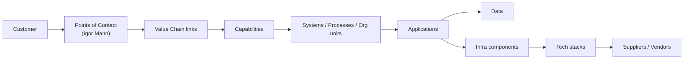
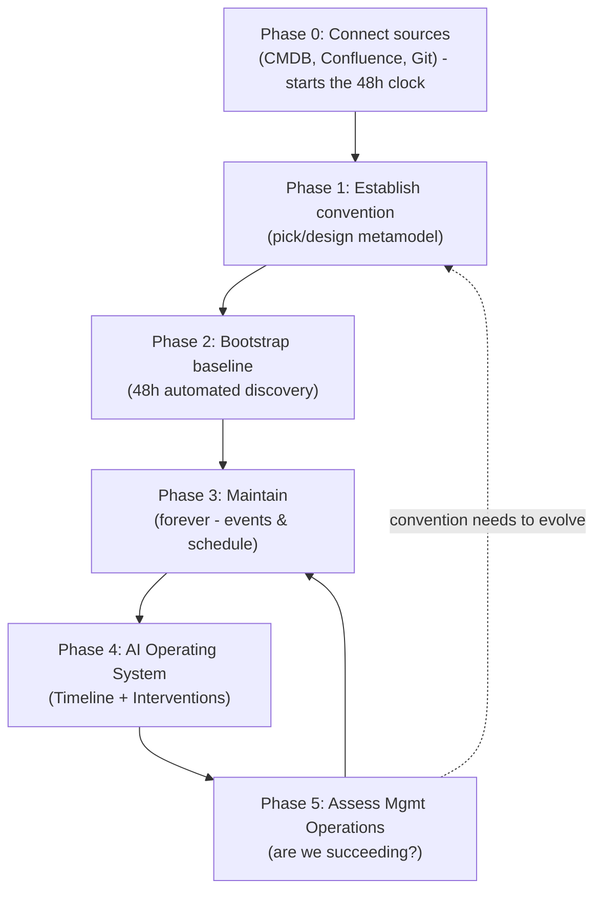

# Context

Yggdrasil is a part of the FeatureFactory Family of the systems.
FeatureFactory is a framework to build AI-native organizations.
There is human factor - building Octopus organization; has nothing to do with the software - pure culture and org. design. It all starts with the "nerve ring" team building a platform and Playbooks how to use it for the "arm" teams.
Mimir is the system to store, serve, and evolve playbooks - via PIPs.

All projects run by the **"arm" teams are tracked by Hugin** - who can access Playbooks, spot deviations and/or failures, and direct Human attention there.

But are these projects meaningful for the organization? To set priorities and focus attention we need to understand who do we serve, what is our value chain, which capabilities we already have and which we do not, which systems/processes/org. units we have for this, which apps they use, which data they provide, what infra components these app rely upon, which technology stacks we employ for this, which suppliers provide them etc.

***Yggdrasil gives any organization a living architecture repository — bootstrapped from your existing repos, CMDBs, and Confluence  [in 48 hours]**, and **kept current forever after by Ratatosk** - so people and AI agents can safely understand and change systems.*

*Leadership gets the strategic clarity to make decisions grounded in reality. Your AI gets a depth of context no human team could hold — and delivers work of unimaginable quality as a result.*

It follows a metamodel (Zachman, TOGAF etc) to organize this information, enabling Model-Driven-Engineering (MDE) for the AI operating as an agent or as an assistant in an Agentic Development Environment (ADE). For every component, Yggdrasil knows three things:

1. *Structural* - what do we have and what consists of what (think: org charts and what they own, APIs connected to the API Portal etc.)
2. *Behavioral* - how these components interact with each other (think: we have a value proposition which requires an app which has pages talking to an API which relies on servers to serve them etc.)
3. *State* - what is the current state of the component and what is the current state of the process building it (think: "Email campaigns have 21 out of 34 outstanding; they have persistent bug problems with bug count not going down and availability being less than 96%")

# The Promise

Every architecture repository ever built dies the same way: a human has to keep it current, and no human ever does. The diagram is true the day it is drawn and fiction a sprint later. This is why LeanIX, Ardoq, ArchiMate models, and Confluence wikis all rot — the concept is right, but maintenance is a tax nobody pays.

Yggdrasil breaks the cycle by removing the human from maintenance entirely.

| Every EA tool before Yggdrasil            | Yggdrasil                                          |
| ----------------------------------------- | -------------------------------------------------- |
| Humans maintain it → it rots within weeks | Ratatosk maintains it → it compounds over time     |
| Big-bang consultancy project to bootstrap | 48h automated discovery from your existing systems |
| A snapshot of a moment already gone       | A living model, updated on every event and merge   |

**The entry-point bet:** lead with AI-native, Octopus-from-the-get-go organizations — greenfield, no incumbent tool to displace, and a nerve-ring team that adopts Yggdrasil as part of building the platform. Time-to-value is measured in weeks. Enterprises come second: they have the deepest pain and the biggest budgets, but also the longest sales cycles — and Ratatosk's automated bootstrap is exactly what removes the #1 reason their EA repositories fail. Build for greenfield, design the metamodel to be enterprise-grade from day one, and let enterprises come to you when they see a repository that actually stays current.

# The Driver: Customer-centric innovation - from Customer to Component

Everything in Yggdrasil is either **demand** or **supply**. The value chain and the customer Points of Contact are the demand — the reason the organization exists. Capabilities, systems, apps, data, infra, stacks, and vendors are the supply that serves it. The value chain is therefore not one use case among many: it is the **spine** that gives every other element its meaning.

Modelled as a traceability chain, it lets Yggdrasil answer the founding question — *"is this meaningful for the organization?"* — by construction:

**Points of Contact (per Igor Mann)** are first-class Elements: each sits at a position in the customer journey and carries a health/quality signal (the state representation Ratatosk already maintains), with edges down into the capabilities and systems that deliver it. Modelling touchpoints this way turns "find and improve your touchpoints" from a marketing poster into a queryable, always-current model.

Because every component traces *up* the spine to a Point of Contact, two questions become answerable at any time:

- **Orphan detection:** a component that serves no Point of Contact is overhead — a candidate to cut. (This is what gives the Redundancy radar and TCO use cases their *reason*.)
- **Blast-radius / weakness:** when a Point of Contact is failing, trace *down* the spine to the capabilities, apps, teams, and vendors behind it — and see their current state.

Everything below in Personas and Use Cases hangs off this spine.

# Personas & their Jobs to Be Done (JTDs)

Personas are grouped to mirror the entry-point bet: **Adopters & Builders** are the AI-native, Day-1 users who adopt Yggdrasil while building the platform; **Leadership & Governance** are the roles whose value compounds as the repository matures — and where the enterprise budget eventually lives.

## Adopters & Builders (AI-native, Day 1)

### Platform / Nerve-Ring Lead

**Mission:** Stand up the platform and Playbooks the arm teams build on — and make sure they actually get used.
**Jobs to be done:**

- Expose what the platform already offers so arm teams stop reinventing wheels.
- Track adoption and health of platform capabilities per arm team.
- Adopt Yggdrasil as part of building the platform, not as an afterthought.

**Pains:** Every arm team rebuilds the same capability; no map of what the platform provides; adoption is invisible until something breaks.
**Gains:** Yggdrasil ships alongside the platform; capability and ownership map exists from week one; Ratatosk keeps it true without a docs team.
**Time-to-value:** Day 1 — capability/ownership map from the first bootstrap; Compounds — adoption trends and reuse metrics as the platform grows.

---

### Software Architect

**Mission:** Ensure the technical design of a system is sound, documented, and understood by everyone building it.
**Jobs to be done:**

- Maintain structural and behavioral views (C4, component diagrams, sequence flows) that reflect the live codebase.
- Assess complexity hotspots and error-prone modules before they accumulate.
- Communicate design decisions and their rationale across team boundaries.

**Pains:** Architecture diagrams become fiction after the first sprint; no automated way to keep them aligned with code; context is lost when people leave.
**Gains:** Ratatosk in CI/CD keeps views in sync with every merge; complexity metrics surfaced automatically; views queryable via API/MCP from any tool.
**Time-to-value:** Day 1 — structural/behavioral views reconstructed from the codebase; Compounds — views stay live on every merge, complexity trends emerge.

---

### Development Team Lead

**Mission:** Keep the team shipping value without being blocked by unclear interfaces or outdated documentation.
**Jobs to be done:**

- Understand upstream/downstream system contracts before starting integration work.
- Keep the team's Asset Card (components, owners, state) current without manual effort.
- Know at a glance what's broken or drifting in the codebase.

**Pains:** Integration surprises because the landscape changed; docs that are always stale; context-switching to find who owns what.
**Gains:** Ratatosk keeps the Asset Card fresh automatically; semantic queries answer "who do I talk to about service X?" instantly.
**Time-to-value:** Day 1 — Asset Card and interface map from the bootstrap; Compounds — never goes stale, so onboarding and integration stay frictionless.

---

### The Organizational AI (agent / ADE assistant)

**Mission:** Do work of unimaginable quality by grounding every action in the organization's real structure, behavior, and state — not in guesses.
**Jobs to be done:**

- Query live ground truth (structural / behavioral / state) before planning or acting.
- Resolve ownership, dependencies, and contracts to act safely across the landscape.
- Feed MDE: read the model, propose changes, and write updates back through Ratatosk.

**Pains:** Hallucinates architecture that doesn't exist; no authoritative source to query; context is stale the moment it's captured.
**Gains:** A live, queryable model of the whole organization via MCP/API; depth of context no human team could hold.
**Time-to-value:** Day 1 — queryable ground truth from the first bootstrap; Compounds — every event and merge sharpens the context it reasons over.

## Leadership & Governance (scales into enterprise)

### CTO

**Mission:** Translate technology into competitive advantage and ensure the portfolio of systems evolves with the business.
**Jobs to be done:**

- Understand which capabilities the org has vs. needs to build or buy.
- Make technology sunset/sunrise decisions backed by actual landscape data.
- Demonstrate to the board that tech investments map to business outcomes.

**Pains:** Decisions made on stale slide-decks and tribal knowledge; no single view of what exists, what's healthy, and what's a liability.
**Gains:** Always-current capability map; can ask "what do we own that supports X?" and get a defensible answer in seconds.
**Time-to-value:** Day 1 — first capability map of the real landscape; Compounds — sunset/sunrise decisions backed by live health and cost trends.

---

### CFO

**Mission:** Control costs and connect every dollar spent in tech to a measurable business return.
**Jobs to be done:**

- See full TCO per component, stack, or vendor — not just licences.
- Map P&L lines to the capabilities that drive them.
- Spot redundant spend (duplicate tools, zombie systems, overlapping contracts).

**Pains:** Tech costs arrive as opaque vendor invoices; no linkage between budget lines and value delivered.
**Gains:** Cost Breakdown Structure drillable by vendor, capability, team, or product; can answer "what does it cost to fulfil an order end-to-end?" on demand.
**Time-to-value:** Day 1 — vendor and component inventory to attach costs to; Compounds — full TCO and P&L-to-capability mapping as financial data links in.

---

### Program Manager

**Mission:** Deliver cross-team initiatives on time and surface risks before they become crises.
**Jobs to be done:**

- Track roadmap themes and epics across multiple teams with RAG status.
- Run Monte Carlo on release milestones and show confidence distributions.
- Identify upstream/downstream dependencies that block delivery.

**Pains:** Status is gathered manually every sprint; dependency maps live in someone's head; surprises arrive late.
**Gains:** Real-time portfolio state; probabilistic release forecasts; dependency graph auto-maintained by Ratatosk.
**Time-to-value:** Day 1 — dependency graph reconstructed from trackers; Compounds — live RAG status and Monte Carlo forecasts as delivery data accrues.

---

### VP Engineering

**Mission:** Grow engineering throughput while keeping quality and morale high.
**Jobs to be done:**

- Identify which teams or modules are systematically under pressure (cycle time, defect density, availability).
- Prioritise where to invest in tech debt reduction vs. new capability.
- Onboard new teams quickly onto existing standards and architecture.

**Pains:** Health metrics scattered across Jira, dashboards, and spreadsheets; hard to compare teams fairly; onboarding takes weeks.
**Gains:** Unified project-level health view (process + technology pillars); auto-generated onboarding packages per asset.
**Time-to-value:** Day 1 — unified health baseline across teams; Compounds — trends reveal systemic pressure and where investment pays off.

---

### Enterprise Architect

**Mission:** Define and enforce the metamodel that keeps the entire organizational landscape coherent and navigable.
**Jobs to be done:**

- Design and evolve the metamodel (elements, relations, stereotypes, packages).
- Audit landscape integrity — missing links, wrong stereotypes, orphaned components.
- Govern permissions so the right people can see and change the right things.

**Pains:** Architecture models drift from reality within weeks of being drawn; no automated enforcement; permissions managed ad hoc.
**Gains:** Ratatosk continuously reconciles reality against the metamodel; integrity violations surface automatically; PBAC enforces governance without manual policing.
**Time-to-value:** Day 1 — metamodel established and baseline populated; Compounds — continuous integrity reconciliation as the landscape evolves.

# Use cases

Each use case is tagged with its primary persona and a **Day 1 vs. Compounds** marker — what the 48h bootstrap delivers versus what maturing data unlocks. Four **flagship** use cases (the wedge scenarios) are elaborated with *Who / Trigger / What Yggdrasil shows / Outcome*. Source frameworks are noted in parentheses.

## Organizational Level

### Know our value chain & required capabilities and Points of Contact [with the Customer; per Igor Mann]

Map who we serve, the value chain that serves them, the capabilities each link requires, and the customer touchpoints along the way. This is the traceability spine described in [The Driver](#the-driver-customer-centric-innovation---from-customer-to-component) — every other element hangs off it, enabling orphan detection (supply serving no touchpoint) and blast-radius analysis (what sits behind a failing touchpoint).
*Who: CTO / CEO · Day 1 → first draft of the value chain and capability map · Compounds → touchpoints and capability gaps sharpen as data links in*

### Know Data we have → construct Data Lake to operate & consume

Data entities catalogue: what data exists, who owns it, who consumes it, lineage. Feeds Data Lake design and data-mesh ownership decisions.
*Who: CTO / Data Lead · Day 1 → catalogue of what data exists and who owns it · Compounds → lineage and consumption paths as pipelines connect*

### Know TCO for every Component we operate

Total cost of ownership per component — licences, infra, people, and operational overhead — not just the invoice line.
*Who: CFO · Day 1 → component inventory to attach costs to · Compounds → full TCO as financial and usage data link in*

### Cost Breakdown Structure — by any combination of factors *(flagship)*

**Who:** CFO
**Trigger:** Board asks "what are we actually spending on X?" and the answer takes three analysts a week.
**What Yggdrasil shows:** Cost rolled up or drilled down by any dimension — vendor, capability, team, product, tech stack — because every cost is attached to a component in the graph. Example: "R&D" 2.5M → 3 new products A, B, C → A 1.5M, B 2M, C 3M in revenue.
**Outcome:** Any cost question answered in seconds, defensibly, from a single source.
*Day 1 → spend by vendor and component · Compounds → arbitrary drill-downs as cost and revenue data link to capabilities*

### Map P&L to the Capabilities and/or components

Connect revenue and cost lines to the capabilities and components that produce them, so investment can be judged by return.
*Who: CFO / CTO · Day 1 → capabilities and components to map P&L onto · Compounds → live P&L-to-capability attribution*

### Technology sunset/sunrise roadmaps

Which technologies are declining (sunset) vs. emerging (sunrise), with the components and capabilities riding on each.
*Who: CTO / Enterprise Architect · Day 1 → inventory of stacks in use and their dependents · Compounds → migration effort and risk as state data accrues*

### AS-IS → TO-BE gap map *(TOGAF, flagship)*

**Who:** Enterprise Architect / CTO
**Trigger:** Strategy sets a target ("we will be event-driven and multi-region in 18 months") but no one can size the distance from today.
**What Yggdrasil shows:** The current capabilities and building blocks (AS-IS, straight from the live model) laid against what the strategy requires (TO-BE), with the delta and migration path between them.
**Outcome:** Investment is prioritised against real gaps, not assumptions; the roadmap has a defensible starting point.
*Day 1 → AS-IS baseline from the bootstrap · Compounds → gap and migration tracking as the landscape moves toward TO-BE*

### Architecture Building Blocks (ABBs) catalogue *(TOGAF)*

Reusable patterns and solutions the org has already validated. New projects start from the catalogue, not from a blank page.
*Who: Enterprise Architect / Software Architect · Day 1 → catalogue of patterns already in use · Compounds → curated, reused building blocks as the org standardises*

### Vendor risk map *(LeanIX)*

Vendor concentration risk, contract expiry dates, single points of supply failure. Surfaced per capability and per tech stack.
*Who: CFO / CTO · Day 1 → vendors mapped to the components they supply · Compounds → concentration and expiry risk as contract data links in*

### Redundancy radar *(LeanIX)*

Applications doing the same job for the same capability — consolidation candidates with estimated cost-of-duplication.
*Who: CTO / Enterprise Architect · Day 1 → overlapping apps per capability · Compounds → quantified cost-of-duplication as usage and cost data accrue*

### Governance compliance *(TOGAF Architecture Governance)*

Are running systems conformant to the approved reference architecture? Deviations flagged automatically by Ratatosk.
*Who: Enterprise Architect · Day 1 → conformance snapshot against the reference architecture · Compounds → continuous deviation flagging on every change*

### Platform health & adoption *(Octopus / FeatureFactory)*

What the nerve-ring team provides; adoption rate and health score per arm team. Identifies under-used platform capabilities vs. reinvented wheels.
*Who: Platform / Nerve-Ring Lead · Day 1 → what the platform offers and who uses it · Compounds → adoption and reuse trends over time*

### Capability ownership map - "work chart" *(Octopus)*

Which arm team owns which capability; gaps where no team is accountable. Linked to Mimir playbooks — flags capabilities with no governing playbook.
*Who: Platform / Nerve-Ring Lead / CTO · Day 1 → ownership map with accountability gaps · Compounds → playbook coverage as Mimir links in*

### AI queries live ground truth *(new-angle flagship)*

**Who:** The Organizational AI (agent / ADE assistant)
**Trigger:** An agent is asked to change or extend a system and must not hallucinate the architecture it's acting on.
**What Yggdrasil shows:** Live structural, behavioral, and state facts on demand via MCP/API — what exists, what depends on what, who owns it, and its current health — the same model Ratatosk keeps current.
**Outcome:** The AI plans and acts on ground truth instead of guesses, and writes changes back through Ratatosk; work quality rises because context is real and never stale.
*Day 1 → queryable ground truth from the first bootstrap · Compounds → every event and merge sharpens the context the AI reasons over*

## Program / Portfolio Level

### Roadmap & state of the themes / epics

State of every theme/epic at a glance: Dark (no data), plus RAG status where data exists.
*Who: Program Manager · Day 1 → themes/epics reconstructed from trackers · Compounds → live RAG status as delivery data flows*

### Release/milestone confidence *(Disciplined Agile)*

Run Monte Carlo → show distribution: Jun 1 P(V1) = 0%, Aug 1 P(V1) = 100%
*Who: Program Manager · Day 1 → milestone scope and history to model · Compounds → tighter forecasts as throughput data accrues*

### Value stream map *(Gene Kim — First Way: Flow, flagship)*

**Who:** Program Manager / VP Engineering
**Trigger:** A release keeps slipping and no one can say where the time goes.
**What Yggdrasil shows:** The feature's full path from idea to production across every team and component, with wait time at each handoff — drawn from the behavioral + state representations Ratatosk already maintains.
**Outcome:** The bottleneck handoff is named and quantified; WIP is rebalanced against the constraint instead of guessed at.
*Day 1 → the path and handoffs reconstructed · Compounds → wait-time and queue metrics as flow data accrues*

### Cross-team dependency graph *(Disciplined Agile)*

Teams as nodes, dependencies as directed edges. Flag bidirectional and circular dependencies before they stall delivery.
*Who: Program Manager · Day 1 → dependency graph from trackers and code · Compounds → live edges as new dependencies form*

### WIP ceiling per value stream *(Lean / Disciplined Agile)*

Visualise in-flight initiatives against org capacity. Surface overloaded value streams before commitments are missed.
*Who: Program Manager / VP Engineering · Day 1 → in-flight initiatives per stream · Compounds → capacity vs. load trends over time*

## Project Level

### Pillar: process — assess state

Cycle time, defect density, and such.
*Who: VP Engineering / Development Team Lead · Day 1 → process baseline from tracker history · Compounds → trends reveal systemic process drag*

### Pillar: technology — assess state

Complexity, error-prone modules, etc.
*Who: Software Architect / VP Engineering · Day 1 → complexity and hotspot baseline · Compounds → drift and decay tracked per release*

### DORA metrics per component *(Gene Kim — Second Way: Feedback)*

Deployment frequency, lead time for changes, MTTR, change failure rate — surfaced next to the component in the knowledge graph. Trends visible across releases.
*Who: VP Engineering / Software Architect · Day 1 → first DORA snapshot from pipeline history · Compounds → trends per component across releases*

### Process tailoring register *(Disciplined Agile)*

Which lifecycle (Scrum / Kanban / Lean / SAFe) each team uses and why. Flag mismatches between chosen process and the nature of the work.
*Who: Program Manager / Development Team Lead · Day 1 → which process each team runs · Compounds → fit/mismatch signals as delivery data accrues*

### Post-mortem linkage *(Gene Kim — Third Way: Continuous Learning)*

Incidents attached to the components they affect. Patterns across components surfaced automatically — systemic fragility becomes visible before the next outage.
*Who: VP Engineering / Software Architect · Day 1 → past incidents linked to components · Compounds → cross-component fragility patterns emerge*

## Team Level (multiple teams in a big project)

Team can have multiple projects/components it is working on.

### Produce onboarding package

Auto-generated per-asset primer: what the component is, how it fits, who owns it, its current state and interfaces — so a new joiner is productive in days, not weeks.
*Who: Development Team Lead · Day 1 → onboarding package from the bootstrap · Compounds → always current, so onboarding never goes stale*

### Integrate with upstream/downstream systems

Know the contracts, owners, and current state of every system the team connects to before writing a line of integration code.
*Who: Development Team Lead · Day 1 → upstream/downstream contracts mapped · Compounds → contract changes surfaced as they happen*

### Interface inventory *(LeanIX)*

Every interface the team's components expose or consume: protocol, SLA, owner, version, deprecation status. Eliminates integration surprises.
*Who: Development Team Lead / Software Architect · Day 1 → interface inventory from code and trackers · Compounds → version and deprecation status kept live*

### Maintain Asset Card up to date

The living record for each asset — components, owners, dependencies, state — kept current by Ratatosk instead of by hand.
*Who: Development Team Lead · Day 1 → Asset Card populated from the bootstrap · Compounds → never stale, updated on every event and merge*

### Codebase State

Current health of the codebase: complexity, error-prone modules, test coverage, drift from the documented architecture.
*Who: Software Architect / Development Team Lead · Day 1 → codebase health baseline · Compounds → drift and decay tracked on every merge*

### Playbook-to-capability traceability *(Mimir / FeatureFactory)*

Mimir playbooks linked to the capabilities they govern. Hugin can flag "this capability has no playbook" or "this playbook is not being followed."
*Who: Platform / Nerve-Ring Lead · Day 1 → playbooks linked to capabilities · Compounds → coverage and adherence signals via Hugin*

## IT Management

### Identify Systematic Problems

Spot recurring failure patterns across services — the same root cause surfacing in different components — before they become outages.
*Who: VP Engineering / IT Ops · Day 1 → known problems linked to components · Compounds → systemic patterns emerge across the estate*

### Current Services State

Live operational state of every service: availability, incidents, health — next to its place in the architecture.
*Who: IT Ops · Day 1 → services inventory with last-known state · Compounds → live health as monitoring data links in*

### Replace application/stack

Assess blast radius before replacing anything: what depends on it, who owns those dependents, and what the migration entails.
*Who: CTO / Enterprise Architect · Day 1 → dependency and ownership map for the target · Compounds → migration risk sharpens as state data accrues*

# How Ratatosk Works

Ratatosk is the mechanism that delivers the promise: a super-powered System Analyst that operates in the given metamodel (Zachman, TOGAF etc), maintains the integrity of the links (to/from; proper stereotypes applied), the state of the components, and the data associated with them. The first three modes below are how Ratatosk **bootstraps** the repository from what you already have — in hours, not months. The fourth is how it **maintains** the baseline forever after, embedded at the point where change actually happens.

## Bootstrap: CMDB scan

Reads ServiceNow, OpenView whatnot -> identifies assets, their repos, metamodels used, current state of the artifacts (think: "this project uses C4 to capture System Architecture Overview; Components are fine but everything else is missing") -> launches subagents to discover gaps and bring Models into shape.

## Bootstrap: unstructured knowledge

Scan Confluence/shared folders/email boxes/Slack chats etc -> maps them into the metamodel used by organization: reconstructs value chain, org chart, capabilities, tech stacks etc.

## Bootstrap: code & issue trackers

Scans GitLab/GitHub/Jira (the sources of structured data). We can discover both assets and their current state from there - for codebases with high fidelity, from the issues - more or less high (depends on the state of the issues - details, how stale they are etc.), infra components (where pipelines deploy etc.)

## Maintain: CI/CD pipeline agent

Works well when the landscape is already mapped - reads whats going on inside the incoming changes, reconciles against the metamodel used in the Project (example: OpenUP and its static and behavioral representations), decides what needs to be updated (example: Component View, Screen Flow View), plans what exactly has to be updated (example: add "Apply humbling" button to screen X, add modsToolbar to the Component View).

# The flow

The flow is not a linear project — it's a loop. The one-time cost is the **48h bootstrap**; everything after it is a self-sustaining cycle that keeps the model true and turns it into action. This is what "bootstrapped in 48 hours, kept current forever after" looks like as a lifecycle.

**Phase 0 — Connect sources.** Point Ratatosk at the systems you already have: CMDB, Confluence/Slack/shared drives, GitLab/GitHub/Jira. This is the only manual setup step, and it starts the 48h clock.

**Phase 1 — Establish convention.** Pick or design the metamodel. Everything is described as an Element (Vertex; think "Application") or Relation (Edge; think "depends on") + Package (roots: think "Business View") + Diagram (special data on how to present Elements, Packages and their Relations). Enterprise-grade from day one, even for a greenfield org.

**Phase 2 — Bootstrap baseline (48h).** Ratatosk's three bootstrap modes (CMDB, unstructured knowledge, code & issue trackers) recognize Entities, link them, put them into Packages, and represent them via Diagrams. This is the heroic one-time event: from zero to a populated, navigable model in hours, not months.

**Phase 3 — Maintain (forever).** Ratatosk's CI/CD mode runs on events and schedule to keep the baseline true. No human maintenance tax — this is the phase that never ends and never rots.

**Phase 4 — AI Operating System.** With a live model to reason over, AI identifies trouble → designs the Timeline (general strategy + task list to implement it) & Interventions (in-moment deviations to be addressed).

**Phase 5 — Assess Management Operations.** Do we implement the Timeline? Do we intervene fast enough? Do we succeed or fail? How must we change strategy? Assessment feeds back into Maintain — and, when the model itself no longer fits reality, back into the convention (the dotted edge above).

# Key features

1. AI-managed: I can tell AI to navigate to the certain view, filter for the certain kind of data, add Element etc. AI can do it via semantic URLs.
2. View browser: I shall be able to view any kind of content with advanced filters on multpiple levels, with some properties hidden/available like "I want to see all Tech Stacks I need to maintain Capability "Fullfill Orders in time". At the same view I want to see all Applications dependent upon that stack and their owners."
3. API: if so I choose I shall be able to not use GUI at all, or build my own. GUI is a standalone app I don't really need in order to interact with the app - I can use Jupyter notebook or custom React app of whatever the hell I want.
4. MCP: ...including MCP. I may choose to interact with Yggdrasil with the Claude Desktop or Cursor or whatever I want.
5. Ratatosk: can be run on schedule or wired to any kind of events or called via webhook or added into GitLab/GitHub pipeline (as CLI client?..) to maintain the baseline.
6. Permission matrix: Users/Groups on X and Stereotypes on Y: I can set allow to CRUDL for any kind of Element and Relation (think "users from Enterprise Architecture Group have full CRUDL on all elements in the repository; and Engineers Group have RL on all Entities in the repository")
7. PBAC: I can allow exclusive access/disallow access to the Groups/users based on certain schema elements of the Elements/Relationships (think "if confidential == yes only Executives group see it" or "if proprietary == yes Contractors group shall not see it.)
8. Temporal model (time-travel & diff): every change is versioned, so I can view the landscape as of any past date and diff two points in time ("what changed between the Jun and Aug releases?"). This is what powers trends, roadmap confidence, DORA-over-time, and Monte Carlo — none of which work on a snapshot alone.
9. Provenance, confidence & freshness: every Element and Relation carries where it came from (which source / Ratatosk run), when it was last verified, and a confidence score — so both humans and the Organizational AI know how much to trust each fact and what is going stale.
10. Change review & curation: Ratatosk's writes flow through a staging queue — high-confidence changes auto-apply, ambiguous ones wait for human approval — with a full audit trail of who/what changed the model and when. This is Yggdrasil's analog to Mimir's PIPs.
11. Connector framework: pluggable connectors for the sources Ratatosk reads and enriches from — CMDB, GitLab/GitHub, Jira, Confluence/Slack, monitoring, and finance/cost systems — so a new data source can be wired in without custom code. This is what makes the recurring "as X data links in" promise real.
12. Metamodel editor & integrity engine: I can define and evolve the metamodel (Element / Relation / Stereotype / Package / Diagram types and their rules), and Yggdrasil continuously validates the graph against it — flagging orphans, missing links, wrong stereotypes, and governance/reference-architecture deviations.
13. Alerts & subscriptions: I can subscribe to conditions and get notified when they trip — "a Point of Contact's health drops", "a vendor contract is 90 days from expiry", "a new orphan appears". This is the mechanism that routes human attention (the Hugin principle) from inside Yggdrasil.

# The wedge / 1st bet

We aim to enter through **a focused wedge for software architects: a live, queryable technical model built from the systems** [we see them as datasources] already used to build and deliver software. It gives the architect — and the organizational AI acting with them — a reliable view of what exists, who owns it, how it connects, and whether a change has made the architecture drift.

1. Connect Git, GitLab, or GitHub repositories.
2. Connect one work tracker.
3. Integrate with CI/CD.
4. Generate and maintain Asset Cards.
5. Discover ownership and dependencies.
6. Detect architecture drift from changes through the Ratatosk CLI client, which can be wired into any delivery pipeline, webhook, event, or schedule.
7. Expose the live model through MCP queries for architects, agents, and ADEs.

