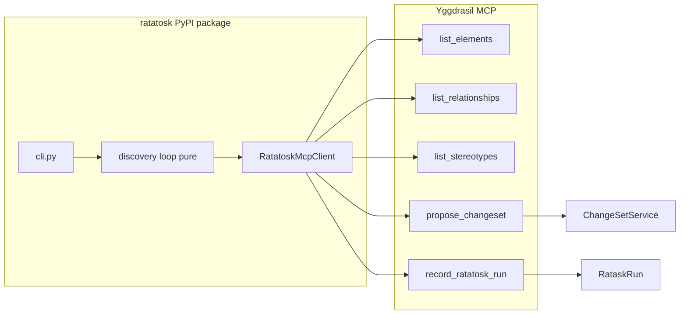

# Ratatosk Bootstrap + Discovery + Update (BPE-01)

**Features**: [`ratatosk-bootstrap.feature`](docs/features/act-1-ratatosk/ratatosk-bootstrap.feature) · [`ratatosk-discovery.feature`](docs/features/act-1-ratatosk/ratatosk-discovery.feature) · [`ratatosk-update.feature`](docs/features/act-6-cicd/ratatosk-update.feature)
**Branch**: `feature/ratatosk-mcp-cli-handoff` (from `iteration/20260717-agents-mcp`)
**Locked decision**: Production CLI has **no `django.setup()`** — Munin handoff via MCP `propose_changeset` (SAO §18.4). In-process AT/pytest keep LocalOrm ports.

---

## Clarifications (answered)

| Q | Answer |
|---|--------|
| CLI Munin write path | **Remote MCP only** for production CLI; ORM handoff only behind test doubles / LocalOrm for AT |
| CICD-06 GUI | Keep mockup AT (`/mockups/ratatosk-run/`) this slice; real RATATOSK_RUN-LIST is Act 9 |
| Empty stdin | Exit 0 + `no architecture changes detected` (already chosen in features) |
| First defense / E2E strategy | **Journey L1** — programmatic integration test importing the same discovery + MCP tool callables the CLI uses (in-process FastMCP Client + real DB). Not Playwright. |

---

## Defense layers (test pyramid for this feature)

| Level | Name | What it proves | What it does NOT prove |
|-------|------|----------------|------------------------|
| **L1** | Journey integration (programmatic E2E) | Act 1 bootstrap → ChangeSet → Act 6 stdin update, via **same modules** CLI/MCP import; real DB; orphan invariant; MCP tool registration path | HTTP/SSE transport, Click argv parsing, network auth headers, browser |
| **L2** | Scenario pytest / Click CliRunner | Individual CLI-*/DISC-*/CICD-* contracts, error messages, Fake MCP for fail paths | Full multi-act narrative |
| **L3** | Behave AT | Gherkin phrases / CATALOG steps | Production packaging |
| **L4** | Staging E2E (later) | Real server + token + pipe | — out of this slice |

**L1 is the north-star for Phases 1–2.** Write it red first (or immediately after tools stub), then green tools until the journey passes. Prefer one file:

`tests/integration/test_journey_bootstrap_then_update.py`

Shape (concrete):
1. `ensure_c4_metamodel()` + empty Model + RW token user in ContextVar
2. `initialize_mcp()` → `async with Client(transport=mcp)`
3. Call discovery loop with `SnapshotPort`/`HandoffPort` backed by **in-process MCP tool calls** (not LocalOrm) — same `list_elements` / `propose_changeset` / `record_ratatosk_run` the CLI will use
4. ScriptedDiscoveryLLM + `sample_webapp` fixture
5. Assert: ChangeSet `source=ratatosk`, no orphan Elements, output/log contains `fetching existing model state via MCP`
6. Second act: pipe `pr.diff` / prose through same loop → second ChangeSet; unchanged not in ops
7. Checkpoint command includes this file first

---

## Context Map

| File | Lines | Note |
|------|-------|------|
| [`src/yggdrasil/ratatosk/agent.py`](src/yggdrasil/ratatosk/agent.py) | ~122–250 | Unified 7-step loop — extract pure discovery into `ratatosk/` package; keep thin Django adapter for AT |
| [`ratatosk/cli.py`](ratatosk/cli.py) | 34–56 | **Remove** `django.setup` from production path; wire MCP snapshot + MCP handoff only |
| [`src/yggdrasil/mcp/server.py`](src/yggdrasil/mcp/server.py) | 100–126 | Register `list_relationships` + `propose_changeset` (+ run record tool) here |
| [`src/yggdrasil/changeset/services.py`](src/yggdrasil/changeset/services.py) | 62–140 | `propose(..., allow_empty=)` — wrap for MCP; do not change apply semantics |
| [`src/yggdrasil/mcp/tools/write.py`](src/yggdrasil/mcp/tools/write.py) | 26–80 | Pattern for write tools: `_require_write_scope()`, server-side user_id, ChangeSet pipeline |

---

## Do Not Do

- Do NOT create a new Django app
- Do NOT write Elements/Relationships from the CLI via ORM or direct SQL
- Do NOT call `django.setup()` in production `ratatosk bootstrap` / `update` paths
- Do NOT reintroduce silent hardcoded Payment API candidates outside `LLM_PROVIDER=scripted` / ScriptedDiscoveryLLM
- Do NOT use `set_model_mode` as a ChangeSet bypass
- Do NOT invent Stereotypes/Packages at discovery time — constrain to Metamodel catalog from MCP `list_stereotypes` (+ packages via model binding)
- Do NOT mock the DB in integration tests that prove ChangeSet/orphan invariants (Fake MCP client is allowed for the **CLI package** unit tests; server-side tool tests use real DB)
- Do NOT expand scope to Celery `trigger_ratatosk_run` async — sync propose this slice
- Do NOT modify root `urls.py` / `settings.py` / `pyproject.toml` deps without a `status-blocked` note (MCP tool registration in `mcp/server.py` is in footprint)

---

## SAO.md Sections That Apply

- **§1 / dependency rules** — `ratatosk` → graph, munin, llm; CLI package is a remote client of MCP
- **§17 Field/Batch Specialist** — NER loop, blackboard, propose-only (not apply as primary path)
- **§18.4 Tool inventory** — `list_elements`, `list_relationships`, `list_stereotypes`, `propose_changeset`, `list_ratatosk_runs`
- **§18.5 Auth** — Bearer PAT at transport; never `user_id` in tool args; read-only token → PermissionError before write
- **ChangeSet invariant** — all writes through Munin/ChangeSet; `source=ratatosk`
- Journey Act 1 / Act 6 — unified 7-step loop; log phrase `fetching existing model state via MCP`

**SAO drift fix (one line):** §2 currently says “Ratatosk calls REST”; align to “CLI snapshot/query/propose uses MCP tools over the server” (features win).

---

## Current state (reuse)

**Already exists (reuse, do not rewrite blindly):**
- Unified discovery loop + blackboard in `yggdrasil.ratatosk.agent`
- Fixtures: `tests/fixtures/repos/sample_webapp`, `sample_stdin`, `empty_repo`
- `RatatoskMcpClient` + `McpSnapshotPort` / `LocalOrmSnapshotPort`
- Pytest covering most DISC + several CICD cases (ORM handoff)
- Behave `cli_steps.py` + `discovery_steps.py` (in-process)

**Missing for option 2:**
- MCP `list_relationships`, `propose_changeset`, `record_ratatosk_run` (or equivalent)
- Django-free discovery core inside published `ratatosk/` package
- CLI production path without `django.setup`
- HandoffPort abstraction (MCP vs LocalOrm)
- Pytest/AT for CLI Click layer (DISC-07/11, CICD-11) and remote handoff
- Missing Act-6 Gherkin step phrases

---

## MCP Tools to Expose

| Tool name | Service method | Write? | HITL? | Auth injection |
|-----------|----------------|--------|-------|----------------|
| `list_relationships` | ORM helper mirroring `list_elements` shape | No | No | server-side user_id |
| `propose_changeset` | `ChangeSetService.propose` (+ optional threshold auto-approve of high-conf items) | Yes | No (pending review / auto by confidence) | server-side user_id; reject read-only |
| `record_ratatosk_run` | create/update `RataskRun` + blackboard + link `changeset_id` | Yes | No | server-side user_id; reject read-only |

`propose_changeset` args (concrete): `model`, `operations` (list), `source` (default `ratatosk`), `munin_reasoning`, `run_id`, `allow_empty` (bool), `confidence_threshold` (float, default 0.80). Returns `{changeset_id, status, applied_count, pending_count, run_url}`.

---

## Tests to Create

| Test | Level | Proves |
|------|-------|--------|
| `test_journey_bootstrap_then_update_via_mcp` | **L1 journey** | Act1 fixture bootstrap → ChangeSet+no orphans → Act6 stdin update via in-process MCP Client; same tools CLI will call |
| `test_list_relationships_returns_total` | integration (T2) | model with N rels → `total` + items; real DB |
| `test_list_relationships_mcp_client` | T1 FastMCP Client | tool registered; async `call_tool` schema |
| `test_propose_changeset_creates_pending` | integration (T2) | ops → ChangeSet `source=ratatosk`, items count |
| `test_propose_changeset_rejects_readonly_token` | integration | read-only scope → PermissionError; no ChangeSet |
| `test_propose_changeset_allow_empty` | integration | `allow_empty=True` → ChangeSet with 0 items |
| `test_propose_changeset_auto_applies_above_threshold` | integration | CLI-05: 9 applied / 2 pending |
| `test_record_ratatosk_run_persists_blackboard` | integration | DISC-02 blackboard keys survive round-trip |
| `test_cli_bootstrap_no_django_setup` | unit (Click + Fake MCP) | `django.setup` not called; MCP snapshot + propose invoked |
| `test_cli_bootstrap_missing_token` | unit Click | DISC-07 / CLI-06 exit ≠ 0, output contains `token` |
| `test_cli_bootstrap_missing_path` | unit Click | DISC-11 exit ≠ 0, output contains `path` |
| `test_cli_update_missing_token` | unit Click | CICD-11 |
| `test_cli_update_pr_diff_happy` | unit Click + Fake MCP | CICD-01 phrases + propose called |
| `test_mcp_snapshot_includes_relationship_count` | unit | Fake client with `list_relationships` → `found N relationships` |
| `test_update_no_orphan_elements` | integration | CICD-13 orphan invariant on stdin path |
| `test_handoff_port_mcp_maps_buckets_to_operations` | unit | DeltaBuckets → propose payload; unchanged omitted |

**Primary checkpoint (L1 first):**
```bash
uv run pytest tests/integration/ratatosk/test_journey_bootstrap_then_update.py -x
```

**Full feature checkpoint:**
```bash
uv run pytest tests/integration/ratatosk/test_journey_bootstrap_then_update.py src/yggdrasil/ratatosk/tests src/yggdrasil/mcp/tests/test_propose_changeset.py src/yggdrasil/mcp/tests/test_list_relationships.py ratatosk/tests -x
```

**AT checkpoint (after steps wired):**
```bash
make test-at -- --tags=-wip -k "ACT-1-CLI or ACT-1-DISC or ACT-6-CICD"
```
(Remove `@wip` from scenarios as each phase greens.)

---

## Logs to Emit

| Where | Trigger | Must include |
|-------|---------|--------------|
| `RatatoskMcpClient.call_tool` | every tool call | tool name, server host (not token), HTTP status |
| CLI `bootstrap`/`update` entry | command start | mode=filesystem\|stdin, model, metamodel (no raw token) |
| CLI after snapshot | MCP fetch ok/fail | `fetching existing model state via MCP`, element_count, relationship_count |
| Discovery cleanup | drop unknown stereotype | stereotype slug, candidate name, reason=unknown_stereotype |
| Discovery empty plan | non-JSON LLM | reason=empty_plan (no invented names) |
| `propose_changeset` entry | MCP write | user_id, model, ops_count, source, run_id |
| `propose_changeset` reject | read-only / empty-without-allow | reason=permission\|empty_ops |
| `record_ratatosk_run` exit | success | run_id, changeset_id, status |
| CLI exit | success/fail | exit class, changeset_id or error class |

---

## Target architecture



---

## Implementation phases (atomic)

### Phase 0 — Prep
- Branch `feature/ratatosk-mcp-cli-handoff`
- Write this plan to [`docs/plans/RATATOSK-CLI-MCP-HANDOFF_IMPLEMENTATION_PLAN.md`](docs/plans/RATATOSK-CLI-MCP-HANDOFF_IMPLEMENTATION_PLAN.md)
- Open/update GitHub issues with mandatory sections inline (group by phase below)
- Rules: BPE-01 · `do-plan-before-doing` · `do-github-issues` · `do-pull-frequently`

### Phase 1 — MCP read: `list_relationships` (CLI-02, CICD-03)
- Implement in [`src/yggdrasil/mcp/tools/query.py`](src/yggdrasil/mcp/tools/query.py); register in `initialize_mcp`
- T1 + T2 tests; hard-fail in `McpSnapshotPort` if tool missing (remove soft-empty that hides drift)
- Commit: `feat(mcp): add list_relationships for Ratatosk snapshot`

### Phase 2 — MCP write: `propose_changeset` + `record_ratatosk_run` (CLI-01/04/05, DISC-06, CICD-13)
- New module [`src/yggdrasil/mcp/tools/propose.py`](src/yggdrasil/mcp/tools/propose.py) (or extend `changeset.py`)
- `_require_write_scope()`; map operations → `ChangeSetService.propose`; optional threshold approve
- `record_ratatosk_run(model, run_id, repo_path, instructions, blackboard, changeset_id, status, trigger)`
- Tests per table; commit: `feat(mcp): propose_changeset and record_ratatosk_run for CLI handoff`

### Phase 2b — Journey L1 (north-star; start as soon as tools exist)
- Add [`tests/integration/test_journey_bootstrap_then_update.py`](tests/integration/ratatosk/test_journey_bootstrap_then_update.py)
- Import **production callables**: discovery runner + `initialize_mcp` + FastMCP `Client` — not a parallel fake pipeline
- Scripted LLM + `sample_webapp` then `sample_stdin/pr.diff`
- Assert journey phrases + ChangeSet invariant (DISC-06 / CICD-13) in one narrative
- This is the **1st level of defense** before Click, behave, or staging E2E
- Rules: `do-test-first` · `do-not-mock-in-integration-tests` (real DB; MCP Client in-process is the seam, not a mock of ChangeSetService)
- Commit: `test(ratatosk): journey L1 bootstrap then update via MCP`

### Phase 3 — Pure discovery package (DISC-01..05, CICD-08)
- Add `ratatosk/discovery/` (tree, stdin classify, map/extract prompts, cleanup, reconcile) with **no Django imports**
- Protocols: `SnapshotPort`, `MetamodelPort`, `HandoffPort`, `LLMPort`
- Move ScriptedDiscoveryLLM / FakeLLM-friendly factory into package (or keep thin shim)
- `yggdrasil.ratatosk.agent` becomes adapter: LocalOrm snapshot/handoff + call shared loop (AT compatibility)
- Rules: `do-skeletons-first` · `do-write-concise-methods` · `do-test-first`
- Commit: `refactor(ratatosk): extract Django-free discovery loop`

### Phase 4 — Production CLI without Django (DISC-07/08/11/13, CICD-11/12)
- Rewrite [`ratatosk/cli.py`](ratatosk/cli.py): only httpx MCP + local LLM + local FS/stdin
- Delete production `django.setup()` path; keep `RATATOSK_SNAPSHOT=orm` **out** of production (AT uses package API with injected Local ports, not ORM env in CLI)
- Click CliRunner tests for token/path/MCP fail messages
- Commit: `feat(ratatosk): MCP-only CLI bootstrap and update`

### Phase 5 — Close scenario pytest gaps
- DISC-11 path error; CICD-01 `pr.diff` happy; CICD-02 instructions; CICD-03 counts; CICD-04 buckets; CICD-05 URL; CICD-13 orphans on update
- CLI-01..07 covered via Click+Fake MCP or adapter tests asserting same output contracts
- Commit: `test(ratatosk): cover CLI and Act-6 gaps`

### Phase 6 — Behave AT wiring
- Fill missing CICD step phrases in [`docs/features/steps/discovery_steps.py`](docs/features/steps/discovery_steps.py)
- Prefer in-process discovery + Fake/Local ports for speed; add one subprocess smoke for missing-token if Click path is the contract
- Strip `@wip` per green scenario group
- Update CATALOG with new step phrases
- Commit: `test(at): wire Act-6 CICD steps; un-wip green scenarios`

### Phase 7 — Docs checkpoint
- SAO one-line MCP clarification; journey already has 7-step table
- Definition-of-done: checkpoint pytest green; orphan invariants green; CLI import does not import django

---

## Scenario → phase map

| Scenarios | Phase |
|-----------|-------|
| CLI-02, CICD-03 (relationship counts via MCP) | 1 |
| CLI-01, CLI-04, CLI-05, DISC-06, CICD-13 | 2 |
| Happy-path Act1+Act6 narrative (DISC-01/06, CICD-01/13) | **2b L1** |
| DISC-01..05, CICD-08, CLI-07 | 3 |
| DISC-07..14, CLI-06, CICD-09..12 | 4 |
| CLI-03, CICD-01/02/04/05/07/14 | 5 |
| CICD-06 (mockup), full AT un-wip | 6 |

---

## Out of scope (follow-up)

- Celery `trigger_ratatosk_run` async NER on server
- Real RATATOSK_RUN-LIST (non-mockup) — Act 9
- Binary stdin rejection polish beyond size-cap
- Publishing new ratatosk version to PyPI
