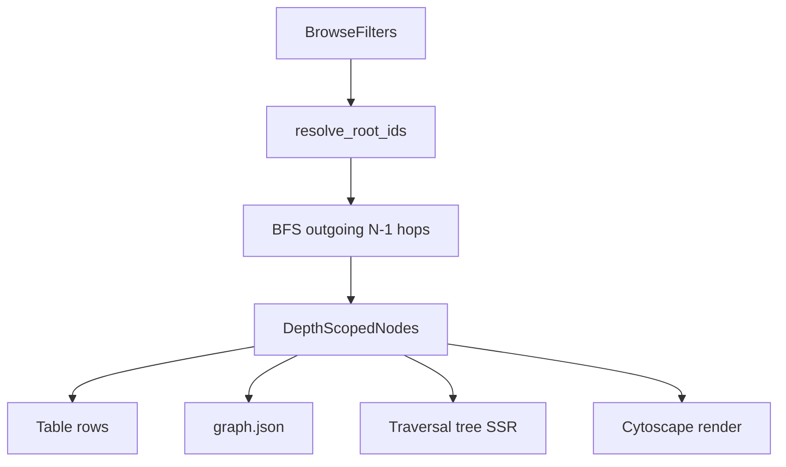

# W13 — View Browser Depth Traversal (BPE-01)

**Feature:** `VIEW-BROWSE-1` · **Wave:** W13
**CR (approved):** [VIEW-BROWSE-1_DEPTH_TRAVERSAL_CHANGE_RECONCILIATION.md](docs/plans/act-2-view-browser/VIEW-BROWSE-1_DEPTH_TRAVERSAL_CHANGE_RECONCILIATION.md)
**Branch:** `feature/view-browse-w13-depth-traversal`
**Scenarios:** 55–60 (new) + revise 17–19 + migrate 01–15 expectations
**GitHub issue:** created during **BPE-01 plan closure** (before any code) — body inlines sections A–F below + Lessons Learned placeholder

---

## BPE-01 vs BPE-02 boundary

| Phase | Activity | Deliverables |
|-------|----------|--------------|
| **Plan closure** | BPE-01 Steps 6–10 | Persisted plan file, GitHub issue (A–F inline), INDEX update, CR marked Approved |
| **Implementation** | BPE-02–07 / MIN | Slices 0–7 below — code, tests, commits |

The GitHub issue is the **handoff artifact for MIN**, not a post-implementation wrap-up. Putting it last conflated plan closure with shipping; corrected order below.

---

## Approved semantics (Q1–Q3 confirmed)

| Rule | Value |
|------|--------|
| Roots | Elements matching browse filters (package / stereotype / health) |
| Unfiltered browse | Roots = **graph sources** (zero incoming edges) |
| Depth N | Roots + **N−1 outgoing hops** (BFS, visited set) |
| Default | `depth=1` when param omitted |
| Table + graph + navigator | Same depth-scoped node set |
| Slider max | `min(longest_hop_from_roots, 20)` |



---

## A — Context Map

| File | Lines | Why |
|------|-------|-----|
| [browse_service.py](src/yggdrasil/graph/browse_service.py) | 28–36, 283–340, 400+ | `BrowseFilters`, flat `subgraph_for_elements`, `_filtered_queryset` — replace with BFS |
| [browse_helpers.py](src/yggdrasil/web/browse_helpers.py) | 56–85, 123–205 | `ViewBrowseParams` (no `depth` yet), `build_package_tree`, `build_view_browse_context` |
| [views.py](src/yggdrasil/web/views.py) | 108–205 | `ViewBrowseView`, `ViewBrowseGraphJsonView` — pass depth through |
| [navigator.html](src/yggdrasil/web/templates/web/view/partials/navigator.html) | 48–86 | Package accordion → traversal tree |
| [view-browser.js](src/yggdrasil/web/static/js/view-browser.js) | 16–26, 100+ | Graph URL builder; add depth slider → `location.search` reload |
| [query.py](src/yggdrasil/mcp/tools/query.py) | 141–183 | `traverse` accepts `depth` but only 1-hop today |
| [view_browser.py](tests/fixtures/view_browser.py) | 65–77 | Explorer rel topology — **Redis is 3 hops from component roots** (munin→Backend→Redis) |
| [test_browse_service.py](src/yggdrasil/graph/tests/test_browse_service.py) | 112–145 | Service tests to extend; pattern for log-story |
| [test_view_browse.py](src/yggdrasil/web/tests/test_view_browse.py) | 93–274 | v0.2 + navigator tests **will break** on default depth=1 — migrate in final slice |

MCP surface: **extend existing** `traverse` only — no new tool registration ([server.py](src/yggdrasil/mcp/server.py) unchanged). ToolExecutor (SAO §17) **not in scope**.

---

## B — Do Not Do

- Do **not** add edge-stereotype layer profiles or direction toggle in browse UI (v1 = outgoing only).
- Do **not** change selection-root BFS (click node → re-root) — filter roots only.
- Do **not** bypass `browse_service` from web/MCP — single BFS implementation (SAO §18.2 Case A).
- Do **not** modify root `urls.py` / `settings.py` without human gate.
- Do **not** leave `NotImplementedError` or defer log-story tests to a follow-up slice.
- Do **not** target `/mockups/` in AT (CATALOG honesty rule); mockup is reference only.

---

## C — SAO.md Sections That Apply

- **§3 Code Organization** — service layer owns graph query logic; web is thin.
- **§5 Test Strategy** — pytest AT via Django test client; integration tests use real DB.
- **§11 Observability** — INFO beats at BFS entry/branch/exit; prove with caplog.
- **§18.2 Integration Case A** — MCP `traverse` wraps `browse_service`, not duplicate BFS.
- **§18.4 Tool Inventory** — align `traverse` multi-hop with browse BFS.

---

## D — Tests to Create / Update

### New service tests (`src/yggdrasil/graph/tests/test_browse_service.py`)

| Test | Asserts |
|------|---------|
| `test_resolve_roots_from_stereotype_filter` | Component filter → auth, munin, graph; not Redis |
| `test_resolve_roots_graph_sources_when_unfiltered` | Payment fixture: sources only (not all 6) |
| `test_bfs_depth_1_roots_only` | `depth=1` + stereotype=component → no Backend/Redis |
| `test_bfs_depth_2_one_hop` | `depth=2` + stereotype=component → Backend or llm visible; **not Redis** |
| `test_bfs_depth_3_two_hops` | `depth=3` + stereotype=component → Redis reachable |
| `test_bfs_cycle_visited_set` | Cycle does not infinite-expand |
| `test_subgraph_edges_both_endpoints_in_scope` | Edge omitted if target outside depth |
| `test_compute_max_depth_capped_at_20` | Max depth respects cap |
| `test_bfs_subgraph_log_story_happy` | caplog: entry, branch (sources_fallback), exit node_count= |
| `test_bfs_subgraph_log_story_reject` | caplog: error on depth=0 or depth=-1 |

### MCP tests (`src/yggdrasil/mcp/tests/test_query_tools.py`)

| Test | Asserts |
|------|---------|
| `test_traverse_depth_2_multi_hop` | ACT-5-MCP-QUERY-04b: munin → llm at depth=2 |
| `test_traverse_depth_2_log_story_happy` | caplog: traverse entry/exit with depth= |

### Web tests (`src/yggdrasil/web/tests/test_view_browse.py`)

| Test | Asserts |
|------|---------|
| `test_depth_slider_renders_graph_mode` | 55: `browser-depth-slider`, `browser-depth-value` |
| `test_depth_1_hides_neighbors_in_navigator` | 18: component + depth=1, no Redis |
| `test_depth_3_shows_redis_in_navigator` | 19 revised: component + depth=3 |
| `test_graph_json_respects_depth` | 56 |
| `test_table_respects_depth` | 58 |
| `test_view_browse_depth_log_story_happy` | caplog: depth= in context build + graph JSON |

### Helper tests (`tests/web/test_browse_helpers.py`)

| Test | Asserts |
|------|---------|
| `test_parse_depth_defaults_to_1` | Omitted param → 1 |
| `test_build_traversal_tree_nests_children` | 60: parent/child from BFS parent map |
| `test_build_traversal_tree_log_story_happy` | caplog: tree build beats |

### v0.2 migration (same PR, explicit slice)

| Test | Change |
|------|--------|
| `test_default_view_shows_elements` | Expect graph **sources** at default depth=1, or add `?depth=3` to reach full payment chain |
| `test_list_elements_no_filter_returns_all` | **Keep** — `list_elements` unchanged; only browse subgraph uses depth |
| `test_view_browser_navigator_package_tree` | Rename/replace → `test_view_browser_navigator_element_tree` |
| Gherkin 19/56 | Fix: Redis at **depth=3**, llm at depth=2 |

---

## E — Log Story Script

| Where | Beat | Trigger | Must include |
|-------|------|---------|--------------|
| `browse_service.resolve_root_element_ids` | entry | BFS prep | `model_slug=`, `filters=` |
| `browse_service.resolve_root_element_ids` | branch | graph-sources fallback | `reason=graph_sources`, `root_count=` |
| `browse_service.subgraph_from_roots` | entry | depth query | `depth=`, `direction=outgoing` |
| `browse_service.subgraph_from_roots` | processing | BFS complete | `node_count=`, `edge_count=` |
| `browse_service.subgraph_from_roots` | exit | success | `max_depth=` |
| `browse_service.subgraph_from_roots` | error | invalid depth | `depth=` |
| `browse_service.compute_max_depth` | exit | slider max | `max_depth=`, `capped=` |
| `build_view_browse_context` | processing | context built | `depth=`, `element_count=`, `tree_root_count=` |
| `ViewBrowseGraphJsonView.get` | exit | JSON | `depth=`, `nodes=`, `edges=` |
| `query.traverse` | entry | MCP call | `from=`, `depth=`, `direction=` |
| `query.traverse` | exit | MCP return | `node_count=` |

---

## F — MCP Tools to Expose

| Tool | Service method | Write? | HITL? | Auth |
|------|----------------|--------|-------|------|
| `traverse` (extend) | `browse_service.bfs_from_element(...)` | No | No | `get_current_user_id()` server-side |

No new tools. T1/T2: extend existing `test_query_tools.py`; T3 unchanged.

---

## Plan closure (BPE-01 — before any code)

**Gate:** User approved plan + Q1–Q3.

1. Copy this plan to [docs/plans/act-2-view-browser/BPE-W13-depth-traversal.md](docs/plans/act-2-view-browser/BPE-W13-depth-traversal.md).
2. Mark CR **Approved** in [VIEW-BROWSE-1_DEPTH_TRAVERSAL_CHANGE_RECONCILIATION.md](docs/plans/act-2-view-browser/VIEW-BROWSE-1_DEPTH_TRAVERSAL_CHANGE_RECONCILIATION.md).
3. Create GitHub issue (`gh issue create`) — title e.g. `VIEW-BROWSE-1 W13: depth traversal BFS + slider`; body **must inline** sections A–F from this plan (not link-only) + `## Lessons Learned` placeholder + checkpoint YAML.
4. Update [INDEX.md](docs/plans/act-2-view-browser/INDEX.md) — W13 linked to plan + issue number.
5. **Commit:** `docs(plan): BPE-W13 depth traversal plan and GitHub issue #N`

Only after this slice does MIN / BPE-02 begin.

---

## Implementation slices (do-rigorously)

Each slice: skeleton → red tests → green → log-story → run pytest → commit.

### Slice 0 — Spec hygiene (first implementation slice)

- Fix Gherkin [view-browse-navigator.feature](docs/features/act-2-view/view-browse-navigator.feature) 19 and [view-browse-canvas.feature](docs/features/act-2-view/view-browse-canvas.feature) 56: **Redis at depth=3**, llm/Backend at depth=2.
- **Commit:** `docs(spec): fix depth traversal Gherkin fixture paths`

### Slice 1 — BFS core (`browse_service`)

Add to [browse_service.py](src/yggdrasil/graph/browse_service.py):

```python
MAX_DEPTH = 20
DEFAULT_DEPTH = 1

@dataclass(frozen=True)
class DepthSubgraph:
    nodes: list[dict[str, Any]]   # element summaries
    edges: list[dict[str, Any]]   # cytoscape edge data
    max_depth: int                # slider ceiling

def resolve_root_element_ids(ymodel, filters) -> set[int]: ...
def subgraph_from_roots(*, model_slug, filters, depth, user_id) -> DepthSubgraph: ...
def bfs_from_element(*, element, direction, depth) -> DepthSubgraph: ...  # MCP
def compute_max_depth(ymodel, root_ids) -> int: ...
```

- Refactor `subgraph_for_elements` to delegate to `subgraph_from_roots` (preserve signature + add optional `depth` kwarg defaulting to flat-all-matching for MCP callers until migrated).
- **Commit:** `feat(graph): add BFS depth subgraph to browse_service`

### Slice 2 — MCP multi-hop `traverse`

- Replace one-hop loop in [query.py](src/yggdrasil/mcp/tools/query.py) with `bfs_from_element`.
- Green QUERY-04b + log-story test.
- **Commit:** `feat(mcp): traverse multi-hop depth via browse_service`

### Slice 3 — Web params + context

- Add `depth: int` to `ViewBrowseParams`; parse from `?depth=` ([browse_helpers.py](src/yggdrasil/web/browse_helpers.py)).
- `build_view_browse_context` calls `subgraph_from_roots`; expose `max_depth`, `current_depth`, `traversal_roots`.
- Update [ViewBrowseGraphJsonView](src/yggdrasil/web/views.py) to pass depth.
- **Commit:** `feat(web): parse depth param and scope browse context`

### Slice 4 — Traversal tree helper

- Add `build_traversal_tree(nodes, parent_map) -> list[root dicts with children]]` in `browse_helpers.py`.
- Parent = first BFS predecessor from any root (per CR Q5).
- Deprecate `build_package_tree` from production path (keep for mockup import if needed).
- **Commit:** `feat(web): build_traversal_tree for navigator SSR`

### Slice 5 — Navigator template

- Replace [navigator.html](src/yggdrasil/web/templates/web/view/partials/navigator.html) package accordion with `browser-element-tree`, `nav-toggle-{slug}`, nested `nav-element-{slug}`.
- **Commit:** `feat(web): traversal tree navigator partial`

### Slice 6 — Depth slider UI

- Add slider to [browse.html](src/yggdrasil/web/templates/web/view/browse.html) canvas toolbar (graph mode only) per IA §6.3.1.
- [view-browser.js](src/yggdrasil/web/static/js/view-browser.js): `input` on slider → set `depth` query param → full page reload (preserve filters); chevron toggles remain Bootstrap collapse (no URL change).
- **Commit:** `feat(web): depth slider synced to URL`

### Slice 7 — AT migration + scenarios 55–60

- Update [test_view_browse.py](src/yggdrasil/web/tests/test_view_browse.py) v0.2 expectations.
- Add behave step stubs in [CATALOG.md](docs/features/CATALOG.md) if needed: `Then the depth slider value is {n}`, `Then the navigator nests {child} under {parent}`.
- Extend log-story test for depth beats.
- **Commit:** `test(web): depth traversal AT scenarios 55-60 and v0.2 migration`

### Slice 7 close-out (optional)

- Fill **Lessons Learned** on the GitHub issue (BPE-01 Step 7 — post-implementation, not issue creation).
- Close issue when checkpoint passes.

---

## Checkpoint (PIN / MIN)

```yaml
checkpoint:
  command: "pytest src/yggdrasil/graph/tests/test_browse_service.py src/yggdrasil/web/tests/test_view_browse.py src/yggdrasil/mcp/tests/test_query_tools.py -x -q"
  log_story_command: "pytest src/yggdrasil/graph/tests/test_browse_service.py src/yggdrasil/web/tests/test_view_browse.py -k log_story -x -q"
```

---

## Lessons Learned (for issue body — fill during implementation)

- Gherkin 19/56 assumed Redis at depth=2 but explorer fixture requires **depth=3** (munin→Backend→Redis).
- Default `depth=1` intentionally breaks v0.2 “show all elements” table tests — migrate explicitly, do not special-case table mode.
- `list_elements` stays flat-filter; only browse subgraph uses BFS — document in `_implementation_notes.md` to avoid confusion.

---

## Risk notes

| Risk | Mitigation |
|------|------------|
| v0.2 AT regression | Dedicated migration slice; run full `test_view_browse.py` after slice 3 |
| Performance on large graphs | BFS bounded by depth cap 20; log `node_count` at exit |
| Duplicate nodes in tree (multi-path) | Show once under first-discovered parent (CR Q5) |
