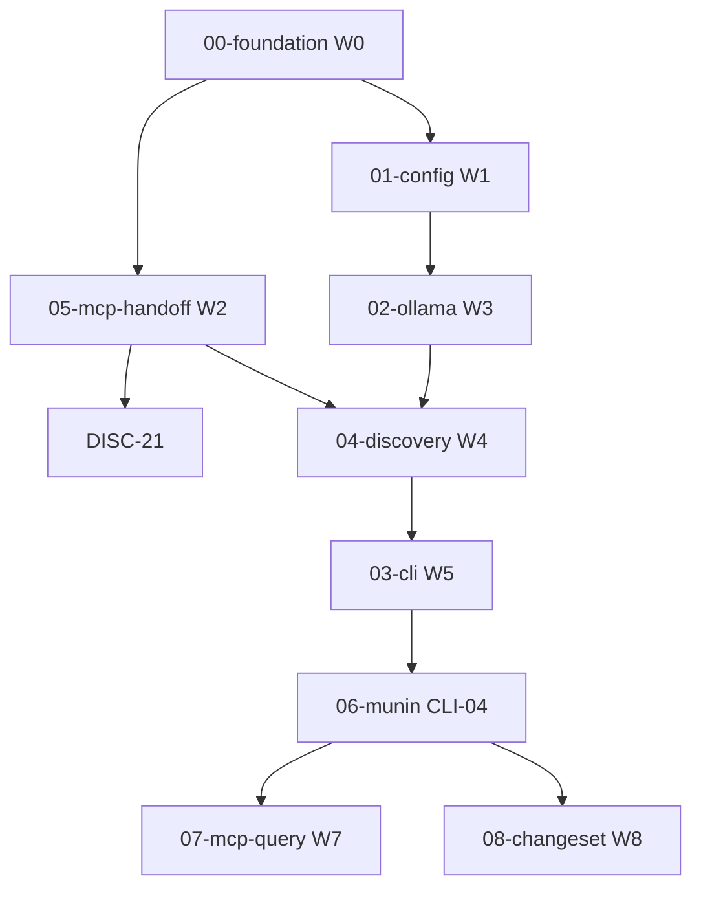

# Bootstrap MVP — Plan Index

Master inventory for per-scenario BPE-01 plans under `docs/plans/bootstrap-mvp/`.

**Posture:** Dr. Dobbs v2 — deliberate, test-first, observable. No GitHub issues until PIN playbook.

**User decisions (locked):**

| Decision | Value |
|----------|-------|
| Deliverable | One `.md` per Gherkin scenario; grouped in packages |
| ChangeSet review | Auto-apply above confidence 0.80; happy path skips manual `approve_changeset` |
| Issues | Deferred until PIN |

---

## Wave order (implementation gate)

Do not start wave *N+1* until wave *N* checkpoint is green.

| Wave | Package | Gate checkpoint |
|------|---------|-----------------|
| W0 | [00-foundation](00-foundation/) | `pytest tests/integration/test_journey_bootstrap_then_update.py -x` |
| W1 | [01-config](01-config/) | `pytest ratatosk/tests/test_config_loader.py -x` |
| W2 | [05-mcp-handoff](05-mcp-handoff/) | `pytest src/yggdrasil/mcp/tests/test_propose_changeset.py tests/integration/mcp_harness/ -x` |
| W3 | [02-ollama-llm](02-ollama-llm/) | `pytest src/yggdrasil/llm/tests/test_ollama_client.py -x` |
| W4 | [04-discovery](04-discovery/) | `pytest src/yggdrasil/ratatosk/tests/test_discovery_agent.py -x` |
| W5 | [03-cli-bootstrap](03-cli-bootstrap/) | `pytest ratatosk/tests/test_cli_click.py -x` |
| W6 | [06-munin-linking](06-munin-linking/) | `pytest src/yggdrasil/munin/tests/test_bootstrap_handoff.py -x` |
| W7 | [07-mcp-query](07-mcp-query/) | MCP query pytest suite (see package README) |
| W8 | [08-mcp-changeset](08-mcp-changeset/) | `pytest src/yggdrasil/mcp/tests/test_approve_changeset.py -x` |
| W9 | [09-error-hygiene](09-error-hygiene/) | Per-scenario checkpoints in Tier 3 files |
| W10+ | [10-rebootstrap](10-rebootstrap/), [11-scout-update](11-scout-update/), [12-munin-briefing-ui](12-munin-briefing-ui/) | Deferred until W0–W9 green |

---

## Scenario inventory

### Tier 1 — first real bootstrap (17 scenarios)

| ID | Tier | Wave | Plan file | Depends |
|----|------|------|-----------|---------|
| ACT-1-CFG-06 | 1 | W1 | [01-config/ACT-1-CFG-06.md](01-config/ACT-1-CFG-06.md) | W0 |
| ACT-1-CFG-07 | 1 | W1 | [01-config/ACT-1-CFG-07.md](01-config/ACT-1-CFG-07.md) | CFG-06 |
| ACT-1-CFG-08 | 1 | W1 | [01-config/ACT-1-CFG-08.md](01-config/ACT-1-CFG-08.md) | CFG-06 |
| ACT-1-CFG-09 | 1 | W1 | [01-config/ACT-1-CFG-09.md](01-config/ACT-1-CFG-09.md) | CFG-06 |
| ACT-1-DISC-21 | 1 | W2 | [04-discovery/ACT-1-DISC-21.md](04-discovery/ACT-1-DISC-21.md) | W2 tools, TFK07 |
| ACT-1-DISC-15 | 1 | W4 | [04-discovery/ACT-1-DISC-15.md](04-discovery/ACT-1-DISC-15.md) | runner ModelSummary |
| ACT-1-DISC-16 | 1 | W4 | [04-discovery/ACT-1-DISC-16.md](04-discovery/ACT-1-DISC-16.md) | DISC-15 |
| ACT-1-DISC-02 | 1 | W4 | [04-discovery/ACT-1-DISC-02.md](04-discovery/ACT-1-DISC-02.md) | tree scan |
| ACT-1-DISC-01 | 1 | W4 | [04-discovery/ACT-1-DISC-01.md](04-discovery/ACT-1-DISC-01.md) | DISC-02, propose |
| ACT-1-DISC-06 | 1 | W4 | [04-discovery/ACT-1-DISC-06.md](04-discovery/ACT-1-DISC-06.md) | DISC-01 |
| ACT-1-LLM-01 | 1 | W3 | [02-ollama-llm/ACT-1-LLM-01.md](02-ollama-llm/ACT-1-LLM-01.md) | CFG-06,07 |
| ACT-1-LLM-03 | 1 | W3 | [02-ollama-llm/ACT-1-LLM-03.md](02-ollama-llm/ACT-1-LLM-03.md) | LLM-01 |
| ACT-1-LLM-ANTHROPIC | 1 | W3 | [02-ollama-llm/ACT-1-LLM-ANTHROPIC-PROVIDER.md](02-ollama-llm/ACT-1-LLM-ANTHROPIC-PROVIDER.md) | LLM-01, CFG-06..09; CFG-10..13, LLM-05..06 |
| ACT-1-CLI-08 | 1 | W5 | [03-cli-bootstrap/ACT-1-CLI-08.md](03-cli-bootstrap/ACT-1-CLI-08.md) | wipe in runner |
| ACT-1-CLI-01 | 1 | W5 | [03-cli-bootstrap/ACT-1-CLI-01.md](03-cli-bootstrap/ACT-1-CLI-01.md) | DISC-01, CLI-08 |
| ACT-1-CLI-09 | 1 | W5 | [03-cli-bootstrap/ACT-1-CLI-09.md](03-cli-bootstrap/ACT-1-CLI-09.md) | CFG-09, DISC-21 |
| ACT-1-CLI-04 | 1 | W6 | [06-munin-linking/ACT-1-CLI-04.md](06-munin-linking/ACT-1-CLI-04.md) | CLI-01, DISC-01 |

Foundation (not Gherkin): [TFK07-AT-STEPS.md](00-foundation/TFK07-AT-STEPS.md), [JOURNEY-L1-BOOTSTRAP-QUERY.md](00-foundation/JOURNEY-L1-BOOTSTRAP-QUERY.md)

### Tier 2 — query bootstrapped graph (9 scenarios)

| ID | Plan file |
|----|-----------|
| ACT-5-MCP-QUERY-01 | [07-mcp-query/ACT-5-MCP-QUERY-01.md](07-mcp-query/ACT-5-MCP-QUERY-01.md) |
| ACT-5-MCP-QUERY-02 | [07-mcp-query/ACT-5-MCP-QUERY-02.md](07-mcp-query/ACT-5-MCP-QUERY-02.md) |
| ACT-5-MCP-QUERY-03 | [07-mcp-query/ACT-5-MCP-QUERY-03.md](07-mcp-query/ACT-5-MCP-QUERY-03.md) |
| ACT-5-MCP-QUERY-04 | [07-mcp-query/ACT-5-MCP-QUERY-04.md](07-mcp-query/ACT-5-MCP-QUERY-04.md) |
| ACT-5-MCP-QUERY-07 | [07-mcp-query/ACT-5-MCP-QUERY-07.md](07-mcp-query/ACT-5-MCP-QUERY-07.md) |
| ACT-5-MCP-QUERY-08 | [07-mcp-query/ACT-5-MCP-QUERY-08.md](07-mcp-query/ACT-5-MCP-QUERY-08.md) |
| ACT-5-MCP-QUERY-09 | [07-mcp-query/ACT-5-MCP-QUERY-09.md](07-mcp-query/ACT-5-MCP-QUERY-09.md) |
| ACT-5-MCP-QUERY-11 | [07-mcp-query/ACT-5-MCP-QUERY-11.md](07-mcp-query/ACT-5-MCP-QUERY-11.md) |
| ACT-5-MCP-CHANGESET-01 | [08-mcp-changeset/ACT-5-MCP-CHANGESET-01.md](08-mcp-changeset/ACT-5-MCP-CHANGESET-01.md) |

### Tier 3 — error hygiene (10 scenarios, canonical paths)

Indexed in [09-error-hygiene/README.md](09-error-hygiene/README.md).

### Tier 4 — deferred (implement after W0–W9)

| Package | Scenarios |
|---------|-----------|
| [10-rebootstrap](10-rebootstrap/) | CLI-02, CLI-03 (DISC-03, DISC-17, DISC-18 green) |
| [03-cli-bootstrap](03-cli-bootstrap/) | CLI-05, CLI-07 |
| [01-config](01-config/) | CFG-02 (also W1 optional) |
| [11-scout-update](11-scout-update/) | SCOUT-01..05, CICD-01..19, CFG-01,03,04,05 |
| [12-munin-briefing-ui](12-munin-briefing-ui/) | MUNIN-BRIEFING-1-01..10 |
| [07-mcp-query](07-mcp-query/) | QUERY-05,06,10 |
| [08-mcp-changeset](08-mcp-changeset/) | CHANGESET-02..06 |
| [04-discovery](04-discovery/) | DISC-09,10,12 |

---

## Dependency graph (simplified)

---

## Known code gaps (cross-reference)

| Gap | Owner plan |
|-----|------------|
| No `ratatosk/config.py`; `_build_llm()` ignores CFG-06 | ACT-1-CFG-06 (done W1) |
| `AnthropicClient.complete()` NotImplemented | ACT-1-LLM-ANTHROPIC |
| `OllamaClient.complete()` NotImplemented | ACT-1-LLM-01 (done W3) |
| Runner logs `fetching existing model state` not `building ModelSummary` | ACT-1-CLI-01, DISC-15 |
| No bootstrap wipe step | ACT-1-CLI-08 |
| `propose_changeset` skips Munin relationship planning | ACT-1-CLI-04 |
| `list_packages` MCP tool missing | ACT-5-MCP-QUERY-11 |
| TFK-07 steps raise NotImplementedError | TFK07-AT-STEPS |

---

## Review gate

Before dr-dobbs implements W0 code: review [ACT-1-CLI-04.md](06-munin-linking/ACT-1-CLI-04.md) and [ACT-1-LLM-01.md](02-ollama-llm/ACT-1-LLM-01.md) as design anchors.
