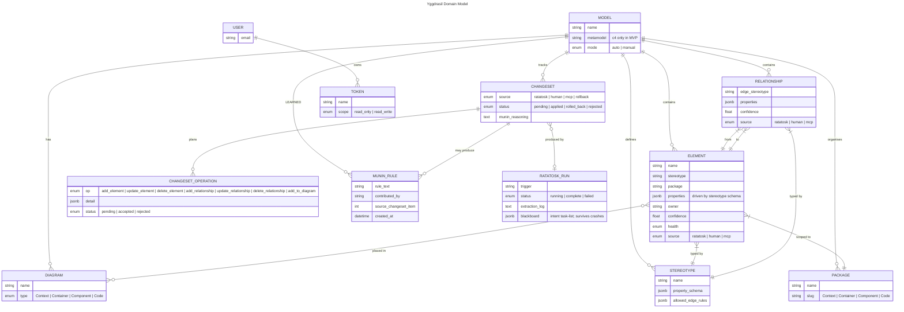
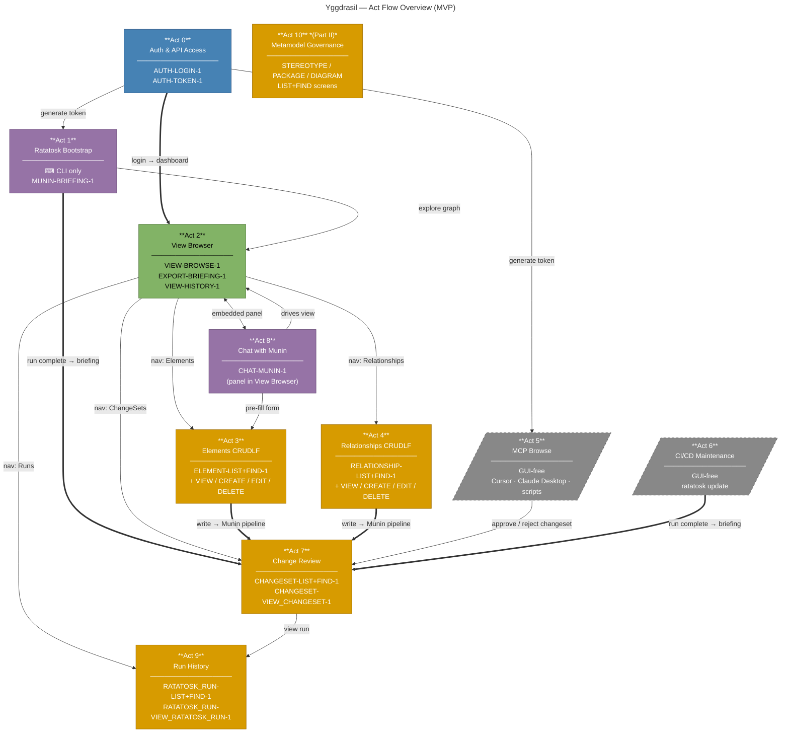

# Yggdrasil — Dialogue Maps (Screen Flows)

Source of truth for screen IDs and navigation. All screen IDs follow the convention:
`{ENTITY}-{OPERATION}-{VERSION}` (see `docs/conventions.md`).

---

## Diagram 1 — Domain Model

Core entities, their properties, and relationships. C4 metamodel is the only supported
metamodel in MVP; Elena governs metamodel evolution in Part II.



---

## Diagram 2 — Act Flow Overview

High-level: what each Act does and how Acts hand off to each other.
No individual screens — just the story arc.



---

## Diagram 3 — Navigation Hub

VIEW-BROWSE-1 is the central hub after login. Shows all entry-point screens reachable
from global nav and their internal CRUDLF sub-screens.

```mermaid
---
title: Yggdrasil — Navigation Hub (screen-level)
---
flowchart LR
    classDef auth       fill:#4682B4,color:#fff,stroke:#2c5282
    classDef browse     fill:#82b366,color:#000,stroke:#5a7d46
    classDef crud       fill:#d79b00,color:#fff,stroke:#9e6c00
    classDef ai         fill:#9673a6,color:#fff,stroke:#6b4e7a
    classDef nogui      fill:#888,color:#fff,stroke:#555,stroke-dasharray:5 5
    classDef listentry  stroke:#111,stroke-width:4px

    %% ── Auth ────────────────────────────────────────────────────
    LOGIN["AUTH-LOGIN-1"]
    TOKEN["AUTH-TOKEN-1"]
    LOGIN -->|"Settings"| TOKEN

    %% ── Central hub ─────────────────────────────────────────────
    BROWSE["VIEW-BROWSE-1\n🔍 View Browser"]

    LOGIN ==>|"success"| BROWSE

    %% ── Browse sub-screens ───────────────────────────────────────
    BROWSE --> EXPORT["EXPORT-BRIEFING-1\nExport Modal"]
    BROWSE --> HISTORY["VIEW-HISTORY-1\nModel History"]
    HISTORY -->|"open snapshot"| BROWSE

    %% ── Munin panel (embedded) ───────────────────────────────────
    BROWSE <-->|"panel"| MUNIN["CHAT-MUNIN-1\nMunin Chat"]

    %% ── Elements ─────────────────────────────────────────────────
    BROWSE -->|"nav"| EL_LIST["ELEMENT-LIST+FIND-1"]
    EL_LIST --> EL_VIEW["ELEMENT-VIEW_ELEMENT-1"]
    EL_LIST --> EL_CREATE["ELEMENT-CREATE_ELEMENT-1"]
    EL_LIST --> EL_EDIT["ELEMENT-EDIT_ELEMENT-1"]
    EL_LIST --> EL_DEL["ELEMENT-DELETE_ELEMENT-1"]
    EL_VIEW --> EL_EDIT

    %% ── Relationships ────────────────────────────────────────────
    BROWSE -->|"nav"| REL_LIST["RELATIONSHIP-LIST+FIND-1"]
    REL_LIST --> REL_VIEW["RELATIONSHIP-VIEW_RELATIONSHIP-1"]
    REL_LIST --> REL_CREATE["RELATIONSHIP-CREATE_RELATIONSHIP-1"]
    REL_LIST --> REL_EDIT["RELATIONSHIP-EDIT_RELATIONSHIP-1"]
    REL_LIST --> REL_DEL["RELATIONSHIP-DELETE_RELATIONSHIP-1"]
    REL_VIEW --> REL_EDIT

    %% ── ChangeSets ───────────────────────────────────────────────
    BROWSE -->|"nav"| CS_LIST["CHANGESET-LIST+FIND-1"]
    CS_LIST --> CS_VIEW["CHANGESET-VIEW_CHANGESET-1\n[Accept][Reject][Do Other]"]

    %% ── Runs ─────────────────────────────────────────────────────
    BROWSE -->|"nav"| RUN_LIST["RATATOSK_RUN-LIST+FIND-1"]
    RUN_LIST --> RUN_VIEW["RATATOSK_RUN-VIEW_RATATOSK_RUN-1"]

    %% ── Munin drives surrounding screen ─────────────────────────
    MUNIN -->|"navigate"| EL_VIEW
    MUNIN -->|"pre-fill"| EL_CREATE

    %% ── Class assignments ────────────────────────────────────────
    class LOGIN,TOKEN                                       auth
    class BROWSE,EXPORT,HISTORY                             browse
    class EL_LIST,EL_VIEW,EL_CREATE,EL_EDIT,EL_DEL         crud
    class REL_LIST,REL_VIEW,REL_CREATE,REL_EDIT,REL_DEL    crud
    class CS_LIST,CS_VIEW,RUN_LIST,RUN_VIEW                 crud
    class MUNIN                                             ai

    class EL_LIST,REL_LIST,CS_LIST,RUN_LIST                 listentry
```

---

## Diagram 4 — Write Pipeline

Every write — from any source — flows through the Munin pipeline and lands in a ChangeSet.
The ChangeSet mode (Auto / Manual) determines whether it applies immediately or queues for review.

```mermaid
---
title: Yggdrasil — Write Pipeline (all sources → ChangeSet)
---
flowchart TD
    classDef source fill:#4682B4,color:#fff,stroke:#2c5282
    classDef munin  fill:#9673a6,color:#fff,stroke:#6b4e7a
    classDef cs     fill:#d79b00,color:#fff,stroke:#9e6c00
    classDef model  fill:#82b366,color:#000,stroke:#5a7d46
    classDef nogui  fill:#888,color:#fff,stroke:#555,stroke-dasharray:5 5

    %% ── Write sources ────────────────────────────────────────────
    CLI[/"⌨ ratatosk bootstrap / update\n(CLI — Act 1 & Act 6)"/]
    GUI["🖱 Human GUI form\n(Act 3 & Act 4)"]
    MCP[/"🔌 MCP tool call\ncreate / update / delete\n(Act 5)"/]

    %% ── Munin pipeline ───────────────────────────────────────────
    PIPELINE["Munin Pipeline\n────────────────────\n1. Validate inputs\n2. Check metamodel rules\n3. Compute blast-radius\n4. Plan graph operations\n5. Classify confidence"]

    %% ── ChangeSet ────────────────────────────────────────────────
    CS["CHANGESET-VIEW_CHANGESET-1\n────────────────────\nList of planned operations\n[Accept] [Reject] [Do Other]"]

    %% ── Mode fork ────────────────────────────────────────────────
    AUTO{"Model mode?"}
    APPLY["Apply directly to Model\n(audit trail kept)"]
    QUEUE["Queue for human review\nCHANGESET-LIST+FIND-1"]

    %% ── Graph ────────────────────────────────────────────────────
    MODEL_DB[("Live Model\n(Elements + Relationships)")]

    %% ── LEARNED feedback loop ────────────────────────────────────
    LEARNED[["LEARNED component\n(MuninRules — append-only)\nprepended to Munin prompt\non next run"]]

    CLI     --> PIPELINE
    GUI     --> PIPELINE
    MCP     --> PIPELINE

    PIPELINE ==> CS
    CS       --> AUTO

    AUTO -->|"Auto-approval"| APPLY
    AUTO -->|"Manual-review"| QUEUE
    QUEUE -->|"human approves"| APPLY
    QUEUE -->|"[Do Other] → correction"| LEARNED
    LEARNED -->|"prepended next run"| PIPELINE

    APPLY ==> MODEL_DB
    APPLY -->|"rollback available"| CS

    class CLI,MCP       nogui
    class GUI           source
    class PIPELINE,LEARNED  munin
    class CS,QUEUE      cs
    class AUTO          cs
    class APPLY,MODEL_DB    model
```

---

## Screen ID Index

| Screen ID | Act | Description |
|---|---|---|
| `AUTH-LOGIN-1` | 0 | Login form |
| `AUTH-TOKEN-1` | 0 | API token management |
| `MUNIN-BRIEFING-1` | 1 | Post-run architectural briefing |
| `VIEW-BROWSE-1` | 2 | View Browser with filters + graph/table toggle |
| `EXPORT-BRIEFING-1` | 2 | Export modal (Mermaid / Markdown deck / JSON) |
| `VIEW-HISTORY-1` | 2 | Model history timeline and A/B diff |
| `ELEMENT-LIST+FIND-1` | 3 | Elements list & search (LIST+FIND entry point) |
| `ELEMENT-VIEW_ELEMENT-1` | 3 | Element detail (properties, ego-graph) |
| `ELEMENT-CREATE_ELEMENT-1` | 3 | Create element form |
| `ELEMENT-EDIT_ELEMENT-1` | 3 | Edit element form |
| `ELEMENT-DELETE_ELEMENT-1` | 3 | Delete confirmation with blast-radius |
| `RELATIONSHIP-LIST+FIND-1` | 4 | Relationships list & search (LIST+FIND entry point) |
| `RELATIONSHIP-VIEW_RELATIONSHIP-1` | 4 | Relationship detail |
| `RELATIONSHIP-CREATE_RELATIONSHIP-1` | 4 | Create relationship form |
| `RELATIONSHIP-EDIT_RELATIONSHIP-1` | 4 | Edit relationship form |
| `RELATIONSHIP-DELETE_RELATIONSHIP-1` | 4 | Delete confirmation |
| `CHANGESET-LIST+FIND-1` | 7 | ChangeSet queue (LIST+FIND entry point) |
| `CHANGESET-VIEW_CHANGESET-1` | 7 | ChangeSet review with Accept / Reject / Do Other |
| `CHAT-MUNIN-1` | 8 | Munin chat panel (embedded in VIEW-BROWSE-1) |
| `RATATOSK_RUN-LIST+FIND-1` | 9 | Run list (LIST+FIND entry point) |
| `RATATOSK_RUN-VIEW_RATATOSK_RUN-1` | 9 | Run detail (extraction log + Munin blackboard) |
| `STEREOTYPE-LIST+FIND-1` | 10 | Stereotype definitions (Part II) |
| `PACKAGE-LIST+FIND-1` | 10 | Package hierarchy (Part II) |
| `DIAGRAM-LIST+FIND-1` | 10 | Diagram list with graph editor (Part II) |
